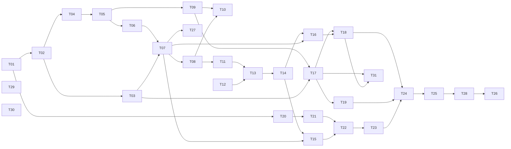

# GitPeek タスクリスト

v1（Phase 1〜9）の作業を、人間が概ね 3 日で終える単位に割ったもの。
**v1 は 2026-09-12 に完了した。** 以後の作業も同じ規約でここに積む。

- **決定の記録**は [`docs/DESIGN.md`](docs/DESIGN.md)（**踏んだ落とし穴と割り切りは §17**）
- **実装中に毎回効く制約**は [`CLAUDE.md`](CLAUDE.md)
- **今やること（＝このファイル）** が進捗の唯一の正

**このファイルには「今やること」しか置かない**（2026-09-09 に整理した）。
作り終わった形の説明・教訓・割り切りは DESIGN.md にある。

---

## このファイルの規約

**着手前に必ずこの節を読むこと。**

1. **完了の記録はコミットと同時に行う。** タスクを終えたら、その実装と同じコミットで
   チェックを入れ、末尾の「完了済み」節へ 1 行に畳んで移す。別コミットにすると忘れる。

2. **ID は再利用しない。** タスクを削除・統合しても番号は空けたままにする。
   3 日に収まらないと判明したタスクは、**末尾に新しい ID を発番**して分割する
   （枝番 `T-13a` は使わない）。ID は発番順であり、実行順は「推奨する着手順」の表と
   各タスクの `依存:` 行が決める。

3. **受け入れ条件には 2 種類ある。**
   - `▸コマンド:` — 実行すれば判定できる。エージェントが自分で確認してよい
   - `▸目視:` — 人間の確認が必要
   
   **目視項目が 1 つでも残っているタスクを、エージェントが単独で「完了」と宣言してはいけない。**
   実装を終えたら「目視確認をお願いします」と述べて止まること。

4. **未着手タスクに書かれた型定義は着手時点の設計案であり、先行タスクの実装が正。**
   着手時に必ず実物と突き合わせ、食い違っていたらタスク本文を書き直してから実装する。

5. **骨子のままのタスクは、着手前に詳細化する。** ⑥実装内容と⑧受け入れ条件が埋まって
   いないタスクは、詳細化そのものを最初の作業として行う。
   骨子のままのタスクはいま無い（T-39 は 2026-09-19 に T-38 へ統合した）。

6. **制約の再掲は出典付き。** 各タスクの「制約」に書かれた内容は CLAUDE.md / DESIGN.md からの
   再掲であり、必ず出典を併記してある。**食い違いを見つけたら CLAUDE.md 側が正。**
   決定理由は再掲していないので、なぜそう決めたか知りたいときは DESIGN.md を読むこと。

---

## 現在地

**最終更新**: 2026-09-19

**次のセッションが最初にやること**

1. 下の「▸コマンド」を 4 つ流してベースラインを取る（直近は **Rust 558 / vitest 518** で全部緑。ignore 2 本のうち 1 本は手元の onyx が要る中止のテスト）
2. **T-38 は実装済みで、▸目視待ち**（「v1.1 — ブランチが取り込まれているか」の節。2026-09-18 に実装し、
   09-19 に利用者の指摘で右クリック中心に作り直した。T-39 を取り込んだ。▸コマンドは全部通っている）。**エージェントは完了を宣言しない** — 目視の結果をもらってから完了済みへ移す。
   **③（`merge-tree` を一時フォルダへ隔離して使う）を許可した判断は CLAUDE.md §1 を緩める 4 件目** —
   節の冒頭の「共通する決めごと」を先に読むこと。コミット検索（T-35 / T-36）は 2026-09-18 に終わった
   （DESIGN.md §6.6）。**利用者は「使っていくと気になる部分があるかもしれない」と言っている** —
   出てきたら、文言と同じく実運用で挙げてもらって直す。
   文言の直しは「画面の名前と読んだ文」をもらって直す（下記）。v1.1 の残りの候補は末尾の表

```
npm run test:rust   npm run check:rust   npm run test   npm run typecheck
```

| 項目 | 内容 |
|---|---|
| 直前に完了 | **v0.2.2 の公開**（GitLab ＋ GitHub。2026-09-20。**止めていないのに「止めました」と出る不具合の修正**。ここは利用者が目視確認済み）/ v0.2.1 の公開（GitLab ＋ GitHub。2026-09-19。**T-38 入り、ただし ▸目視は未了のまま**利用者の指示で公開）/ v0.2.0 の公開（2026-09-18）/ **T-37**（取り込み判定の本体。git の下限を 2.38 へ）/ T-36 / T-35（コミット検索）|
| いまここ | **T-38 実装済み・▸目視待ち**（2026-09-19 に作り直した。T-39 を取り込んだ）|
| 未解決の判断事項 | なし（git 2.38 未満は**警告して止める**と 2026-09-18 に確定）。ただし**文言はまだ途中で、利用者はまだ満足していない**（下記）|

**v1 は 2026-09-12 に終わった**（Phase 9 完了 ＋ 実リポジトリ 8 個で 7 日運用 ＋ 既存 GUI クライアントを
一度も開かなかった）。T-31（`git pull --ff-only` 相当）は
**CLAUDE.md §1 を緩める 3 件目**で、緩め方は既存の 2 件と揃えてある。理由は DESIGN.md §8.6 —
とくに**なぜ `git pull` を呼ばないのか**はそこにしか書いていない。

**待ち時間に T-32 / T-33 を入れ、v0.1.2 として公開した**（2026-09-09 に依頼、09-10 に目視・公開）。
ブランチ一覧の CSV 保存と、更新日でチェックを付け直す機能。**どちらも git の実行を増やしていない。**
決めたことと理由は DESIGN.md §6.4。

**作ってみて分かったこと（落とし穴・割り切り）は DESIGN.md §17。**

### 文言はまだ途中（T-29 の 1 巡目のあと。2026-09-06）

**利用者は「問題ない」と言ったが、「満足していない。今後もっと改善していく」とも
言った。通ったことにして忘れないこと。**

1 巡目で取ったのは**削れば直る硬さ**（自明な主語・重ね書き・翻訳調の連体修飾・
「〜の可能性があります」・「〜してください」の多用）。**残っているのは、
画面の中で読んだときにしか分からないもの** — 前後の文とのつながり、同じ画面に
並んだときの語調のばらつき、長さの釣り合い。**一覧をまとめて読んでも見つからない。**

**次に触るときは、実運用の中で引っかかった文を挙げてもらう形にする**。
**画面の名前と、そこで読んだ文をそのまま**もらえば直せる。

### 済んだ Phase で決めたこと — 出典だけ置く

**毎回効く制約は CLAUDE.md、決定理由は DESIGN.md に移してある。**
ここへ書き写すと必ずどちらかが古くなるので、迷ったら出典を読むこと。

| Phase | 決まったこと | 出典 |
|---|---|---|
| 2 | レーン割り当てと描線（**判定ゲート合格 2026-09-03。以降動かさない**）／第 2 親のレーン合流は不採用 | CLAUDE.md §3 / DESIGN.md §5.1, §5.2, §15.1 |
| 3 | 可視 ref の絞り込みと ahead/behind ／ ref が数千本のときにペインが潰れる件 | CLAUDE.md §6 / DESIGN.md §4.4, §4.5, §6.4 |
| 4 | 3 ペイン配置 ／ 差分の色と語単位強調（強調の中では構文色をやめた）／ 文字コードの判別順 | DESIGN.md §6.1, §7.2, §9.1 |
| 5 | 任意 2 点比較（**`A...B` は 1 つの引数**）／ 作業ツリーの擬似行 | CLAUDE.md §6 / DESIGN.md §7.5, §10.3 |
| 6 | fetch の進捗・中止・放置警告・上流のタグ付け替え | CLAUDE.md §2, §8 / DESIGN.md §8.3, §8.3.1 |
| 6 | checkout の渡し分け ／ 確認画面 ／ FF マージ ／ 書き込み後は HEAD へ寄せる | CLAUDE.md §1, §2, §6 / DESIGN.md §8.1, §8.2, §8.5 |
| 7 | clone の引数と保存先の決め方 ／ 残骸の後始末（**自分が作ったフォルダだけ**）／ Job Object は入れない ／ サブモジュールは**確認画面で選ばれたときだけ** | CLAUDE.md §1, §4, §6, §8 / DESIGN.md §8.4 |

**利用者の判断で「実装しないと決めた」ものを 4 つ緩めてある**（ローカル追跡ブランチ /
サブモジュール / 取ってきてから進める / `merge-tree` の一時フォルダへの書き込み）。どれも**「黙ってやらない」ほうを守った条件付きの
緩和**で、同じ形が必要になったら勝手に変えず利用者に聞くこと。
**一覧は CLAUDE.md §1 の表が正**（ここへ写すと必ず片方が古くなる）。

**EUC-JP の判別が当たらない件は「当面このまま」で決着した**（2026-09-03、利用者の判断）。
EUC-JP を使う予定が無く、**UTF-8 と Shift_JIS が判定できれば足りる**ため。挙動は
`encoding.rs` の `euc_jp_hiragana_is_misdetected_as_shift_jis` が固定している（DESIGN.md §9.1）。

### 登録済みリポジトリ（判定と目視に使うもの）

| リポジトリ | コミット | max_lane | 同時レーン平均 | ルート |
|---|---|---|---|---|
| gitviewer / AerialSoldierMaker / save_temperature | 24 / 22 / 10 | 0 | 1.00 | 1 |
| drogon | 2,298 | 20 | 2.91 | 1 |
| vite | 10,186 | 54 | 5.45 | 1 |
| onyx | 20,285 | 52 | 11.43 | 4（orphan ブランチ 2 本）|
| MinerU | 6,692 | — | — | **T-19 の目視で clone したもの**（ref 304 本）|
| linux | 148 万 | — | — | DESIGN.md §4.1 の非対象 |

小さい 3 つはマージが 1 件も無い一直線なので、枝分かれの確認には使えない。
**サブモジュールを持つリポジトリはまだ登録していない。** T-19 の目視には使ったが、
以後もサブモジュールの確認が要るなら 1 つ手元に置いておくとよい。

**100 万コミット級の正式対応は v1.1 以降に送った**（DESIGN.md §1.1, §4.1 / 下の「v1.1」表）。
v1 では非対象のままだが、恒久的な非対象ではなくなった。

---

## 推奨する着手順

上から順に着手するのが効率的。

| 順 | Phase | タスク | 備考 |
|---|---|---|---|
| 1 | 1 | T-01 → T-02 → T-03 / T-04 | **済** |
| 2 | 2 | T-05 → T-06 → T-07 → T-08 → T-27 | **済**（T-08 は判定ゲート。合格） |
| 3 | 3 | T-09 → T-10 | **済** |
| 4 | 4 | T-11 → T-12 → T-13 → T-14 | **済** |
| 5 | 5 | T-15 → T-16 | **済** |
| 6 | 6-7 | T-17 → T-18 → T-19 | **済**（書き込み系はこれで終わり）|
| 7 | 8 | T-20 → T-21 → T-22 → T-23 | **済**（**Phase 8 完了 ＝ AI レビューは終わり**）|
| 8 | 9 | T-24 → T-25 → T-28 → T-29 / T-30 → T-26 | **済**（**2026-09-12 に v1 の DoD が埋まった**）|
| 9 | 9 | T-31 | **済**（2026-09-08 に利用者が決めて足した。`git pull --ff-only` 相当。v0.1.1 として公開）|



---

# v1.1 — ブランチが取り込まれているか

**2026-09-18 に利用者が着手を決めた。** 実運用で「squash マージされたのに、元のブランチが残っていて
マージされていないように見える」ブランチを取り違えたのがきっかけ（元のブランチは消えていなかった）。
**T-37 → T-38 の順**（T-39 は 2026-09-19 に T-38 へ統合）。**T-37（判定の本体）は 2026-09-18 に完了**（末尾の「完了済み」）。
T-38 まで終われば、ローカルブランチの取り違えは起きなくなる。

**3 本に共通する決めごと（2026-09-18 に利用者と確定。変えるときは聞くこと）**

1. **`git merge-tree --write-tree`（③）を使ってよい。書き込みは一時フォルダに限って許可する**
   （利用者の判断）。新しいオブジェクトは `GIT_OBJECT_DIRECTORY` でリポジトリの外の一時フォルダへ
   逸らし、既存のオブジェクトは `GIT_ALTERNATE_OBJECT_DIRECTORIES` で読むだけにする。
   **CLAUDE.md §1 を緩める 4 件目**（表の 4 行目）
2. **git は 2.38 以上を必須にする**（`merge-tree --write-tree` が 2.38 から）。**対応外の git では警告して止める**
   （2026-09-18 に利用者が決めた。いまの「下限に届かないと起動画面で止まる」作りをそのまま使い、
   下限を 2.20 → 2.38 に上げた。T-37）。**②だけで判定する逃げ道は作らない**
3. **比べる相手**: 印は既定ブランチ（グラフの lane 0 の幹）と比べる。ほかは右クリックから
   **「このブランチより後に動いたブランチすべて」**と比べる（時間がかかってよい。2026-09-19 に、相手を設定で
   選ぶ形をやめてこちらにした — 利用者の指摘）
4. **③で「入っているか」、②（差分の突き合わせ）で「どこで入ったか」を見る。** 片方が外れる場面を
   もう片方が拾う（下の実験）
5. **文言は「マージされました」ではなく「〈相手〉に入っています」。** 中身で判断するので、
   同じ変更を別に書き直した場合も当たる
6. **グラフとレーンには触らない**（CLAUDE.md §3）。印はブランチ一覧とチップにだけ付ける

**実測と、③ / ② が互いの外れを拾うことの確認は DESIGN.md §7.6。**

## - [ ] T-38 [v1.1] 取り込まれているかを画面に出す（T-39 を取り込んだ）

**目的**: ローカルブランチが幹に取り込まれているかを自動で調べ、ブランチ一覧とチップに印を付ける。
**右クリックからは、そのブランチを取り込んでいる可能性があるブランチを全部調べて並べる**（T-39 の中身）。
**git 2.38 未満で止まる起動画面の目視もここでまとめて行う**（下限を上げたのは T-37）。

**参照**: DESIGN.md §7.6 / §7.6.1（画面）/ §6.4（ブランチ一覧）/ §3.4（git の検出）/ CLAUDE.md §6, §8

**依存**: T-37

**2026-09-19 の作り直し**（利用者の指摘）: 最初は「このリポジトリの設定」で既定の相手を選び、右クリックの
「相手を選んで調べる…」で 1 本ずつ比べる形にしたが、**相手を設定するのは手間**だった。**設定の欄を外し**、
右クリックの「**このブランチを取り込んでいる可能性があるブランチを調べる…**」で全部と比べる形にした。
骨子の T-39 と同じものなので、**T-39 はここへ統合した**（ID は空けたまま — 規約 2）。
印の相手は幹だけになった。

**制約**

- **判定は Rust**（`check_containment` / `find_containers`）。判定の順番・種類を画面側で作り直さない（DESIGN.md §7.6）。
  **ref は完全な名前で渡し、SHA は渡さない**（Rust がスナップショットから引く。CLAUDE.md §4）
- **グラフとレーンには触らない**（CLAUDE.md §3）。印はブランチ一覧とチップにだけ付ける
- **押せない選択肢を消さない**（CLAUDE.md §6）
- 出し分け・対象の選び方・鍵は `src/lib/*.ts` の純関数へ。`.tsx` とストアは呼ぶだけ（CLAUDE.md §8）
- 文言は `ja.ts`。**「マージされました」ではなく「〈相手〉に入っています」**（共通する決めごと 5）

**実装したもの（2026-09-19 時点。▸目視待ち）**

1. **Rust**（`git/contained.rs` / `lib.rs`）
   - `container_candidates` — 相手の選び方。先端のコミット時刻が古くないブランチ（ローカル・リモート）。
     除くもの: タグ ／ 履歴の外 ／ 自分 ／ 先端が同じ ／ 自分の上流と、自分を上流にしているもの。ローカル → リモート、名前順
   - `find_containers` — 逐次に判定し、**1 本ごとに中止を見る**。スナップショットと索引は 1 度だけ。
     1 本の失敗で止めない。コマンド `find_containers` / `cancel_find_containers`、途中経過は `containers-progress`
   - **判定の直し**: 一致したのが**相手の側を取り込んだマージコミットだけ**なら `notContained`（全部と比べて踏んだ。DESIGN.md §17.1）
2. **純関数**（`src/lib/containment.ts`）— 自動で調べるブランチ / 鍵 / 次の 1 本と進み具合 / 印の出し分け /
   squash へ飛べるか / 右クリックの押せる・押せない / 残りの目安 / 結果の見出し / 結果の並び
3. **印を自動で付ける**（`src/store/containment.ts` ＋ `App.tsx` の `ContainmentRunner`）— ローカルブランチを 1 本ずつ、
   相手は幹。**覚えるのはメモリだけ**、鍵は先端の組
4. **印**（`ContainmentMark.tsx`。ブランチ一覧とチップ）とホバーの根拠、クリックで squash へ。調べている間は進み具合
5. **右クリック**（ブランチ一覧とチップの 2 か所。`containmentText.ts`）— 「〈幹〉に入っているか調べる」と
   「このブランチを取り込んでいる可能性があるブランチを調べる…」
6. **ダイアログ**（`ContainersDialog.tsx`）— 開いたら調べ始め、進み具合と残りの目安、止める。結果は入っていたものだけを
   まるごと入っているものから並べ、ブランチと squash へ移動できる。**止めたら「全部ではない」と書く**
7. README / DESIGN.md（§7.6, §7.6.1, §14.6, §17.1）

**このタスクで決めたこと（2026-09-18 に利用者が了承。09-19 の作り直しで 4. は形が変わった）**

- **結果はメモリにだけ覚える**（`state.json` に書かない）
- **普通のマージ（`ancestor`）にも印を付ける**／**`notContained` には付けない**
- **上流が相手のローカルブランチは自動で調べない**（ahead/behind と重なる）
- **幹以外と比べた結果は印にせず、ダイアログの中にだけ出す**
- **調べるたびに git コマンドログに行が積まれる。ログから外す口は作らない**（DESIGN.md §3.5）

**目視で見つけて直したもの**

- **止めていないのに「止めました。16 本のうち 0 本まで」と出る**（2026-09-19）。StrictMode の 2 回目の効果が
  1 回目の走り（2 回目に中止されたほう）の結果を採っていた。**走りごとの番号で捨てる**ようにした（DESIGN.md §17.1）。
  ついでに、止めたときの文を「どこまで調べ、何が見つかり、残りはどうしたか」の順に書き直した

**テストが当たらないところ**

- `store/containment.ts` の逐次実行・切替での破棄（`pump`）。判断は純関数へ出し、ストアは「次の 1 本を聞いて呼ぶ」だけ
- `ContainersDialog.tsx` の配線（開いたら始める・閉じたら止める・古い結果を捨てる）
- 印のコンポーネント・文言の引き当て（`containmentText.ts`）・`App.tsx` の配線
- Rust の `find_containers` / `cancel_find_containers` コマンドとイベント（`lib.rs`。本体の `git/contained.rs` はテストが当たる）

**受け入れ条件**

- ▸コマンド: `containment.test.ts`（DESIGN.md §14.6 の「取り込まれているかの画面」）／ `tests/contained.rs`
  （同「取り込んでいる可能性があるブランチ」）／ 4 コマンド
- ▸目視: **今回取り違えたブランチ**に「入っている」の印が出て、クリックで squash コミットへ飛ぶこと
- ▸目視: `squash` テストリポジトリで、普通のマージ／squash／途中まで／squash の後に書き換え／入っていない が
  **印とホバーで見分けられる**こと
- ▸目視: **右クリック「このブランチを取り込んでいる可能性があるブランチを調べる…」**で、入っているブランチが並び、
  ブランチと squash へ移動できること
- ▸目視: onyx のリモートブランチで上の右クリックを走らせ、**進み具合と残りの目安が出て、止めると
  「全部ではない」と出る**こと（本数と時間の実測もここで取る）
- ▸目視: onyx を開いたとき、自動で調べる間も**グラフの操作が詰まらない**こと
- ▸目視: 2.38 未満の git を指定したとき、**起動画面で止まり、なぜ 2.38 が要るかが読める**こと

**⚠️ このタスクはエージェントが単独で完了を宣言してはいけない。**

---

## T-39 [v1.1] このブランチより新しいブランチすべてと比べる — **T-38 に統合（2026-09-19）**

利用者の指摘で T-38 の右クリックがこの形になったので、ここでは作らない。ID は空けたまま（規約 2）。

---

# v1.1 以降（ID は振らない）

着手が近づいた時点で詳細化し、末尾から新しい ID を発番する。

## v1.1

| 項目 | 内容 | 参照 |
|---|---|---|
| ~~コミット検索~~ | **T-35 / T-36 で実装済み**（末尾の「完了済み」）| DESIGN.md §6.6 |
| stash 一覧 | stash の閲覧のみ（作成・適用はしない） | DESIGN.md §15.3 |
| ファイル単位の履歴 | `log --follow` によるファイルの変更履歴 | DESIGN.md §15.3 |
| ブランチ同士の比較 | `origin/main...HEAD` 形式の比較を専用 UI から起動 | DESIGN.md §10.3 |
| `--cc` マージ差分 | マージコミットで両親と異なる部分だけを示す combined diff | DESIGN.md §7.4 |
| 画像差分 | 画像ファイルの変更を並べて表示 | DESIGN.md §7.2 |
| リポジトリのグループ分け | サイドバーでフォルダによる分類 | DESIGN.md §6.2 |
| ローカル追跡ブランチ作成 | `checkout -b --track` を明示的なメニュー項目として追加 | DESIGN.md §8.1 |
| 100 万コミット級リポジトリ | 「全件をフロントへ渡す」前提の見直し。v1 は自動で読まないだけ | DESIGN.md §1.1, §4.1 |
| **文言の見直し 2 巡目** | **T-29 は 1 巡目で、利用者はまだ満足していない。** 実運用で引っかかった文を挙げてもらって直す（一覧をまとめて読んでも見つからない種類が残っている）| 「現在地」の節 |

## v2.0

| 項目 | 内容 | 参照 |
|---|---|---|
| blame | 行ごとの最終変更コミットの表示 | DESIGN.md §15.3 |
| reflog | reflog の閲覧 | DESIGN.md §15.3 |
| submodule 対応 | submodule の中身を辿れるようにする（v1 は「壊れない」だけ担保） | DESIGN.md §15.3 |

---

# 完了済み

| ID | Phase | タイトル | コミット |
|---|---|---|---|
| — | 0 | Tauri v2 雛形 ＋ git 検出 ＋ git コマンドログパネル | `93867ed` |
| T-01 | 1 | 設定ストアと %APPDATA% レイアウト（settings.json / state.json） | `cf5fd37` |
| T-02 | 1 | リポジトリの登録・判定・フォルダスキャン ＋ テスト用リポジトリ生成 | `1f368b7` |
| T-03 | 1 | リポジトリ一覧サイドバーと切替 ＋ 右クリック登録解除・D&D 並べ替え | `80189ea` |
| T-04 | 1 | コミットメタ情報の全件取得とパース ＋ 読み込み進捗と大規模リポジトリの確認 | `c9aae9d` |
| T-05 | 2 | レーン割り当てアルゴリズム ＋ topo / date の並び順 | `6601800` |
| T-06 | 2 | レーン配列 → SVG パス生成と描線 | `e6e877f` `7793d6a` `4bce75b` |
| T-07 | 2 | コミットリストの仮想スクロールと列表示 | `a419547` `f1da933` |
| T-08 | 2 | 判定ゲート — 美しさの検証と調整（**合格**） | `d861dba` `1a5f36a` `1662e52` |
| T-27 | 2 | orphan ブランチと履歴の終端に印を付ける | `3339a0c` |
| T-09 | 3 | 到達可能集合と ahead/behind の計算 | `01a1571` |
| T-10 | 3 | ブランチ / タグツリー UI | `79e5311` `4fb5ec9` |
| T-11 | 4 | コミット詳細と変更ファイル一覧（＋ 3 ペインへの配置替え） | `f0a7906` `041197b` |
| T-12 | 4 | 文字コード自動判別と改行コード検出 | `415e71f` |
| T-13 | 4 | 差分の取得・パースと side-by-side 描画 | `f6ff002` `012364a` |
| T-14 | 4 | Shiki ハイライトと大差分の折りたたみ | `9489720` |
| T-15 | 5 | 任意 2 コミット間差分 | `50a12fb` |
| T-16 | 5 | 作業ツリーの read-only 表示 | `fa7f998` |
| T-17 | 6 | fetch と放置警告 | `b12ec13` `6677914` `4e61936` |
| T-18 | 6 | checkout と FF マージのガード（**Phase 6 完了**） | `6ee4e1f` `cde5db4` `46ed744` |
| T-19 | 7 | URL から clone（**Phase 7 完了 ＝ 書き込み系は終わり**） | `555430b` `300e58b` `5a5298b` |
| T-20 | 8 | LLM プロバイダ設定と資格情報保管（keyring / ureq を追加。MSRV 1.88 へ） | `058db91` |
| T-21 | 8 | skill の読み込みと信頼モデル（**信頼はスキルごと**。globset を追加） | `533e251` `78fb9a9` |
| T-22 | 8 | レビュー実行エンジン（SSE ／ hunk 分割 ／ Markdown フォールバック。**依存を増やさず**） | `d8f7680` `a41ab5e` |
| T-23 | 8 | レビュー UI と結果の永続化（**Phase 8 完了**。目視 2 巡・1 件 ＋ 要望 2 件） | `625de38` `a952b6b` `f531b8e` `47776ff` |
| T-24 | 9 | ログファイルと panic の受け皿 ＋ マスキングの点検（`tauri-plugin-log` を追加） | `4a4ca0a` `af015e2` |
| T-25 | 9 | 設定画面とショートカット ＋ 差分内検索（目視 9 項目通過・要望 1 件。**依存を増やさず**） | `3af5ea2` `808afb2` `02bf7e3` |
| T-28 | 9 | `Givsoner` → `GitPeek` の改名（**identifier ごと変え、移行はしない**。経緯は DESIGN.md §2.3.1） | `0495f94` `2bc1c07` |
| T-30 | 9 | リポジトリの右クリックに「エクスプローラーで開く」（**パスは渡さず ID だけ**）| `56e6e82` `ee1cbae` |
| T-29 | 9 | 画面の文言の見直し **1 巡目**（`ja.ts` ＋ Rust 側。**まだ満足はされていない** — 「現在地」の節）| `a6f3c82` `ee1cbae` |
| — | 9 | GitLab へ公開 ＋ **v0.1.0 リリース**（`npm run release`。DESIGN.md §2.3.2）／ README と MIT ライセンス | `8359499` `cd936d1` `1aadbf5` |
| — | 9 | アプリのアイコンを独自の図案へ（DESIGN.md §2.3.3）／ **コード署名は「しない」を維持**（§2.3.4）| `5448c85` `3b62aa1` |
| T-31 | 9 | 取ってきてから、ブランチを進める（`git pull --ff-only` 相当。**CLAUDE.md §1 を緩める 3 件目**。目視 2 巡・2 件、どちらも文言。v0.1.1 として公開）| `f1cb3b0` `ea47af8` `b552922` |
| — | 9 | **v0.1.1 リリース**（T-31 入り。v0.1.0 で残っていたアイコンの積み残しもここで解消）| `ea47af8` `b552922` |
| T-32 | — | ブランチ一覧を CSV に保存（**チェック済みだけ / タグは入れない**。UTF-8 BOM 付き。`export_markdown` を `export_text` へ改名。DESIGN.md §6.4、割り切りは §17.2）| `acbf611` |
| T-33 | — | 更新日でブランチのチェックを付け直す（**押したときだけ効く**。**日付だけの ISO 文字列は UTC の 0 時**という罠を踏んだ。DESIGN.md §6.4、§17.1）| `acbf611` |
| — | — | **v0.1.2 リリース**（T-32 / T-33 入り。匿名で落とせることまで確認済み）| `84433e6` |
| T-34 | — | 差分が先頭の数十行しか描かれない不具合（1 本の ref を外枠と内側に付けていた。**テストでは固定できない**。DESIGN.md §17.1）／ `Enter` のフォーカス移動は効いていないように見えるが、利用者が求めないので直さない（§17.2）| `820ee1b` |
| T-26 | 9 | 配布ビルドと DoD 検証 — **v1 完了**。ログ 7 日（09-06〜09-12）/ 実リポジトリ 8 個 / **既存 GUI クライアントは一度も開かなかった**（2026-09-12 に利用者が回答。測り方は DESIGN.md §15.2）| `00b4590` |
| — | — | **v0.1.3 リリース**（T-34 入り）／ **GitHub にも写した**（上げる前に GitLab の SHA-256 と突き合わせ、両方ともログインせずに落とせることを確認）| `b34ac6f` |
| T-35 | v1.1 | ことばでコミットを探す（メッセージ / 作者。**`--author` を 2 つ並べると `--all-match` でも OR** — DESIGN.md §17.1。判定はフックから `planSearch` / `searchView` へ出した。DESIGN.md §6.6）| `a6b72e1` |
| T-36 | v1.1 | コード内容で探す（`log -S`）＋ 目安の時間と中止（`run_streaming` に中止の旗。覚えるレートは **`code:` だけの実行に限る**。onyx で 1.5 秒で中止 → 1.53 秒で戻る。DESIGN.md §6.6.1）| `287d678` |
| T-37 | v1.1 | ブランチが相手に取り込まれているかの判定（`merge-tree` を**一時フォルダへ隔離**。**CLAUDE.md §1 を緩める 4 件目**。squash / 途中まで / squash 後に書き換え を ③ と ② で見分ける。**git の下限を 2.38 へ**。テストを見直した際、**相手が隣の行を書き換えると誤って「途中まで」と答える**不具合を囮のテストで見つけ、②を二分探索より先にした（DESIGN.md §17.1）。▸目視なし — 画面は T-38。DESIGN.md §7.6）| `19ec785` |
| — | — | **v0.2.2 リリース**（「取り込んでいる可能性があるブランチを調べる」で、**StrictMode の 2 回目の効果が 1 回目の中止された結果を採っていた**のを直した。DESIGN.md §17.1。**この修正は利用者が目視確認済み** — T-38 全体の目視はまだ）／ GitHub にも写した（SHA-256 `c53225c6…`、ログインせずに落とせることを確認）| `3539439` |
| — | — | **v0.2.1 リリース**（T-38 の印と「取り込んでいる可能性があるブランチを調べる」。**T-38 の ▸目視は未了のまま、利用者の指示で公開した** — T-38 は完了扱いにしていない）／ GitHub にも写した（SHA-256 `b47db155…`、両方ともログインせずに落とせることを確認）| `5ac9556` |
| — | — | **v0.2.0 リリース**（T-35 / T-36 のコミット検索 ＋ T-37 の判定の本体。**git 2.38 以上が必須になった**ので 2 桁目を上げた）／ **GitHub にも写した**（GitLab の SHA-256 `b6e9ddf8…` と突き合わせ、両方ともログインせずに落とせることを確認）| `a7feaf3` |
