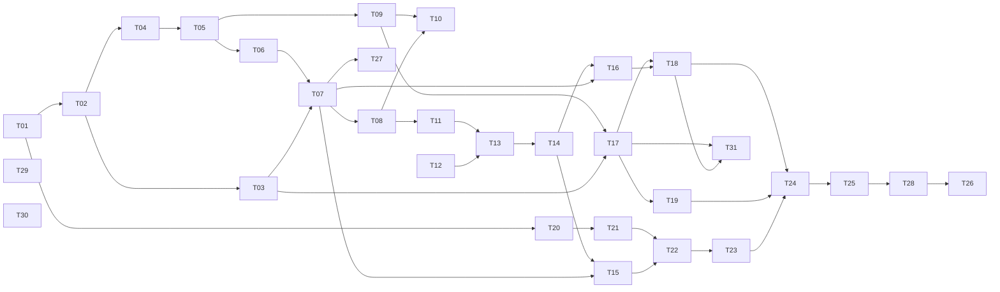

# GitPeek タスクリスト

v1（Phase 1〜9）の残作業を、人間が概ね 3 日で終える単位に割ったもの。

- **決定の記録**は [`docs/DESIGN.md`](docs/DESIGN.md)（**踏んだ落とし穴と割り切りは §17**）
- **実装中に毎回効く制約**は [`CLAUDE.md`](CLAUDE.md)
- **今やること（＝このファイル）** が進捗の唯一の正

**このファイルには「今やること」しか置かない**（2026-09-09 に整理した）。
作り終わった形の説明・教訓・割り切りは DESIGN.md にある。

---

## このファイルの規約

**着手前に必ずこの節を読むこと。**

1. **完了の記録はコミットと同時に行う。** タスクを終えたら、その実装と同じコミットで
   チェックを入れ、末尾の「完了済み」節へ 1 行に畳んで移す。別コミットにすると忘れる。

2. **ID は再利用しない。** タスクを削除・統合しても番号は空けたままにする。
   3 日に収まらないと判明したタスクは、**末尾に新しい ID を発番**して分割する
   （枝番 `T-13a` は使わない）。ID は発番順であり、実行順は「推奨する着手順」の表と
   各タスクの `依存:` 行が決める。

3. **受け入れ条件には 2 種類ある。**
   - `▸コマンド:` — 実行すれば判定できる。エージェントが自分で確認してよい
   - `▸目視:` — 人間の確認が必要
   
   **目視項目が 1 つでも残っているタスクを、エージェントが単独で「完了」と宣言してはいけない。**
   実装を終えたら「目視確認をお願いします」と述べて止まること。

4. **未着手タスクに書かれた型定義は着手時点の設計案であり、先行タスクの実装が正。**
   着手時に必ず実物と突き合わせ、食い違っていたらタスク本文を書き直してから実装する。

5. **骨子のままのタスクは、着手前に詳細化する。** ⑥実装内容と⑧受け入れ条件が埋まって
   いないタスクは、詳細化そのものを最初の作業として行う。
   **いま骨子のタスクは無い**（残っているのは詳細化済みの T-26 だけ。2026-09-09 時点）。

6. **制約の再掲は出典付き。** 各タスクの「制約」に書かれた内容は CLAUDE.md / DESIGN.md からの
   再掲であり、必ず出典を併記してある。**食い違いを見つけたら CLAUDE.md 側が正。**
   決定理由は再掲していないので、なぜそう決めたか知りたいときは DESIGN.md を読むこと。

---

## 現在地

**最終更新**: 2026-09-10

**次のセッションが最初にやること**

1. 下の「▸コマンド」を 4 つ流してベースラインを取る（直近は **Rust 482 / vitest 416** で全部緑）
2. **T-26 の日数を数え直す**（下の T-26 本文のコマンド。**日付が変わっていれば増えている**）
3. 7 日ぶん揃っていたら、**▸目視 1 問**（既存 GUI クライアントを一度も開かずに済んだか）を
   利用者に聞く。**それで v1 の DoD が埋まる**

```
npm run test:rust   npm run check:rust   npm run test   npm run typecheck
```

| 項目 | 内容 |
|---|---|
| 直前に完了 | **T-31**（取ってきてから、ブランチを進める。目視 2 巡・2 件、どちらも文言）＋ **v0.1.1 の公開** |
| いまここ | **T-26 の実運用だけ。2026-09-09 時点で 4 日ぶん / 8 リポジトリ**（09-06〜09-09）|
| 未解決の判断事項 | なし。ただし**文言はまだ途中で、利用者はまだ満足していない**（下記）|

**v1 の残りは T-26 の実運用だけ。** T-31（`git pull --ff-only` 相当）は
**CLAUDE.md §1 を緩める 3 件目**で、緩め方は既存の 2 件と揃えてある。理由は DESIGN.md §8.6 —
とくに**なぜ `git pull` を呼ばないのか**はそこにしか書いていない。

**待ち時間に T-32 / T-33 を入れた**（2026-09-09 に依頼、09-10 に目視で完了）。ブランチ一覧の
CSV 保存と、更新日でチェックを付け直す機能。**どちらも git の実行を増やしていない。**
決めたことと理由は DESIGN.md §6.4。

**作ってみて分かったこと（落とし穴・割り切り）は DESIGN.md §17。**

**T-26 に残るは日数だけ。** T-26 の作業ぶん（zip・README）は終わっていて、
**カレンダー時間が経つのを待つ**（規約の 3 日基準の例外）。ログが 7 日ぶん揃うのは
**2026-09-12 ごろ**。リポジトリ数は 8 個で足りているので、**足りないのは日数だけ**。
最後に ▸目視 1 問（既存 GUI クライアントを一度も開かずに済んだか）へ答えてもらえば
v1 の DoD が埋まる。

### 文言はまだ途中（T-29 の 1 巡目のあと。2026-09-06）

**利用者は「問題ない」と言ったが、「満足していない。今後もっと改善していく」とも
言った。通ったことにして忘れないこと。**

1 巡目で取ったのは**削れば直る硬さ**（自明な主語・重ね書き・翻訳調の連体修飾・
「〜の可能性があります」・「〜してください」の多用）。**残っているのは、
画面の中で読んだときにしか分からないもの** — 前後の文とのつながり、同じ画面に
並んだときの語調のばらつき、長さの釣り合い。**一覧をまとめて読んでも見つからない。**

**次に触るときは、実運用の中で引っかかった文を挙げてもらう形にする**
（T-26 の 1 週間はどのみち待ち時間なので、その間に溜める）。
**画面の名前と、そこで読んだ文をそのまま**もらえば直せる。

### 済んだ Phase で決めたこと — 出典だけ置く

**毎回効く制約は CLAUDE.md、決定理由は DESIGN.md に移してある。**
ここへ書き写すと必ずどちらかが古くなるので、迷ったら出典を読むこと。

| Phase | 決まったこと | 出典 |
|---|---|---|
| 2 | レーン割り当てと描線（**判定ゲート合格 2026-09-03。以降動かさない**）／第 2 親のレーン合流は不採用 | CLAUDE.md §3 / DESIGN.md §5.1, §5.2, §15.1 |
| 3 | 可視 ref の絞り込みと ahead/behind ／ ref が数千本のときにペインが潰れる件 | CLAUDE.md §6 / DESIGN.md §4.4, §4.5, §6.4 |
| 4 | 3 ペイン配置 ／ 差分の色と語単位強調（強調の中では構文色をやめた）／ 文字コードの判別順 | DESIGN.md §6.1, §7.2, §9.1 |
| 5 | 任意 2 点比較（**`A...B` は 1 つの引数**）／ 作業ツリーの擬似行 | CLAUDE.md §6 / DESIGN.md §7.5, §10.3 |
| 6 | fetch の進捗・中止・放置警告・上流のタグ付け替え | CLAUDE.md §2, §8 / DESIGN.md §8.3, §8.3.1 |
| 6 | checkout の渡し分け ／ 確認画面 ／ FF マージ ／ 書き込み後は HEAD へ寄せる | CLAUDE.md §1, §2, §6 / DESIGN.md §8.1, §8.2, §8.5 |
| 7 | clone の引数と保存先の決め方 ／ 残骸の後始末（**自分が作ったフォルダだけ**）／ Job Object は入れない ／ サブモジュールは**確認画面で選ばれたときだけ** | CLAUDE.md §1, §4, §6, §8 / DESIGN.md §8.4 |

**利用者の判断で「実装しないと決めた」ものを 3 つ緩めてある**（ローカル追跡ブランチ /
サブモジュール / 取ってきてから進める）。どれも**「黙ってやらない」ほうを守った条件付きの
緩和**で、同じ形が必要になったら勝手に変えず利用者に聞くこと。
**一覧は CLAUDE.md §1 の表が正**（ここへ写すと必ず片方が古くなる）。

**EUC-JP の判別が当たらない件は「当面このまま」で決着した**（2026-09-03、利用者の判断）。
EUC-JP を使う予定が無く、**UTF-8 と Shift_JIS が判定できれば足りる**ため。挙動は
`encoding.rs` の `euc_jp_hiragana_is_misdetected_as_shift_jis` が固定している（DESIGN.md §9.1）。

### 登録済みリポジトリ（判定と目視に使うもの）

| リポジトリ | コミット | max_lane | 同時レーン平均 | ルート |
|---|---|---|---|---|
| gitviewer / AerialSoldierMaker / save_temperature | 24 / 22 / 10 | 0 | 1.00 | 1 |
| drogon | 2,298 | 20 | 2.91 | 1 |
| vite | 10,186 | 54 | 5.45 | 1 |
| onyx | 20,285 | 52 | 11.43 | 4（orphan ブランチ 2 本）|
| MinerU | 6,692 | — | — | **T-19 の目視で clone したもの**（ref 304 本）|
| linux | 148 万 | — | — | DESIGN.md §4.1 の非対象 |

小さい 3 つはマージが 1 件も無い一直線なので、枝分かれの確認には使えない。
**サブモジュールを持つリポジトリはまだ登録していない。** T-19 の目視には使ったが、
以後もサブモジュールの確認が要るなら 1 つ手元に置いておくとよい。

**100 万コミット級の正式対応は v1.1 以降に送った**（DESIGN.md §1.1, §4.1 / 下の「v1.1」表）。
v1 では非対象のままだが、恒久的な非対象ではなくなった。

---

## 推奨する着手順

上から順に着手するのが効率的。

| 順 | Phase | タスク | 備考 |
|---|---|---|---|
| 1 | 1 | T-01 → T-02 → T-03 / T-04 | **済** |
| 2 | 2 | T-05 → T-06 → T-07 → T-08 → T-27 | **済**（T-08 は判定ゲート。合格） |
| 3 | 3 | T-09 → T-10 | **済** |
| 4 | 4 | T-11 → T-12 → T-13 → T-14 | **済** |
| 5 | 5 | T-15 → T-16 | **済** |
| 6 | 6-7 | T-17 → T-18 → T-19 | **済**（書き込み系はこれで終わり）|
| 7 | 8 | T-20 → T-21 → T-22 → T-23 | **済**（**Phase 8 完了 ＝ AI レビューは終わり**）|
| 8 | 9 | T-24 → T-25 → T-28 → T-29 / T-30 → **T-26** | いまここ。**T-26 で v1 が終わる**。作業は残っておらず、実運用 1 週間を待つだけ |
| 9 | 9 | T-31 | **済**（2026-09-08 に利用者が決めて足した。`git pull --ff-only` 相当。v0.1.1 として公開）|



---

# Phase 9 — 仕上げと配布

## - [ ] T-26 [Phase 9] 配布ビルドと DoD 検証

**目的**: ポータブル zip を作り、実運用で v1 の完成を判定する。**これで v1 が終わる。**

**参照**: DESIGN.md §2.3, §15.2 / CLAUDE.md §9, §10

**依存**: T-28（済）

**着手時に確認した現況（規約 4。2026-09-06 に調べた）**

- **`npm run package:zip` は既にある**（Phase 0 で用意済み。T-28 で名前を直した）。
  `tauri build` のあと PowerShell の `Compress-Archive` で
  `src-tauri/target/release/GitPeek.exe` を `dist-zip/GitPeek-portable.zip` にする。
  **まだ一度も走らせていない**（`tauri build` を通したことがない）
- **`tauri.conf.json` の `bundle.active` は `false`。** installer を作らないための設定で、
  exe そのものは `target/release` に出るので zip 化には足りる。**触らない**
- **ログの 1 行に `[<リポジトリのパス>]` が入っている**（`commandlog.rs` の `log_line`）。
  ファイルは日付ごとに分かれ 7 日で消える（T-24）。**DoD の「5 個以上」と「1 週間」は
  ログから数えられる**（下記）
- **`README.md` はまだ無い**

**DoD の測り方（2026-09-06 に利用者が決めた）**

**アプリ自身のログを証拠にする。日誌は書かない。**
ログの 7 日ローテーションが DoD の「1 週間」とちょうど同じ幅なので、
使い切った時点のログがそのまま記録になっている。

| DoD の要素 | どう確かめるか |
|---|---|
| 実リポジトリ **5 個以上** | ログの `[<パス>]` を数える（**▸コマンド**。下記） |
| **1 週間** 実運用 | `gitpeek-YYYY-MM-DD.log` が 7 日ぶん揃っている（**▸コマンド**。同上） |
| 既存 GUI クライアントを**一度も開かずに済んだ** | **▸目視。利用者に 1 度だけ聞く**（他の目視項目と同じ扱い。答えはこのタスクを畳むときに 1 行で残る）|

**`docs/dod.md` のような手書きの記録は作らない**（**利用者が断った**。
一度しか使わない記録を書き続けることになる）。**数える道具も足さない** —
一度きりの確認のために永久に残るスクリプトを増やさない（T-28 で移行コードを
書かなかったのと同じ理由）。**下のコマンドをその場で打つ。**

```
cd "$APPDATA/com.tatsu.gitpeek/logs"
ls gitpeek-*.log | wc -l
grep -ho '\[[A-Za-z]:\\[^]]*\]' gitpeek-*.log | sort -u
```

**リポジトリを数える行は 2026-09-09 に直した。** 元は `'\[[^]]*\]'` で角括弧を全部拾って
いたが、**git の stderr に出る `[new branch]` / `[new tag]` まで数えていた**（T-31 で fetch を
よく使うようになって表に出た。8 個のはずが 10 と出る）。**パスの形（`C:\…`）で絞る。**
数え方の穴は、数が増えたときではなく**増えた理由を見たときにしか気付けない。**

**この行をエージェントに流させると 0 個と出る。** `\\` がツールを 1 段通る間に
`\` へ剥がれ、grep が「文字としての `[`」を探しに行って 1 件も当たらない
（ヒアドキュメントに入れても剥がれる）。**0 個だったら数え方ではなくこれを疑う。**
`'\[[A-Za-z]:[^]]*\]'` ならバックスラッシュが要らず、
`[new branch]` も拾わないので同じ数になる（2026-09-09 に踏んだ）。

**2026-09-09 時点で実行済み: 4 日ぶん（09-06 / 09-07 / 09-08 / 09-09）/ 8 リポジトリ。**
リポジトリ数は既に足りている（`drogon` / `dycora` / `linux` / `onyx` / `vite` /
`AerialSoldierMaker` / `gitviewer` / `save_temperature`）。**残るは日数だけで、
7 日ぶん揃うのは 2026-09-12 ごろ。**

**実装内容**

1. `npm run package:zip` を実際に走らせる。**済（2026-09-06）** — 通った。
   ただし **exe の実体が `gitpeek.exe`（小文字）になっていた**。cargo のパッケージ名が
   そのまま出ており、zip が `GitPeek.exe` で通っていたのは
   **Windows が大文字小文字を区別しないおかげの偶然**だった。
   `tauri.conf.json` に **`mainBinaryName: "GitPeek"`** を足して実体を揃えた
2. zip を**別のフォルダへ展開して起動**する。開発ビルドとの差異を見る —
   `%APPDATA%` の解決 ／ アイコン ／ ウィンドウの初期サイズ ／ WebView2
3. `README.md` を書く。**済（2026-09-06）** — 何ができて何を「しないと決めた」か
   （CLAUDE.md §1）／ 起動方法 ／ 設定とログの置き場所
   （`%APPDATA%\com.tatsu.gitpeek\`）／ git と WebView2 が要ること ／
   リポジトリ内 skill が既定で無効なこと ／ AdGuard で白くなる話
4. 1 週間使う。**終わりに上のコマンドを打ち、目視 1 問に答えてもらう**。
   **2026-09-08 時点で 3 日ぶん**（このタスクの外で、公開・リリース・アイコンの差し替えを
   挟んでいる。現在地の表を見ること）

**制約**

- Tauri の bundler に zip ターゲットは無いので、`src-tauri/target/release/GitPeek.exe` を
  npm script で zip 化する（CLAUDE.md §10）
- **`bundle.active` を `true` にしない**（installer は恒久的に非対象）
- **速度を測るならリリースで測る**（CLAUDE.md §8）

**受け入れ条件**

- ▸コマンド: `npm run package:zip` が `dist-zip/GitPeek-portable.zip` を生成する
- ▸コマンド: `npm run test:rust` / `npm run check:rust` / `npm run test` / `npm run typecheck`
- ▸コマンド: ログに **7 日ぶんのファイル**と **5 個以上のリポジトリ**があること（上記）
- ▸目視: zip を**別のフォルダへ展開した exe が単体で起動する**こと
- ▸目視: リリースビルドで、設定とログが `%APPDATA%\com.tatsu.gitpeek\` に出ること
- ▸目視: **既存 GUI クライアントを一度も開かずに済んだ**こと（**1 度だけ聞く**）

**⚠️ このタスクはエージェントが単独で完了を宣言してはいけない。**

**非スコープ**: 自動更新／コード署名／インストーラ（すべて恒久的に非対象）／
アイコンの差し替え／`docs/dod.md` のような手書きの記録（**利用者が断った**）

**注記**: 3 日基準の例外。作業時間ではなくカレンダー時間（実運用 1 週間）。
**zip と README はすぐ終わる。** そのあと 1 週間空く。

---

# v1.1 以降（ID は振らない）

着手が近づいた時点で詳細化し、末尾から新しい ID を発番する。

## v1.1

| 項目 | 内容 | 参照 |
|---|---|---|
| コミット検索 | メッセージ / 作者 / `log -S` によるコード内容検索 | DESIGN.md §15.3 |
| stash 一覧 | stash の閲覧のみ（作成・適用はしない） | DESIGN.md §15.3 |
| ファイル単位の履歴 | `log --follow` によるファイルの変更履歴 | DESIGN.md §15.3 |
| ブランチ同士の比較 | `origin/main...HEAD` 形式の比較を専用 UI から起動 | DESIGN.md §10.3 |
| `--cc` マージ差分 | マージコミットで両親と異なる部分だけを示す combined diff | DESIGN.md §7.4 |
| 画像差分 | 画像ファイルの変更を並べて表示 | DESIGN.md §7.2 |
| リポジトリのグループ分け | サイドバーでフォルダによる分類 | DESIGN.md §6.2 |
| ローカル追跡ブランチ作成 | `checkout -b --track` を明示的なメニュー項目として追加 | DESIGN.md §8.1 |
| 100 万コミット級リポジトリ | 「全件をフロントへ渡す」前提の見直し。v1 は自動で読まないだけ | DESIGN.md §1.1, §4.1 |
| **文言の見直し 2 巡目** | **T-29 は 1 巡目で、利用者はまだ満足していない。** 実運用で引っかかった文を挙げてもらって直す（一覧をまとめて読んでも見つからない種類が残っている）| 「現在地」の節 |

## v2.0

| 項目 | 内容 | 参照 |
|---|---|---|
| blame | 行ごとの最終変更コミットの表示 | DESIGN.md §15.3 |
| reflog | reflog の閲覧 | DESIGN.md §15.3 |
| submodule 対応 | submodule の中身を辿れるようにする（v1 は「壊れない」だけ担保） | DESIGN.md §15.3 |

---

# 完了済み

| ID | Phase | タイトル | コミット |
|---|---|---|---|
| — | 0 | Tauri v2 雛形 ＋ git 検出 ＋ git コマンドログパネル | `93867ed` |
| T-01 | 1 | 設定ストアと %APPDATA% レイアウト（settings.json / state.json） | `cf5fd37` |
| T-02 | 1 | リポジトリの登録・判定・フォルダスキャン ＋ テスト用リポジトリ生成 | `1f368b7` |
| T-03 | 1 | リポジトリ一覧サイドバーと切替 ＋ 右クリック登録解除・D&D 並べ替え | `80189ea` |
| T-04 | 1 | コミットメタ情報の全件取得とパース ＋ 読み込み進捗と大規模リポジトリの確認 | `c9aae9d` |
| T-05 | 2 | レーン割り当てアルゴリズム ＋ topo / date の並び順 | `6601800` |
| T-06 | 2 | レーン配列 → SVG パス生成と描線 | `e6e877f` `7793d6a` `4bce75b` |
| T-07 | 2 | コミットリストの仮想スクロールと列表示 | `a419547` `f1da933` |
| T-08 | 2 | 判定ゲート — 美しさの検証と調整（**合格**） | `d861dba` `1a5f36a` `1662e52` |
| T-27 | 2 | orphan ブランチと履歴の終端に印を付ける | `3339a0c` |
| T-09 | 3 | 到達可能集合と ahead/behind の計算 | `01a1571` |
| T-10 | 3 | ブランチ / タグツリー UI | `79e5311` `4fb5ec9` |
| T-11 | 4 | コミット詳細と変更ファイル一覧（＋ 3 ペインへの配置替え） | `f0a7906` `041197b` |
| T-12 | 4 | 文字コード自動判別と改行コード検出 | `415e71f` |
| T-13 | 4 | 差分の取得・パースと side-by-side 描画 | `f6ff002` `012364a` |
| T-14 | 4 | Shiki ハイライトと大差分の折りたたみ | `9489720` |
| T-15 | 5 | 任意 2 コミット間差分 | `50a12fb` |
| T-16 | 5 | 作業ツリーの read-only 表示 | `fa7f998` |
| T-17 | 6 | fetch と放置警告 | `b12ec13` `6677914` `4e61936` |
| T-18 | 6 | checkout と FF マージのガード（**Phase 6 完了**） | `6ee4e1f` `cde5db4` `46ed744` |
| T-19 | 7 | URL から clone（**Phase 7 完了 ＝ 書き込み系は終わり**） | `555430b` `300e58b` `5a5298b` |
| T-20 | 8 | LLM プロバイダ設定と資格情報保管（keyring / ureq を追加。MSRV 1.88 へ） | `058db91` |
| T-21 | 8 | skill の読み込みと信頼モデル（**信頼はスキルごと**。globset を追加） | `533e251` `78fb9a9` |
| T-22 | 8 | レビュー実行エンジン（SSE ／ hunk 分割 ／ Markdown フォールバック。**依存を増やさず**） | `d8f7680` `a41ab5e` |
| T-23 | 8 | レビュー UI と結果の永続化（**Phase 8 完了**。目視 2 巡・1 件 ＋ 要望 2 件） | `625de38` `a952b6b` `f531b8e` `47776ff` |
| T-24 | 9 | ログファイルと panic の受け皿 ＋ マスキングの点検（`tauri-plugin-log` を追加） | `4a4ca0a` `af015e2` |
| T-25 | 9 | 設定画面とショートカット ＋ 差分内検索（目視 9 項目通過・要望 1 件。**依存を増やさず**） | `3af5ea2` `808afb2` `02bf7e3` |
| T-28 | 9 | `Givsoner` → `GitPeek` の改名（**identifier ごと変え、移行はしない**。経緯は DESIGN.md §2.3.1） | `0495f94` `2bc1c07` |
| T-30 | 9 | リポジトリの右クリックに「エクスプローラーで開く」（**パスは渡さず ID だけ**）| `56e6e82` `ee1cbae` |
| T-29 | 9 | 画面の文言の見直し **1 巡目**（`ja.ts` ＋ Rust 側。**まだ満足はされていない** — 「現在地」の節）| `a6f3c82` `ee1cbae` |
| — | 9 | GitLab へ公開 ＋ **v0.1.0 リリース**（`npm run release`。DESIGN.md §2.3.2）／ README と MIT ライセンス | `8359499` `cd936d1` `1aadbf5` |
| — | 9 | アプリのアイコンを独自の図案へ（DESIGN.md §2.3.3）／ **コード署名は「しない」を維持**（§2.3.4）| `5448c85` `3b62aa1` |
| T-31 | 9 | 取ってきてから、ブランチを進める（`git pull --ff-only` 相当。**CLAUDE.md §1 を緩める 3 件目**。目視 2 巡・2 件、どちらも文言。v0.1.1 として公開）| `f1cb3b0` `ea47af8` `b552922` |
| — | 9 | **v0.1.1 リリース**（T-31 入り。v0.1.0 で残っていたアイコンの積み残しもここで解消）| `ea47af8` `b552922` |
| T-32 | — | ブランチ一覧を CSV に保存（**チェック済みだけ / タグは入れない**。UTF-8 BOM 付き。`export_markdown` を `export_text` へ改名。DESIGN.md §6.4、割り切りは §17.2）| |
| T-33 | — | 更新日でブランチのチェックを付け直す（**押したときだけ効く**。**日付だけの ISO 文字列は UTC の 0 時**という罠を踏んだ。DESIGN.md §6.4、§17.1）| |
