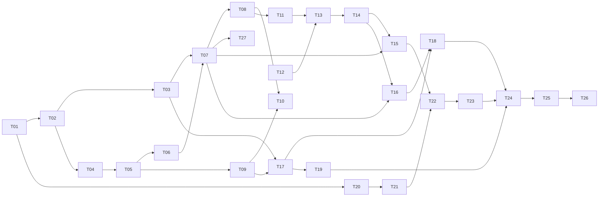

# Givsoner タスクリスト

v1（Phase 1〜9）の残作業を、人間が概ね 3 日で終える単位に割ったもの。

- **決定の記録**は [`docs/DESIGN.md`](docs/DESIGN.md)
- **実装中に毎回効く制約**は [`CLAUDE.md`](CLAUDE.md)
- **今やること（＝このファイル）** が進捗の唯一の正

---

## このファイルの規約

**着手前に必ずこの節を読むこと。**

1. **完了の記録はコミットと同時に行う。** タスクを終えたら、その実装と同じコミットで
   チェックを入れ、末尾の「完了済み」節へ 1 行に畳んで移す。別コミットにすると忘れる。

2. **ID は再利用しない。** タスクを削除・統合しても番号は空けたままにする。
   3 日に収まらないと判明したタスクは、**末尾に新しい ID を発番**して分割する
   （枝番 `T-13a` は使わない）。ID は発番順であり、実行順は「推奨する着手順」の表と
   各タスクの `依存:` 行が決める。

3. **受け入れ条件には 2 種類ある。**
   - `▸コマンド:` — 実行すれば判定できる。エージェントが自分で確認してよい
   - `▸目視:` — 人間の確認が必要
   
   **目視項目が 1 つでも残っているタスクを、エージェントが単独で「完了」と宣言してはいけない。**
   実装を終えたら「目視確認をお願いします」と述べて止まること。

4. **未着手タスクに書かれた型定義は着手時点の設計案であり、先行タスクの実装が正。**
   着手時に必ず実物と突き合わせ、食い違っていたらタスク本文を書き直してから実装する。

5. **骨子のままのタスクは、着手前に詳細化する。** ⑥実装内容と⑧受け入れ条件が埋まって
   いないタスクは、詳細化そのものを最初の作業として行う（本文に「骨子」と書いてある節から先）。
   **いまは T-23 以降が骨子**（T-22 は 2026-09-05 に詳細化済み・実装前）。

6. **制約の再掲は出典付き。** 各タスクの「制約」に書かれた内容は CLAUDE.md / DESIGN.md からの
   再掲であり、必ず出典を併記してある。**食い違いを見つけたら CLAUDE.md 側が正。**
   決定理由は再掲していないので、なぜそう決めたか知りたいときは DESIGN.md を読むこと。

---

## 現在地

**最終更新**: 2026-09-05

| 項目 | 内容 |
|---|---|
| 直前に完了 | T-21 skill の読み込みと信頼モデル（目視 2026-09-05 通過） |
| 次にやる | **T-22 レビュー実行エンジン（Phase 8）。詳細化は済み、実装はこれから** |
| 未解決の判断事項 | **T-22 の「この節で決めた実装レベルの選択」8 件の確認**（依存は増えない） |

**T-23 以降が骨子**なので、着手時に詳細化そのものを最初の作業として行うこと（規約 5）。
残りは T-22 → T-23 で Phase 8 が終わり、そのあと Phase 9（T-24 → T-25 → T-26）。

**T-22 は T-20 と T-21 の上に乗る。** 3 つのチョークポイントが用意してある。

| モジュール | 何が閉じているか |
|---|---|
| `llm/client.rs` | 接続・タイムアウト・失敗の言い分け・**マスキング**（`sanitize`）|
| `secret.rs` | API キーの出し入れ。**ここ以外でキーに触らない** |
| `llm/skill.rs` | レビュー観点と**信頼判定**。本文は `usable_body()` からしか出ない |

**とくに skill 本文は `SkillEntry::usable_body()` からしか取らないこと。**
`preview` は画面で読ませるためのもので、プロンプトへ入れてはいけない（CLAUDE.md §4）。
`SkillEntry::active()` が「隠されていない ＋ 使う ＋ 信頼済み」で絞ってくれる。

### これまでに踏んだ落とし穴（次も効く）

**安全側の仕組みは、粒度を細かくすると特別扱いが消えることがある**（T-21）。
リポジトリ単位の信頼で作ったときは「信頼したあとファイルが増えたら再確認」という
条件を足す必要があったが、**ファイル単位へ絞ったら、増えたものは記録が無いので
そのまま未決**になり、条件ごと要らなくなった。**条件を足す前に、粒度を疑うこと。**

**コミット前に `git status` を見る**（T-21）。`git add -A` で、利用者が目視のために
置いた `.gitviewer/skills/*.md` を巻き込んでコミットした（amend で外した）。
**作った覚えのないファイルが混ざっていないか、`--name-only` で必ず目を通す。**

**テストの入力が「ありそうな形」に寄ると、端の値が丸ごと抜ける**（T-20）。API キーを
伏せ字にする処理を `sk-example-key-0123456789` のような**それらしい長さ**でしかテストして
いなかったので、**1 文字のキー（`a`）で応答本文が壊れる**のを目視で初めて踏んだ
（`message` が `mess***ge` になり、JSON のキー名まで潰れて理由が取り出せなくなった）。
**利用者が入れうる最短・最長・空を、思い付きではなく列挙して 1 本ずつ書くこと。**

**画面まで一度も通していない経路は、テストが緑でも動かないと思ったほうがよい**（T-18）。
`rename_all_fields` を落としていて、引数の組み立てを固定するテストが全部通ったまま、
ボタンが 1 度も機能しなかった。**フロントから構造体を送る箇所は、Rust 側がその JSON を
実際に食えることをテストで固定する**（CLAUDE.md §8）。T-19 では
`the_clone_wire_format_matches_what_the_front_end_sends` がその役をしている。

**判定をコンポーネントに直書きするとテストが 1 つも当たらない**（T-19）。フロントは
純関数だけテストする決まりなので、`.tsx` に書いた条件は誰も見ていない。実際、
clone の「この保存先を次回から既定にする」は**条件が常に成立せず一度も表示されない**まま
コマンドの受け入れ条件を全部通した。**判定は `src/lib/*.ts` へ出してから書く。**

**押せる条件でだけ選択肢を出すと、画面から消えて何が効いているのか読めなくなる**（T-19）。
押せない形で残し、押せない理由といまの値を文言に出す（CLAUDE.md §6）。

**UI の文言は「何が起きるか」で書く**（T-18）。「FF マージ」は通じなかった。
メニューは「main に origin/x を取り込む」のように方向を名前で書き、
**できないときも何ができないのかを説明する**。

**目視は 1 巡では終わらない。** T-18 は 3 巡・9 件、T-19 は 2 巡・2 件、
T-20 は 3 巡・3 件、T-21 は 2 巡・2 件だった。
実装が終わった時点を「終わり」と見積もらないこと。

**目視で来るのはバグだけではない。設計の作り直しで来る**（T-21）。
「リポジトリごとの観点をアプリ全体の設定に置くな」「信頼はスキルごとにしろ」は
どちらも動くものへの指摘ではなく、**形そのものへの指摘**だった。
受け入れ条件を全部通していても、**触ってみて初めて分かる形**がある。

### 抱えている割り切り（承知の上で残してあるもの）

- **skill を編集する画面は無い**（T-21）。グローバルは `%APPDATA%\com.tatsu.givsoner\skills\`
  を直接編集する。**アプリから足せるのは「追加の指示」だけ**で、これは `settings.json` に
  入り skill ファイルは書き換えない（他人のリポジトリの skill にも足せるようにするため）
- **「追加の指示」は欄から離れたときに保存する**（T-21）。保存ボタンは置いていない。
  書きかけで別の場所を押すと保存されるが、**中身が変わったときだけ書く**ので
  `settings.json` が無駄に上書きされることはない
- **symlink を辿らないことのテストは、開発者モードか管理者権限が要る**（T-21）。
  作れない環境では**理由を出して落ちる** — 黙って素通りさせると、守れているのか
  確かめていないのか区別が付かなくなるため。外すときは `GIVSONER_SKIP_SYMLINK_TEST=1`

- **probe は 1 リポジトリあたり git を 5 回起動する。** T-17 でリモートの有無を足したぶん
  1 回増えた。この環境では 1 回 34ms（実測）なので、登録 7 件で一覧の更新が 240ms ほど伸びる。
  リモートの有無は「放置警告を永久に出し続けない」ための必須情報なので落とせない。
  気になるようになったら、**リポジトリごとの probe を並列にする**のが効く（いまは 1 件ずつ順）
- **中止で落とせるのは git 本体だけ。** `git-remote-https` のような子は残りうる。親が死ねば
  追って終わるが即座ではないので、理屈の上では「中止しています…」のまま返ってこない経路がある。
  **T-19 で「Job Object は入れない」と決着した**（DESIGN.md §8.4）。clone の残骸は
  再試行で消しており、消せなければ場所を出す。fetch 側はそもそも残骸の概念が無い
- **確認画面を出すまでに git を 9 回起動する**（T-18）。判定に probe（5 回）と
  `status`（4 回）を通すため、この環境では 300ms ほど無反応になる。判定を 1 箇所に
  保つほうを取った（probe を分解すると bare / unborn / `index.lock` の判定が 2 系統になる）。
  気になるようになったら、**確認画面を先に出して判定を後から差し込む**のが素直
- **サブモジュールが取り込まれることを結合テストで確かめられない**（T-19）。git 2.38 以降は
  サブモジュールの `file` トランスポートを拒む（この環境の git 2.43 で実測）ので、生成した
  ローカルの上流では成功しない。`protocol.file.allow` を緩めると全 git 呼び出しに効くので
  行わず、**フラグが実際のプロセスへ届いていること**をコマンドログで固定してある

### 済んだ Phase で決めたこと — 出典だけ置く

**毎回効く制約は CLAUDE.md、決定理由は DESIGN.md に移してある。**
ここへ書き写すと必ずどちらかが古くなるので、迷ったら出典を読むこと。

| Phase | 決まったこと | 出典 |
|---|---|---|
| 2 | レーン割り当てと描線（**判定ゲート合格 2026-09-03。以降動かさない**）／第 2 親のレーン合流は不採用 | CLAUDE.md §3 / DESIGN.md §5.1, §5.2, §15.1 |
| 3 | 可視 ref の絞り込みと ahead/behind ／ ref が数千本のときにペインが潰れる件 | CLAUDE.md §6 / DESIGN.md §4.4, §4.5, §6.4 |
| 4 | 3 ペイン配置 ／ 差分の色と語単位強調（強調の中では構文色をやめた）／ 文字コードの判別順 | DESIGN.md §6.1, §7.2, §9.1 |
| 5 | 任意 2 点比較（**`A...B` は 1 つの引数**）／ 作業ツリーの擬似行 | CLAUDE.md §6 / DESIGN.md §7.5, §10.3 |
| 6 | fetch の進捗・中止・放置警告・上流のタグ付け替え | CLAUDE.md §2, §8 / DESIGN.md §8.3, §8.3.1 |
| 6 | checkout の渡し分け ／ 確認画面 ／ FF マージ ／ 書き込み後は HEAD へ寄せる | CLAUDE.md §1, §2, §6 / DESIGN.md §8.1, §8.2, §8.5 |
| 7 | clone の引数と保存先の決め方 ／ 残骸の後始末（**自分が作ったフォルダだけ**）／ Job Object は入れない ／ サブモジュールは**確認画面で選ばれたときだけ** | CLAUDE.md §1, §4, §6, §8 / DESIGN.md §8.4 |

**利用者の判断で「実装しないと決めた」ものを 2 つ緩めてある。** どちらも
**「黙ってやらない」ほうを守った条件付きの緩和**であり、同じ形が必要になったら
勝手に変えず利用者に聞くこと。

| いつ | 何を | 条件 |
|---|---|---|
| 2026-09-04 | ローカル追跡ブランチの作成（`checkout -b --track`） | checkout の確認画面で**選ばれたときだけ**（DESIGN.md §8.1）|
| 2026-09-05 | サブモジュールの取り込み（`--recurse-submodules`） | clone の確認画面で**チェックされたときだけ**（DESIGN.md §8.4）|

**EUC-JP の判別が当たらない件は「当面このまま」で決着した**（2026-09-03、利用者の判断）。
EUC-JP を使う予定が無く、**UTF-8 と Shift_JIS が判定できれば足りる**ため。挙動は
`encoding.rs` の `euc_jp_hiragana_is_misdetected_as_shift_jis` が固定している（DESIGN.md §9.1）。

### 登録済みリポジトリ（判定と目視に使うもの）

| リポジトリ | コミット | max_lane | 同時レーン平均 | ルート |
|---|---|---|---|---|
| gitviewer / AerialSoldierMaker / save_temperature | 24 / 22 / 10 | 0 | 1.00 | 1 |
| drogon | 2,298 | 20 | 2.91 | 1 |
| vite | 10,186 | 54 | 5.45 | 1 |
| onyx | 20,285 | 52 | 11.43 | 4（orphan ブランチ 2 本）|
| MinerU | 6,692 | — | — | **T-19 の目視で clone したもの**（ref 304 本）|
| linux | 148 万 | — | — | DESIGN.md §4.1 の非対象 |

小さい 3 つはマージが 1 件も無い一直線なので、枝分かれの確認には使えない。
**サブモジュールを持つリポジトリはまだ登録していない。** T-19 の目視には使ったが、
以後もサブモジュールの確認が要るなら 1 つ手元に置いておくとよい。

**100 万コミット級の正式対応は v1.1 以降に送った**（DESIGN.md §1.1, §4.1 / 下の「v1.1」表）。
v1 では非対象のままだが、恒久的な非対象ではなくなった。

---

## 推奨する着手順

上から順に着手するのが効率的。

| 順 | Phase | タスク | 備考 |
|---|---|---|---|
| 1 | 1 | T-01 → T-02 → T-03 / T-04 | **済** |
| 2 | 2 | T-05 → T-06 → T-07 → T-08 → T-27 | **済**（T-08 は判定ゲート。合格） |
| 3 | 3 | T-09 → T-10 | **済** |
| 4 | 4 | T-11 → T-12 → T-13 → T-14 | **済** |
| 5 | 5 | T-15 → T-16 | **済** |
| 6 | 6-7 | T-17 → T-18 → T-19 | **済**（書き込み系はこれで終わり）|
| 7 | 8 | T-20 → T-21 → **T-22** → T-23 | いまここ。T-20 / T-21 は済。**T-23 は着手前に詳細化**（規約 5）|
| 8 | 9 | T-24 → T-25 → T-26 | |



---

# Phase 8 — AI レビュー

## - [ ] T-22 [Phase 8] レビュー実行エンジン

**目的**: 差分をファイル単位で LLM に投げ、結果を構造化して受け取る。**フォールバック経路が要。**
ここで作る「レビューを 1 回走らせる」経路を T-23 の画面がそのまま呼ぶ。

**参照**: DESIGN.md §10.4, §10.5, §10.6, §10.7, §11.3 / CLAUDE.md §2, §4, §7, §8

**依存**: T-21, T-15

**T-20 / T-21 までの申し送り（着手時に確認すること。規約 4）**

- **チョークポイントを外に書き直さない**（CLAUDE.md §4・§7）。
  - `llm/client.rs` — 接続・タイムアウト・失敗の言い分け・**マスキング（`sanitize`）**。
    **HTTP はここ以外に書かない。** ストリーミングもここへ足す
  - `secret.rs` — API キーの出し入れ。**ここ以外でキーに触らない**
  - `llm/skill.rs` — レビュー観点と信頼判定。**本文は `usable_body()` からしか出ない**
- **`SkillEntry::preview` をプロンプトへ入れてはいけない**（CLAUDE.md §4）。
  画面で読ませるためのもので、**未信頼の skill にも入っている**。
  絞り込みは `SkillEntry::active()`（隠されていない ＋ 使う ＋ 信頼済み）を通す
- **`ReviewSettings` は T-01 で既にある**（`store/settings.rs`）。
  `concurrency: u8`（既定 1）と `context_lines: u8`（既定 10）で、**新設ではなくこれが正**。
  `Settings::normalize` が `concurrency` を `1..=MAX_REVIEW_CONCURRENCY`(3) に丸める
- **`saved_endpoint()` が lib.rs に既にある**。プロファイルとキーはここから取る。
  **フロントから平文のキーを受け取る引数を増やさない**（DESIGN.md §10.2.1）
- **`git::exec::Cancel` をそのまま使う**（中身は `Arc<AtomicBool>` だけ）。
  中止の型を 2 つ作ると、どちらを見ているのか読めなくなる
- **`uuid` / `sha2` / `serde_json` は既に依存にある。** T-22 で足す依存は**無い**
- **判定・整形をコンポーネントやフックに直書きしない**（T-19・T-21 で嵌まった）。
  ただし T-22 では**判定そのものを Rust に置く**（下の「見積もりを 2 言語に持たない」）
- **フロントと Rust をまたぐ構造体は両方向テストする**（T-18 / T-21）。
  送る側 `..._matches_what_the_front_end_sends` と受ける側 `..._matches_what_the_front_end_reads`
- **最短・最長・空を列挙して書く**（T-20 で 1 文字のキーを踏んだ）。ここでは
  **1 文字の API キー / 空のキー / hunk 0 個のファイル / 応答 0 バイト / 空の findings** が該当する

**この節で決めた実装レベルの選択**（DESIGN.md 付録 B の範囲。**着手前に利用者へ確認する**）

| 決めたこと | 理由 |
|---|---|
| **新しい依存は足さない。** SSE のパースも並列実行も `std` と `serde_json` で書く | SSE は「行に切って `data:` を読む」だけで、`git/fetchprogress.rs` が `\r` 区切りでやっているのと同じ形。並列度は最大 3 なので `std::thread::scope` で足りる |
| 差分本文は **`FileDiff` の hunks から組み立てる**（`git diff` の生出力を別経路で取り直さない）| `file_diff` が**文字コードの判別を済ませてある**（`encoding.rs`）。生の stdout を直に使うと **Shift_JIS のファイルで JSON が壊れる**。組み立ては純関数なので、**hunk 分割がそのまま「hunk を選んで組み立て直す」で書ける** |
| トークン見積もりは **Rust 側だけに置く**（`文字数 ÷ 4`。DESIGN.md §10.4）| 実行前パネル（T-23）の概算と、hunk 分割の判定が**同じ数**でなければならない。TS と Rust に 1 つずつ置くと必ずずれる。フロントへは**計算済みの数と「分割されます」の印**を渡す |
| コンテキスト超過は **①見積もりで先に分ける ②それでも超過エラーが返ったら分けて 1 度だけ再試行** の 2 段 | `文字数 ÷ 4` は日本語で大きく外れる（1 文字 ≒ 1 トークン）。見積もりを賢くする代わりに、**外したときに拾える経路**を置く。DESIGN.md §10.4 の「粗い見積で足りる」を変えずに済む |
| `response_format: {"type":"json_object"}` は **送る。咎められたら外して 1 度だけ再試行し、以後その実行では付けない** | 本命の接続先は**ローカルの小型モデル**で、§10.6 がフォールバックを必須にしたのは**それがスキーマを守れない**から。遵守率を上げる指定を自分から捨てない（Ollama は OpenAI 互換層でこれを `format: "json"` に読み替える）。ただし受け付けないサーバに当たると**全ファイルが 400 で落ちてレビューが丸ごと失われる**ので、決定 3 と同じ「2 段」で拾う。**プロンプトでの JSON 要求は外さない**（`format: json` だけでは空白を吐き続けることがある）|
| ストリームのマスクは **末尾を持ち越してから流す**（ホールドバック）| チャンクの切れ目でキーが割れると、チャンクごとの `sanitize` をすり抜ける。**64 文字と鍵の長さの大きいほう**を手元に残し、次のチャンクと繋げてから流す |
| 「使う」と決めた skill が **1 つも当てはまらないファイルはレビューしない** | 観点無しで投げると、モデルが勝手な基準で書く。**除外して理由を出す**ほうが読める（CLAUDE.md §6） |
| 実サーバでの確認は **`#[ignore]` のテスト 1 本**（`GIVSONER_LLM_BASE_URL` を見て走る）| T-22 には画面が無い。**T-23 まで実物を一度も通さない**のは、T-18 の「緑でも動かない」を繰り返す |

**作成・変更するファイル**

| 種別 | パス | 内容 |
|---|---|---|
| 新規 | `src-tauri/src/llm/review.rs` | 計画・プロンプト組み立て・実行・JSON パースとフォールバック |
| 変更 | `src-tauri/src/llm/client.rs` | `chat_stream`（SSE ＋ 中止 ＋ **マスク済みの差分を流す**）を追加 |
| 変更 | `src-tauri/src/llm/mod.rs` | `pub mod review;` |
| 変更 | `src-tauri/src/git/diff.rs` | `DiffSource` を lib.rs から**引っ越す**（差分と共用。下記） |
| 変更 | `src-tauri/src/lib.rs` | `plan_review` / `start_review` / `cancel_review` ＋ `review-progress` ＋ `AppState.review_cancel` |
| 新規 | `src-tauri/tests/review.rs` | モックサーバでの結合テスト |
| 変更 | `src-tauri/tests/common/mockhttp.rs` | **少しずつ返す応答**（SSE）と同時接続数の記録を足す |
| 変更 | `src/lib/ipc.ts` | 型と `invoke` の口だけ（**画面は作らない**） |

**実装内容**

*何を比べるかは既存の型で受ける（`git/diff.rs`）*

- いま `lib.rs` に**私有**の `DiffSource`（`{kind:"range"|"workingTree"}`）がある。
  レビューも同じものを指すので、**`git::diff::DiffSource` へ引っ越して共用する。**
  ワイヤ形式は変えない（`kind` ＋ camelCase）。**両方が同じ型を使うので、
  ワイヤ形式のテストが 1 本で両方に効く**
- 未追跡ファイルは**レビュー対象にしない**。`git diff` に出ないので差分が無い（DESIGN.md §7.5）

*計画（`plan_review`）*

- 入力: `repository_id` / `source` / `profile_id`
- `changed_files` を取り、ファイルごとに
  - `file_diff`（`-U{review.context_lines}`、`ignore_whitespace: false`、文字コードは自動判別）
  - 差分本文を組み立て、`文字数 ÷ 4` で見積もる
  - 予算 = `context_window - max_tokens - 512`。超えるなら hunk 単位で `parts` に分ける
- 出力（**除外するものも消さずに理由付きで残す**。CLAUDE.md §6）

```rust
pub struct ReviewPlan {
    pub files: Vec<PlannedFile>,
    pub skills: Vec<PlannedSkill>,     // 名前 ＋ 出どころ。**本文は入れない**
    pub tokens_estimate: u32,
    pub blocked: Option<String>,       // 実行できない理由（そのまま画面に出す）
}
pub struct PlannedFile {
    pub path: String,
    pub old_path: Option<String>,
    pub status: ChangeStatus,
    pub tokens_estimate: u32,
    pub parts: usize,                  // 2 以上なら「hunk 分割されます」
    pub skipped: Option<String>,       // 「バイナリなので差分がありません」など
}
```

- `blocked` になるのは: プロファイルが選ばれていない / 使う skill が 0 件 /
  変更ファイルが 0 件。**押せない理由といまの値を文言に入れる**

*400 の扱いは 3 系統（`review.rs`）*

- **接続先の言い分で振り分ける。** 判定は `client.rs` に置く（`server_message` の解釈を
  外へ持ち出さない）。`review.rs` は返ってきた種類で分岐するだけ
  - `response_format` を咎めている → **その指定を外して 1 度だけ再試行**し、
    **以後その実行では最初から付けない**（同じ 400 を全ファイルで踏み直さない）
  - 文脈長・トークン数を咎めている → **hunk 分割して 1 度だけ再試行**
  - どちらでもない → **再試行せず**、そのファイルだけ失敗として記録して次へ進む
- **再試行はどの系統でも 1 度だけ。** 2 度目の 400 はそのまま失敗にする

*実行（`start_review`）*

- 入力: `repository_id` / `source` / `profile_id` / `paths`（利用者が残したファイル）
- **計画は Rust 側で組み直す。** フロントから受け取るのは「どのファイルを外したか」だけで、
  分割数も見積もりも渡させない（古い計画で走らせない）
- ファイルごとに 1 リクエスト。分割されたファイルは**部分ごとに投げて 1 件へまとめる**
- 全ファイルのあと**全体サマリ**を 1 リクエスト。渡すのは
  **各ファイルの要約と指摘の見出しだけ**（差分は渡さない）。予算を超えたら
  入るところまでにして「以下 N 件は要約に含めていません」を添える
- 並列度は `review.concurrency`（既定 1・最大 3）。`std::thread::scope` で待ち行列から取る
- **1 ファイルの失敗で全体を止めない。** そのファイルに `error` を記録して次へ進む
- 中止は `Cancel`。**ファイルの切れ目とストリームのチャンクごとに見る**

*プロンプト（`review.rs`。純関数）*

- system: 役割 ＋ **要求する JSON スキーマ**（DESIGN.md §10.6 の 5 キー）＋
  「指摘が無ければ `findings` は空配列」＋「差分に現れない行番号を書かない」＋
  **当てはまる skill の本文**（`usable_body()` を名前付きで連結）
- user: ファイルパス（リネームなら `旧 → 新`）／変更の種類／**unified diff** ／コミットメッセージ
- **skill の当て方は `skill::matches_changes(entry, &[そのファイルのパス])`。**
  ファイルごとに当たる観点が変わる（DESIGN.md §11.3）
- **コミットメッセージを渡すのは 1 コミットを見ているときだけ**（`from` がその第 1 親）。
  2 点比較と作業ツリーでは「何と何を比べているか」の 1 行だけを渡す
  （どのメッセージを指すのか決まらないものを、決まったふりで渡さない）
- **ファイル全文・リポジトリ構成・skill のパス・ハッシュは渡さない**（CLAUDE.md §7）

*差分本文の組み立て（`review.rs`。純関数）*

- `FileDiff.hunks` から `@@ -a,b +c,d @@ 見出し` ＋ ` ` / `+` / `-` を復元する
- **バイナリは投げない**（`skipped` にして理由を出す）
- 末尾に改行が無い行（`ending: None`）は `\ No newline at end of file` を添える
- hunk 分割は**この関数に渡す hunk を選ぶだけ**。1 つの hunk だけで予算を超えるときは
  そのまま投げ、`parts` に記録する（これ以上は割れない）

*ストリーミング（`client.rs`）*

- `POST {base}/chat/completions` に `"stream": true`。**接続テストは今まで通り `false`**
- タイムアウトは**別立て**にする: 接続 10 秒 / **最初の応答まで 120 秒** /
  本文全体は 600 秒（既定の `timeout_global` 120 秒のままだと、長い生成を途中で切る）
- 本文は `Body::as_reader()` で読み進め、**行に切ってから** SSE として解釈する
  - `:` で始まる行は無視（keepalive）
  - `data: [DONE]` で終わり
  - `data:` の JSON から `choices[0].delta.content` を足す
  - **JSON でない `data:` 行は捨てるが、生の応答としては残す**
  - **`stream` を無視して普通の JSON を返すサーバがある。** SSE として 1 件も読めず、
    本文が chat completion として読めたら `choices[0].message.content` を使う
- **チャンクをまたいだ行を必ずバッファする**（`\r\n` も `\n` も）
- 流す差分は `sanitize` を通す。**末尾は持ち越す**（ホールドバック。上表）
- チャンクごとに `cancel.is_cancelled()` を見て、立っていれば読むのをやめる

*結果（`review.rs`）*

```rust
pub struct ReviewRun {
    pub run_id: String,            // uuid。T-23 の保存名に使える
    pub profile_id: String, pub model: String,
    pub source: DiffSource, pub skills: Vec<PlannedSkill>,
    pub files: Vec<ReviewFileResult>,
    pub summary: Option<ReviewText>,
    pub failed: usize,             // **サマリに出す「N 件失敗」の正**
    pub cancelled: bool,
    pub started_at: i64, pub elapsed_ms: u64,
}
pub struct ReviewFileResult {
    pub path: String, pub old_path: Option<String>,
    pub parts: usize,
    pub text: Option<ReviewText>,  // 成功したぶん
    pub error: Option<LlmError>,   // このファイルだけの失敗
    pub elapsed_ms: u64, pub tokens_estimate: u32,
}
/// **構造化できたか、できなかったかの両方をここで持つ。**
pub struct ReviewText {
    pub summary: String,
    pub findings: Vec<Finding>,
    /// 構造化に失敗したときの生出力。**捨てない**（DESIGN.md §10.6）
    pub markdown: Option<String>,
    /// `markdown` が入っている理由。画面はこれをそのまま添える
    pub fallback_reason: Option<String>,
}
```

*JSON の読み取りとフォールバック（`review.rs`。純関数）*

- 素で読む → ```` ```json ```` のフェンスを剥がして読む → 最初の `{` から最後の `}` を読む、
  の順で試す。**どれも駄目なら `markdown` に生出力を入れて返す**
- 読めても中身は繕う。**指摘を落とすほうが、ラベルが雑なことより悪い**
  - `severity` が 4 つのどれでもない → `info` に寄せる
  - `line` が無い / 0 → `None`
  - `file` が無い → **いま見ているファイル名**で埋める
  - `findings` が無い → 空配列
  - `summary` が無い → 空文字（`markdown` は付けない。読めてはいる）

*イベント（`lib.rs`）*

- `review-progress` 1 本。`{kind}` で区別し、**どのファイルかを添える**
  （`started` / `fileStarted` / `delta` / `fileDone` / `summaryStarted` / `summaryDelta` / `summaryDone`）
- 並列度 2 以上では `delta` が混ざるので、**必ず `index` を見て振り分けられる形**にする
- `run_id` を全イベントに載せる（中止して次を始めたとき、前の走りの残りを捨てられる）

**制約**

- **ファイル全文を渡さない**（CLAUDE.md §7）。渡すのは パス ＋ unified diff ＋
  コミットメッセージ ＋ skill 本文だけ
- **JSON → Markdown フォールバックは必須。** この経路をテストで必ず通す（CLAUDE.md §7）
- **1 ファイルの失敗で全体を止めない**（CLAUDE.md §7）
- **skill 本文は `usable_body()` からしか取らない。`preview` を渡さない**（CLAUDE.md §4）
- **LLM から外へ出る文字列は `client.rs` の `sanitize` を通す**（CLAUDE.md §4）。
  ストリームの差分も画面へ出るので同じ扱い
- **git の実行は `git/exec.rs` を通す**（CLAUDE.md §2）。`Command::new("git")` を書かない
- **HTTP は `llm/client.rs` を通す**（CLAUDE.md §7）。`review.rs` から `ureq` を直に触らない
- 表示文言は `src/i18n/ja.ts`（CLAUDE.md §6）。ここで足すのは型と `invoke` の口だけ
- **新しい依存を足さない**（足したくなったら実装前に利用者へ聞く）

**受け入れ条件**

*モックサーバで、レビューが失われないこと（DESIGN.md §10.6）*

- ▸コマンド: `npm run test:rust` — ①正しい JSON ②```` ```json ```` で囲まれた JSON
  ③前後に地の文が付いた JSON ④壊れた JSON ⑤JSON でない Markdown
  ⑥**途中で切れた応答**（`[DONE]` が来ない）⑦**応答 0 バイト** のすべてで、
  **受け取った本文が結果に残ること**（④〜⑥は `markdown` ＋ 理由が付くこと）
- ▸コマンド: `npm run test:rust` — HTTP 401 / 404 / 500 で**そのファイルだけ失敗し、
  残りは成功して `failed` が数えられる**こと
- ▸コマンド: `npm run test:rust` — `severity` が未知 / `line` 欠落 / `file` 欠落 /
  `findings` 欠落 でも**指摘が 1 件も落ちない**こと

*中止（DESIGN.md §10.7）*

- ▸コマンド: `npm run test:rust` — **1 文字ずつ返すモック**の途中で中止すると、
  **次のチャンクで畳まれ** `cancelled: true` で返り、以降のファイルへ進まないこと
- ▸コマンド: `npm run test:rust` — ファイルの切れ目で中止すると 2 件目が**始まらない**こと

*秘匿情報（CLAUDE.md §4）*

- ▸コマンド: `npm run test:rust` — サーバがキーを echo しても、
  **結果とイベントに 1 文字も現れない**こと。**キーは 1 文字 / 空 / 長いものの 3 本**で見る
- ▸コマンド: `npm run test:rust` — **キーが 2 つのチャンクに割れても伏せ字になる**こと
- ▸コマンド: `npm run test:rust` — `Authorization` が**キーの無いときに付かない**こと

*渡すものと渡さないもの（CLAUDE.md §7）*

- ▸コマンド: `npm run test:rust` — **未信頼 skill の本文が要求本文に 1 文字も現れない**こと
  （本文に目印を入れて確かめる）／`preview` を渡していないこと
- ▸コマンド: `npm run test:rust` — `globs` に当たらない skill の本文が**そのファイルの
  要求に載らない**こと
- ▸コマンド: `npm run test:rust` — 要求本文が**差分と一致し、ファイル全文が入っていない**こと
- ▸コマンド: `npm run test:rust` — 2 点比較と作業ツリーでは**コミットメッセージを渡さない**こと

*投入単位と分割（DESIGN.md §10.5）*

- ▸コマンド: `npm run test:rust` — `context_window` を小さくしたプロファイルで
  **1 ファイルが 2 回に分かれて投げられ、結果が 1 件にまとまる**こと
- ▸コマンド: `npm run test:rust` — **1 つの hunk だけで超過するとき**は分けずに投げ、
  記録に残ること
- ▸コマンド: `npm run test:rust` — 超過エラーが返ったら**分割して 1 度だけ再試行**すること
- ▸コマンド: `npm run test:rust` — 並列度 3 で**同時に 3 本走る**こと（サーバ側で同時接続数を見る）
- ▸コマンド: `npm run test:rust` — 全体サマリが**差分ではなく各ファイルの要約**を受け取ること

*400 の扱い（決定 4）*

- ▸コマンド: `npm run test:rust` — `response_format` を**既定で送っている**こと
- ▸コマンド: `npm run test:rust` — `response_format` を咎める 400 で、**外して 1 度だけ再試行**し
  成功すること。**2 ファイル目以降は最初から付けない**こと
- ▸コマンド: `npm run test:rust` — 文脈長を咎める 400 では**分割して再試行**すること
  （`response_format` を外す側と混ざらないこと）
- ▸コマンド: `npm run test:rust` — どちらでもない 400 は**再試行せず**、
  そのファイルだけ失敗になること
- ▸コマンド: `npm run test:rust` — **2 度目の 400 は再試行しない**こと

*組み立て（純関数）*

- ▸コマンド: `npm run test:rust` — unified diff の組み立て:
  追加 / 削除 / 複数 hunk / リネーム（`旧 → 新` が出る）/ **hunk 0 個** /
  **末尾に改行が無い** / バイナリ（投げない）
- ▸コマンド: `npm run test:rust` — SSE のパース: `data:` 複数 / `[DONE]` / 空行 /
  コメント行（`: ping`）/ **JSON でない `data:` 行** / **チャンクの途中で切れた行** /
  CRLF / **`stream` を無視して普通の JSON を返すサーバ**
- ▸コマンド: `npm run test:rust` — 見積もり: 空 / 1 文字 / ASCII / 日本語

*ワイヤ形式（T-18 / T-21 の申し送り）*

- ▸コマンド: `npm run test:rust` —
  `the_review_request_wire_format_matches_what_the_front_end_sends`（`DiffSource` を含む）
- ▸コマンド: `npm run test:rust` —
  `the_wire_format_matches_what_the_front_end_reads`（`ReviewPlan` / `ReviewRun` /
  イベント。**skill 本文が webview へ出ないこと**も）

*まとめ*

- ▸コマンド: `npm run test:rust` / `npm run check:rust` / `npm run test` / `npm run typecheck`
- ▸目視: **実サーバへ 1 回流す。** `GIVSONER_LLM_BASE_URL` を設定して
  `cargo test --test review -- --ignored` を実行し、ローカル Ollama で
  ①指摘が返る ②ストリームが少しずつ届く ③中止が効く の 3 つを確かめる

**テスト**: `npm run test:rust`, `npm run check:rust`, `npm run test`, `npm run typecheck`, 目視

**非スコープ**: レビュー UI と実行前パネル（T-23）／結果の永続化（T-23）／
fetch 後の自動レビュー（v1 では持たない。DESIGN.md §10.3）／
指摘の差分行へのインライン表示（T-23）

**注記**: 3 日基準に収まる見込みだが、**ストリーミングと並列実行が同時に来るので、
逐次 ＋ 非ストリーミングを先に通してから足すこと。** 画面が無いぶん
「緑でも動かない」を踏みやすいので、実サーバへ流す `#[ignore]` のテストを最初に置く。

---

> **ここから先は骨子。着手前に詳細化すること**（このファイルの規約 5）。

## - [ ] T-23 [Phase 8] レビュー UI と結果の永続化

**目的**: レビューを起動・表示し、結果を履歴として積む。

**参照**: DESIGN.md §10.3, §10.4, §12.4 / CLAUDE.md §5

**依存**: T-22

**作成・変更するファイル**: `src/components/review/ReviewDrawer.tsx`(新) /
`src/components/review/PreflightPanel.tsx`(新) / `src/components/review/ReviewHistory.tsx`(新) /
`src-tauri/src/store/reviews.rs`(新)

**実装内容（骨子）**

- **実行前パネルを必ず出す**: 対象ファイル一覧 ＋ 個別除外チェック、skill 複数選択、
  プロファイル選択、概算トークン数（文字数 ÷ 4）、超過ファイルに「hunk 分割されます」バッジ
- 差分ペイン右のドロワーに結果を表示。構造化できた指摘は差分の該当行にインラインバッジ
- 結果を `reviews/<repo-id>/<timestamp>.json` に保存。**上書きせず履歴として積む**
- リポジトリごとの「レビュー履歴」一覧。開くと当時の差分と並べて再表示
- 「Markdown で書き出し」ボタン（保存形式は JSON のまま、Markdown は出力専用）

**制約**（CLAUDE.md §5）

- レビュー結果は**上書きせず履歴として積む**
- 保存先は `%APPDATA%\com.tatsu.givsoner\reviews\`（OneDrive 配下に置かない）

**受け入れ条件（骨子）**: 同じ差分を 2 回レビューすると 2 件残ること、
JSON パース失敗時に Markdown が表示され「構造化に失敗しました」が添えられること、
`Ctrl+Shift+A` で起動できること。

**テスト**: `npm run typecheck`, 目視

**非スコープ**: fetch 後の自動レビュー（v1 では持たない）

---

# Phase 9 — 仕上げと配布

## - [ ] T-24 [Phase 9] ログファイルとエラー処理の仕上げ

**目的**: 後から追える記録を残し、エラー表示を人間向けに整える。

**参照**: DESIGN.md §13.3, §13.4 / CLAUDE.md §4

**依存**: T-18, T-19, T-23

**作成・変更するファイル**: `src-tauri/src/logging.rs`(新) / `src-tauri/src/redact.rs`(変更) /
`src-tauri/src/lib.rs`(変更)

**実装内容（骨子）**

- `logs/givsoner-YYYY-MM-DD.log` に書き、7 日分でローテーション
- Rust 側の panic をキャッチしてエラーダイアログを出し、ログの場所を案内
- **マスキングの適用範囲を点検する。** 画面表示とログの両方が `redact.rs` を通っているか、
  全経路を洗い出して確認する
- 各エラーの「人間向けメッセージ ＋ 展開で生 stderr」を整備する

**制約**（CLAUDE.md §4）

- **全出力が `redact.rs` を通ること。** `%APPDATA%` に平文トークンを残さない

**受け入れ条件（骨子）**: 認証情報付き URL を含むリモートで操作し、
ログファイルにも画面にも平文が出ないこと。panic を意図的に起こしてダイアログが出ること。

**テスト**: `cargo test`, 目視

**非スコープ**: 設定画面（T-25）

---

## - [ ] T-25 [Phase 9] 設定画面とショートカット

**目的**: 散らばっている設定を 1 画面にまとめ、ショートカットを全実装する。

**参照**: DESIGN.md §6.5, §12.2 / CLAUDE.md §6

**依存**: T-24

**作成・変更するファイル**: `src/components/settings/SettingsDialog.tsx`(新) /
`src/hooks/useShortcuts.ts`(新) / `src/i18n/ja.ts`(変更)

**実装内容（骨子）**

- 設定画面（git パス / ワークスペースルート / テーマ / 日時形式 / 差分レイアウト /
  コンテキスト行 / fetch 放置閾値 / レビュー並列度 / LLM プロファイル / skill）
- DESIGN.md §6.5 のショートカットをすべて実装し、キーバインド一覧を設定画面に表示
- `Ctrl+,` で設定を開く、`Esc` で閉じる

**制約**: 表示文言は `src/i18n/ja.ts`（CLAUDE.md §6）

**受け入れ条件（骨子）**: 全ショートカットが効くこと、設定変更が即座に反映され再起動後も保持されること。

**テスト**: `npm run typecheck`, 目視

**非スコープ**: 新機能の追加

---

## - [ ] T-26 [Phase 9] 配布ビルドと DoD 検証

**目的**: ポータブル zip を作り、実運用で v1 の完成を判定する。

**参照**: DESIGN.md §2.3, §15.2 / CLAUDE.md §10

**依存**: T-25

**作成・変更するファイル**: `package.json`(変更) / `README.md`(新)

**実装内容（骨子）**

- `npm run package:zip` が動作することを確認する（Phase 0 で用意済みのスクリプト）
- リリースビルドで起動し、開発ビルドとの差異（パス解決・アイコン・ウィンドウ）を確認する
- README を書く（何ができて何をしないか、起動方法、設定の場所）
- **実リポジトリを 5 個以上登録し、1 週間実運用する**

**制約**: Tauri の bundler に zip ターゲットは無いので、
`src-tauri/target/release/Givsoner.exe` を npm script で zip 化する（CLAUDE.md §10）

**受け入れ条件**

- ▸コマンド: `npm run package:zip` が `dist-zip/Givsoner-portable.zip` を生成する
- ▸目視: zip を展開した exe が単体で起動する
- ▸目視: **実リポジトリ 5 個以上で 1 週間実運用し、既存 GUI クライアントを一度も開かずに済んだ**

**⚠️ このタスクはエージェントが単独で完了を宣言してはいけない。**

**非スコープ**: 自動更新／コード署名／インストーラ（すべて恒久的に非対象）

**注記**: 3 日基準の例外。作業時間ではなくカレンダー時間（実運用 1 週間）。

---

# v1.1 以降（ID は振らない）

着手が近づいた時点で詳細化し、末尾から新しい ID を発番する。

## v1.1

| 項目 | 内容 | 参照 |
|---|---|---|
| コミット検索 | メッセージ / 作者 / `log -S` によるコード内容検索 | DESIGN.md §15.3 |
| stash 一覧 | stash の閲覧のみ（作成・適用はしない） | DESIGN.md §15.3 |
| ファイル単位の履歴 | `log --follow` によるファイルの変更履歴 | DESIGN.md §15.3 |
| ブランチ同士の比較 | `origin/main...HEAD` 形式の比較を専用 UI から起動 | DESIGN.md §10.3 |
| `--cc` マージ差分 | マージコミットで両親と異なる部分だけを示す combined diff | DESIGN.md §7.4 |
| 画像差分 | 画像ファイルの変更を並べて表示 | DESIGN.md §7.2 |
| リポジトリのグループ分け | サイドバーでフォルダによる分類 | DESIGN.md §6.2 |
| ローカル追跡ブランチ作成 | `checkout -b --track` を明示的なメニュー項目として追加 | DESIGN.md §8.1 |
| 100 万コミット級リポジトリ | 「全件をフロントへ渡す」前提の見直し。v1 は自動で読まないだけ | DESIGN.md §1.1, §4.1 |

## v2.0

| 項目 | 内容 | 参照 |
|---|---|---|
| blame | 行ごとの最終変更コミットの表示 | DESIGN.md §15.3 |
| reflog | reflog の閲覧 | DESIGN.md §15.3 |
| submodule 対応 | submodule の中身を辿れるようにする（v1 は「壊れない」だけ担保） | DESIGN.md §15.3 |

---

# 完了済み

| ID | Phase | タイトル | コミット |
|---|---|---|---|
| — | 0 | Tauri v2 雛形 ＋ git 検出 ＋ git コマンドログパネル | `93867ed` |
| T-01 | 1 | 設定ストアと %APPDATA% レイアウト（settings.json / state.json） | `cf5fd37` |
| T-02 | 1 | リポジトリの登録・判定・フォルダスキャン ＋ テスト用リポジトリ生成 | `1f368b7` |
| T-03 | 1 | リポジトリ一覧サイドバーと切替 ＋ 右クリック登録解除・D&D 並べ替え | `80189ea` |
| T-04 | 1 | コミットメタ情報の全件取得とパース ＋ 読み込み進捗と大規模リポジトリの確認 | `c9aae9d` |
| T-05 | 2 | レーン割り当てアルゴリズム ＋ topo / date の並び順 | `6601800` |
| T-06 | 2 | レーン配列 → SVG パス生成と描線 | `e6e877f` `7793d6a` `4bce75b` |
| T-07 | 2 | コミットリストの仮想スクロールと列表示 | `a419547` `f1da933` |
| T-08 | 2 | 判定ゲート — 美しさの検証と調整（**合格**） | `d861dba` `1a5f36a` `1662e52` |
| T-27 | 2 | orphan ブランチと履歴の終端に印を付ける | `3339a0c` |
| T-09 | 3 | 到達可能集合と ahead/behind の計算 | `01a1571` |
| T-10 | 3 | ブランチ / タグツリー UI | `79e5311` `4fb5ec9` |
| T-11 | 4 | コミット詳細と変更ファイル一覧（＋ 3 ペインへの配置替え） | `f0a7906` `041197b` |
| T-12 | 4 | 文字コード自動判別と改行コード検出 | `415e71f` |
| T-13 | 4 | 差分の取得・パースと side-by-side 描画 | `f6ff002` `012364a` |
| T-14 | 4 | Shiki ハイライトと大差分の折りたたみ | `9489720` |
| T-15 | 5 | 任意 2 コミット間差分 | `50a12fb` |
| T-16 | 5 | 作業ツリーの read-only 表示 | `fa7f998` |
| T-17 | 6 | fetch と放置警告 | `b12ec13` `6677914` `4e61936` |
| T-18 | 6 | checkout と FF マージのガード（**Phase 6 完了**） | `6ee4e1f` `cde5db4` `46ed744` |
| T-19 | 7 | URL から clone（**Phase 7 完了 ＝ 書き込み系は終わり**） | `555430b` `300e58b` `5a5298b` |
| T-20 | 8 | LLM プロバイダ設定と資格情報保管（keyring / ureq を追加。MSRV 1.88 へ） | `058db91` |
| T-21 | 8 | skill の読み込みと信頼モデル（**信頼はスキルごと**。globset を追加） | `533e251` `78fb9a9` |
