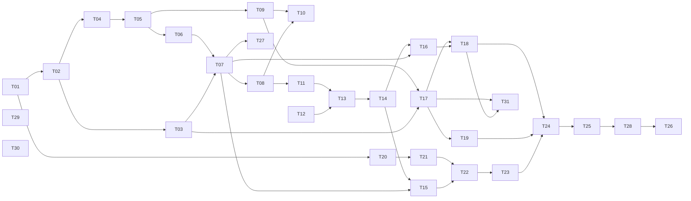

# GitPeek タスクリスト

v1（Phase 1〜9）の残作業を、人間が概ね 3 日で終える単位に割ったもの。

- **決定の記録**は [`docs/DESIGN.md`](docs/DESIGN.md)
- **実装中に毎回効く制約**は [`CLAUDE.md`](CLAUDE.md)
- **今やること（＝このファイル）** が進捗の唯一の正

---

## このファイルの規約

**着手前に必ずこの節を読むこと。**

1. **完了の記録はコミットと同時に行う。** タスクを終えたら、その実装と同じコミットで
   チェックを入れ、末尾の「完了済み」節へ 1 行に畳んで移す。別コミットにすると忘れる。

2. **ID は再利用しない。** タスクを削除・統合しても番号は空けたままにする。
   3 日に収まらないと判明したタスクは、**末尾に新しい ID を発番**して分割する
   （枝番 `T-13a` は使わない）。ID は発番順であり、実行順は「推奨する着手順」の表と
   各タスクの `依存:` 行が決める。

3. **受け入れ条件には 2 種類ある。**
   - `▸コマンド:` — 実行すれば判定できる。エージェントが自分で確認してよい
   - `▸目視:` — 人間の確認が必要
   
   **目視項目が 1 つでも残っているタスクを、エージェントが単独で「完了」と宣言してはいけない。**
   実装を終えたら「目視確認をお願いします」と述べて止まること。

4. **未着手タスクに書かれた型定義は着手時点の設計案であり、先行タスクの実装が正。**
   着手時に必ず実物と突き合わせ、食い違っていたらタスク本文を書き直してから実装する。

5. **骨子のままのタスクは、着手前に詳細化する。** ⑥実装内容と⑧受け入れ条件が埋まって
   いないタスクは、詳細化そのものを最初の作業として行う（本文に「骨子」と書いてある節から先）。
   **いまは T-24 以降が骨子**（T-23 は詳細化・実装とも済み、目視の途中）。

6. **制約の再掲は出典付き。** 各タスクの「制約」に書かれた内容は CLAUDE.md / DESIGN.md からの
   再掲であり、必ず出典を併記してある。**食い違いを見つけたら CLAUDE.md 側が正。**
   決定理由は再掲していないので、なぜそう決めたか知りたいときは DESIGN.md を読むこと。

---

## 現在地

**最終更新**: 2026-09-09

| 項目 | 内容 |
|---|---|
| 直前に完了 | **T-31**（取ってきてから、ブランチを進める。目視 2 巡・2 件、どちらも文言）＋ **v0.1.1 の公開** |
| いまここ | **T-26 の実運用だけ。2026-09-09 時点で 3 日ぶん / 8 リポジトリ**（09-09 のログはまだ無い）|
| 未解決の判断事項 | なし。ただし**文言はまだ途中で、利用者はまだ満足していない**（下記）|

**T-31 は 2026-09-08 に利用者が決めて足したもの**（`git pull --ff-only` 相当）。
**CLAUDE.md §1 を緩める 3 件目**で、緩め方は既存の 2 件と揃えてある（禁止をやめず、
「黙ってやらない」ほうを残して条件を付けた）。決定理由は DESIGN.md §8.6 —
とくに**なぜ `git pull` を呼ばないのか**はそこにしか書いていない。

**残るは日数だけ。** T-26 の作業ぶん（zip・README）は終わっていて、
**カレンダー時間が経つのを待つ**（規約の 3 日基準の例外）。ログが 7 日ぶん揃うのは
**2026-09-12 ごろ**。リポジトリ数は 8 個で足りているので、**足りないのは日数だけ**。
最後に ▸目視 1 問（既存 GUI クライアントを一度も開かずに済んだか）へ答えてもらえば
v1 の DoD が埋まる。

### T-26 の外でやったこと（2026-09-07 〜 09-08）

**タスク ID は振っていない** — 利用者がその場で頼んだもので、3 日単位に割る性質のものでもない。
出典だけ置く（規約 6）。

| 何を | 記録の場所 |
|---|---|
| CLAUDE.md を 566 行から畳んだ。**テスト項目の一覧は DESIGN.md §14.6 へ移した** | CLAUDE.md（229 行）|
| README を他人向けに書き直し、**MIT ライセンス**を付けた | README.md / LICENSE |
| GitLab へ push（`https://gitlab.com/tatsunoko7324/gitpeek`）。**いまは意図的に private** | — |
| **リリース手順**（`npm run release` → `scripts/release.ps1`）。zip を汎用パッケージレジストリへ上げ、Releases から張る | DESIGN.md §2.3.2 / CLAUDE.md §10 |
| **v0.1.0 を公開した**（タグ `v0.1.0` ＝ `1aadbf5`）| GitLab の Releases |
| **v0.1.1 を公開した**（タグ `v0.1.1` ＝ `ea47af8`。中身は T-31 とその文言）| GitLab の Releases |
| **アイコンを Tauri のロゴから独自の図案へ差し替えた** | DESIGN.md §2.3.3 / CLAUDE.md §10 |
| **コード署名は「しない」を維持**（2026-09-08 に一度調べ直した）| DESIGN.md §2.3.4 |

**v0.1.0 の積み残しは v0.1.1 で解消した**（2026-09-08）。v0.1.0 の zip は `1aadbf5` から作ったので
中の exe が古い Tauri のロゴのままだったが、**v0.1.1 には新しいアイコンが入っている**
（`package:zip` が `tauri build` の前に `build.rs` を touch するため）。

**v0.1.1 の実測**: zip 5.8 MB ／ SHA-256 `07be5872cbf7ad90bbff7f6e2fc4454998117e941d8c6b4703423255131f1973`。
**リリース直後の匿名ダウンロードは通った**（スクリプトの [6]）。v0.1.0 のときは
「Allow anyone to pull from Package Registry」が OFF で落とせなかったので、そこは解消済み。

**未追跡のまま残しているもの**: `docs/images/top.png`（README のヘッダに入れたい画面写真。
**作者のメールアドレスとローカルパスが写り込んでいる**ので、ダミーのリポジトリで撮り直してから
入れる。README にはその旨のコメントを置いてある）。

### 文言はまだ途中（T-29 の 1 巡目のあと。2026-09-06）

**利用者は「問題ない」と言ったが、「満足していない。今後もっと改善していく」とも
言った。通ったことにして忘れないこと。**

1 巡目で取ったのは**削れば直る硬さ**（自明な主語・重ね書き・翻訳調の連体修飾・
「〜の可能性があります」・「〜してください」の多用）。**残っているのは、
画面の中で読んだときにしか分からないもの** — 前後の文とのつながり、同じ画面に
並んだときの語調のばらつき、長さの釣り合い。**一覧をまとめて読んでも見つからない。**

**次に触るときは、実運用の中で引っかかった文を挙げてもらう形にする**
（T-26 の 1 週間はどのみち待ち時間なので、その間に溜める）。
**画面の名前と、そこで読んだ文をそのまま**もらえば直せる。

### レビューまわりの形（T-22 / T-23 で作ったもの）

**判定は全部 Rust 側にある。** 画面はそれを読むだけでよい。

| コマンド | 返るもの |
|---|---|
| `plan_review` | `ReviewPlan`（ファイルごとの概算トークン数・分割数・**投げない理由**・押せない理由）|
| `start_review` | **`StoredReview`**（保存済みの 1 件。`run` に `ReviewRun` が入る）。途中経過は `review-progress` イベント |
| `cancel_review` | — |
| `list_reviews` / `load_review` | 履歴の一覧（軽い行）と 1 件の全文 |
| `export_markdown` | Markdown の書き出し（**組み立てはフロントの純関数**）|
| `set_repository_llm_profile` | リポジトリごとの既定接続先 |

- **見積もりも分割数も同じ計算をフロントに置かない**（必ずずれる。DESIGN.md §10.7.1）
- `ReviewPlan.blocked` と `PlannedFile.skipped` は**そのまま画面へ出す文言**
- **`ReviewProgress.index` は `ReviewPlan.files` の添字ではない**（`skipped` のぶん詰まる）。
  `fileStarted` の `path` で結び付けること
- 型は `src/lib/ipc.ts` に揃えてある。判定と整形の純関数は
  `src/lib/reviewPlan.ts` / `reviewFindings.ts` / `reviewMarkdown.ts` / `reviewTarget.ts`
- **「何をレビューしたのか」の文言は `reviewTarget.ts` だけが組み立てる**（結果・履歴・
  Markdown の 3 か所が同じものを出す。DESIGN.md §10.7.2）。**コミットの要約は保存して
  いない**ので、読み込み済みのコミットから引く（引けなければ SHA だけ）
- **指摘から差分の行へ飛べる。** 飛び先は行ではなく**行リストの索引**
  （`lib/diffRows.ts` の `rowIndexForLine`）。差分に無い行では動かさず、
  ドロワーへ「この差分に無い行を指しています」と出す

### これまでに踏んだ落とし穴（次も効く）

**相手が親切だと、テストが何も確かめないまま緑になる**（T-24）。git の stderr を
マスクしていることを `fetch <資格情報付き URL>` で確かめたら通ったが、**git 2.43 が
自分で資格情報を落としていた**だけで、マスクを外しても緑のままだった。
**伏せてくれない形**（知らないオプションを渡すと受け取った文字列がそのまま出る）に
変え、**伏せ字になった形まで見る**ようにして、マスクを外すと落ちることを確かめた。
「含まれない」だけの確かめ方は、**そもそも出ていないときにも通る**。

**md の中の `\` は、書き換えの道具を通ると 1 段はがれる**（T-25 で発見）。
`i18n/ja.ts` の `.gitviewer\skills\`（当時。**いまは `.gitpeek`** — T-30）が `\s` になっていて、画面には
**`.gitviewerskills` と出ていた**（T-21 から誰も気付かなかった）。JS は知らない
エスケープを黙って落とすので、**型でもテストでも捕まらない**。パスを含む文言を
足したら、`node -e` で 1 度出してみること。**まとめて書き換えたあとは
`git diff` を読む** — 直前の行のコメントや `#[test]` を巻き込んでいることがある。

**「繋ぐと同じ」と「少しずつ届く」は別の性質**（T-23）。ストリーミングの確認を
「流した差分を繋ぐと本文になる」だけで書いていたので、**最後にまとめて 1 回だけ
届いていても緑になった**。応答がホールドバック（当時 256 文字）より短いと差分は
1 度も流れず、目視で「少しずつ流れない」として上がった。
**時間の性質は、結果を見るテストでは捕まらない。** 届いた回数を数えること。

**幅や閾値の既定は、実際に来る入力の大きさと突き合わせる**（T-23）。
256 文字というホールドバックは「一番長い秘匿情報が収まるか」だけで決めていて、
**レビュー 1 件の応答が 100〜200 文字であること**と突き合わせていなかった。
安全側に倒した数字でも、扱う値より大きいと機能そのものが消える。

**端の値はアサーションのほうも壊す**（T-22）。T-20 の申し送りに従って
「1 文字 / 空 / 長い」の 3 本で API キーの漏れを見たが、**1 文字のキー（`a`）を
`contains(key)` で調べると、結果に含まれる別の語の `a` で必ず真になる。**
テストは「漏れている」と言って落ちるが、実際には何も確かめていない。
**端の値を入力に足したら、確かめ方のほうも端で成り立つか見ること**
（`Bearer a` のように、echo された場所を名指しで見る形へ直した）。

**時間で測る観測は、後片付けの遅れを拾う**（T-22）。モックサーバが最後のチャンクを
書いたあとも眠っていたため、相手はもう読み終えているのに接続だけが残り、
**逐次実行が「同時に 2 本」に見えた**。並列度の既定が守られていることを見る
テストが、実装ではなくテスト側の都合で落ちた。

**安全側の仕組みは、粒度を細かくすると特別扱いが消えることがある**（T-21）。
リポジトリ単位の信頼で作ったときは「信頼したあとファイルが増えたら再確認」という
条件を足す必要があったが、**ファイル単位へ絞ったら、増えたものは記録が無いので
そのまま未決**になり、条件ごと要らなくなった。**条件を足す前に、粒度を疑うこと。**

**コミット前に `git status` を見る**（T-21）。`git add -A` で、利用者が目視のために
置いた `.gitviewer/skills/*.md` を巻き込んでコミットした（amend で外した）。
**作った覚えのないファイルが混ざっていないか、`--name-only` で必ず目を通す。**

**テストの入力が「ありそうな形」に寄ると、端の値が丸ごと抜ける**（T-20）。API キーを
伏せ字にする処理を `sk-example-key-0123456789` のような**それらしい長さ**でしかテストして
いなかったので、**1 文字のキー（`a`）で応答本文が壊れる**のを目視で初めて踏んだ
（`message` が `mess***ge` になり、JSON のキー名まで潰れて理由が取り出せなくなった）。
**利用者が入れうる最短・最長・空を、思い付きではなく列挙して 1 本ずつ書くこと。**

**画面まで一度も通していない経路は、テストが緑でも動かないと思ったほうがよい**（T-18）。
`rename_all_fields` を落としていて、引数の組み立てを固定するテストが全部通ったまま、
ボタンが 1 度も機能しなかった。**フロントから構造体を送る箇所は、Rust 側がその JSON を
実際に食えることをテストで固定する**（CLAUDE.md §8）。T-19 では
`the_clone_wire_format_matches_what_the_front_end_sends` がその役をしている。

**判定をコンポーネントに直書きするとテストが 1 つも当たらない**（T-19）。フロントは
純関数だけテストする決まりなので、`.tsx` に書いた条件は誰も見ていない。実際、
clone の「この保存先を次回から既定にする」は**条件が常に成立せず一度も表示されない**まま
コマンドの受け入れ条件を全部通した。**判定は `src/lib/*.ts` へ出してから書く。**

**押せる条件でだけ選択肢を出すと、画面から消えて何が効いているのか読めなくなる**（T-19）。
押せない形で残し、押せない理由といまの値を文言に出す（CLAUDE.md §6）。

**UI の文言は「何が起きるか」で書く**（T-18）。「FF マージ」は通じなかった。
メニューは「ローカルの main を origin/x まで進める」のように方向を名前で書き、
**できないときも何ができないのかを説明する**。

**似た項目が並ぶときは、違いを書き出しに置く**（T-31 の目視 1 巡目）。
「main に origin/x を取り込む」と「main に origin/x を**取ってきて**取り込む」を並べたら、
「違いが分かりにくい」と言われた。**書き出しが同じまま、語の途中が 5 文字違うだけ**だったため。
**言葉が正確かどうかと、並べたときに見分けられるかは別。**

**動詞を利用者の頭の中の絵に合わせると、説明が要らなくなる**（T-31 の目視 2 巡目）。
見分けは付くようにしたのに「もっとよくできる」と言われ、**利用者から「ローカルの master を
origin/master まで進める」という見立てが出た。** これが効いたのは 3 つの理由がある。
**やっていること（`--ff-only`）がそのまま言える** ／ **「進める」は前へ動かすだけなので、
手元にだけあるコミットがあると進められないことがラベルから分かる**（ヘルプ 3 文が要らなくなる）／
**pull 側が「取ってきてから、〈同じ文〉」になり、片方がもう片方 ＋α だと読める。**
**見分けられることと、頭の中の絵と合っていることは別。** 迷ったら、利用者がその操作を
どう言い表すか聞くこと。

**目視は 1 巡では終わらない。** T-18 は 3 巡・9 件、T-19 は 2 巡・2 件、
T-20 は 3 巡・3 件、T-21 は 2 巡・2 件、**T-23 は 1 巡目で 1 件 ＋ 要望 2 件**、
**T-31 は 2 巡・2 件（どちらも文言で、動きへの指摘は 0 件）**。
実装が終わった時点を「終わり」と見積もらないこと。

**受け入れ条件を全部通しても、要望はそこから出る**（T-23）。1 巡目の目視は
全項目通ったのに、そのあと「履歴のどれがどれだか分からない」「指摘を押しても
行まで行かない」の 2 つが出た。**どちらも「動かない」ではなく、
使ってみて初めて分かる「読めない／届かない」**である（T-21 の
「設計の作り直しで来る」と同じ種類）。**条件を満たしたことと、
道具として使えることは別。**

**T-22 だけ 1 巡・0 件だが、これは楽をしたのではなく触れる面が無かったから。**
画面が無く、目視できたのは実サーバへ 1 往復させるテスト 1 本だけだった。
**T-22 で作ったものが人の目に触れるのは T-23 が初めて**なので、
そのぶんを T-23 の巡回数に見込んでおくこと。

**目視で来るのはバグだけではない。設計の作り直しで来る**（T-21）。
「リポジトリごとの観点をアプリ全体の設定に置くな」「信頼はスキルごとにしろ」は
どちらも動くものへの指摘ではなく、**形そのものへの指摘**だった。
受け入れ条件を全部通していても、**触ってみて初めて分かる形**がある。

### 抱えている割り切り（承知の上で残してあるもの）

- **中止はチャンクが届いた時点で効く**（T-22）。生成が進んでいる限りは即座に効くが、
  **接続先が黙り込んだときだけ**、読み取りが返るまで畳まれない。fetch の
  「中止しています…のまま返ってこない経路」と同じ割り切り（DESIGN.md §8.3）。
  最後の砦は本文の読み取り上限 600 秒
- **流す途中のマスクは末尾 64 文字ぶんしか遡れない**（T-22。T-23 で 256 から縮めた）。
  溜めた全文にマスクを掛け直してから末尾を残して流すので、**64 文字より長い秘匿情報**が
  チャンクにまたがると、先頭側が伏せられる前に**実行中の画面へ**流れうる。
  **結果として残る `content` は全文にマスクを掛け直したもの**なので、
  保存されるレビューには出ない。`redact` が見るトークンの形（`sk-` ＋ 40 字程度、
  `ghp_` ＋ 36 字）は収まる幅にしてある。**鍵がこれより長いときは鍵の長さまで広げる**
- **トークンの見積もりは日本語で外れる**（T-22）。`文字数 ÷ 4` は 1 文字 1 トークンに
  近い日本語で小さく出るので、「収まる」と見て投げたものが超過することがある。
  **外したら接続先の 400 で拾って分割し直す**（DESIGN.md §10.7.1）。
  見積もりを賢くするより、外したときに拾える経路を選んだ
- **`context_window` がごく狭い接続先では分割が効かない**（T-22）。予算に
  下限 1,024 トークンを置いてあるので、それより狭い設定にしても分割の粒度は
  それ以上細かくならない。1 つの hunk だけで超えるものも、それ以上は割れない
- **T-22 の経路が画面から通ったのは T-23 が初めて。** その 1 巡目で
  「本文が少しずつ流れない」が出た（`a952b6b` で修正済み）。**T-18 の
  「テストが緑でも動かない」を、実際にもう一度踏んだ**ということ
- ~~**指摘から差分へ「飛ぶ」のは、ファイルを開くところまで**~~ → **2026-09-06 に解消**
  （利用者の要望。DESIGN.md §10.7.2）。指摘を押すと該当行まで動き、印が付く。
  **残っている割り切りは 2 つ** — ①**大きすぎて畳んである差分では動かない**
  （`CollapsedNotice` のまま。開けば動く）、②**「当たらなかった」と書けるのは
  いま開いているファイルのぶんだけ**（他のファイルは差分を読んでいないので分からない。
  分からないものを「当たらなかった」と書くと嘘になる）
- **`@tauri-apps/plugin-fs` は入れていない**（T-23）。Markdown の書き出しに
  必要だったが、依存 2 つ（npm と Cargo）と引き換えに得られるのは
  「任意のファイルを書く」機能で、要るのは 1 用途だけ。行き先は保存ダイアログで
  選んだパスに限り、書き込みは Rust の `export_markdown` で行う
  （`dialog:allow-save` を capabilities へ追加してある）
- **レビュー中の他の操作を止めていない**（T-23）。走っている最中にリポジトリを
  切り替えると、`useReview` は状態を捨てるが**走っている実行そのものは止まらない**
  （終われば保存される）。1 度に 1 本という制限は実行ボタンの側だけで見ている
- **差分の中の検索は文字を塗らない**（T-25）。当たった行へ移動して囲むだけで、
  行の中のどこに当たったかは示さない。行には既に語単位差分と構文色が載っていて、
  3 つ目の色を重ねると**どれが変更でどれが検索結果か読めなくなる**ため。
  **大文字小文字は区別しない**（切り替えは持たない）。**畳んである差分では開かない**
  （飛ぶ先が画面に無い）。**探すのは開いているファイルの中だけ**で、
  横断検索は v1.1 の「コミット検索」の話
- **ショートカットは編集できない**（T-25。v1 は固定）。設定画面に出るのは一覧だけ。
  キーの形は `src/lib/shortcuts.ts` の対応表が持つ
- **コマンドログの出し入れは設定画面の「一般」だけ**（T-25 の目視のあとに利用者が
  要望。2026-09-06）。ヘッダのボタンは畳んだ。**値は `settings.json` に持つ**
  （`ui.showCommandLog`）— 設定画面の中にある欄が再起動で戻ると、他の欄と挙動が
  食い違うため。ヘッダから消えたぶん、**外したときの文言に戻り方を書いてある**
  （CLAUDE.md §6 の「覚えている既定は必ず画面に出す」）
- **可視 ref は「このリポジトリの設定」に出していない**（T-25）。ブランチツリーの
  チェックボックスがそのまま設定なので、2 か所から変えられるようにすると
  どちらが効いているのか読めなくなる
- **panic のダイアログは目視していない**（T-24。2026-09-06 に利用者の判断で飛ばした）。
  仕込まないと起こせないため。**組み立て（`panic_line`）と hook の登録はテスト済み**だが、
  **ダイアログが実際に出るところは画面で 1 度も見ていない**（T-18 の「テストが緑でも
  動かない」に当たりうる箇所として残る）。次に本物の panic を踏んだときが最初の確認になる
- **ログの日付は起動した日で固定される**（T-24）。プラグインが書き出し先を組み立ての
  ときに決めるため、起動したまま日付をまたぐと同じファイルに書き続ける。
  掃除は次の起動で追いつく
- **skill を編集する画面は無い**（T-21）。グローバルは `%APPDATA%\com.tatsu.gitpeek\skills\`
  を直接編集する。**アプリから足せるのは「追加の指示」だけ**で、これは `settings.json` に
  入り skill ファイルは書き換えない（他人のリポジトリの skill にも足せるようにするため）
- **「追加の指示」は欄から離れたときに保存する**（T-21）。保存ボタンは置いていない。
  書きかけで別の場所を押すと保存されるが、**中身が変わったときだけ書く**ので
  `settings.json` が無駄に上書きされることはない
- **symlink を辿らないことのテストは、開発者モードか管理者権限が要る**（T-21）。
  作れない環境では**理由を出して落ちる** — 黙って素通りさせると、守れているのか
  確かめていないのか区別が付かなくなるため。外すときは `GITPEEK_SKIP_SYMLINK_TEST=1`

- **probe は 1 リポジトリあたり git を 5 回起動する。** T-17 でリモートの有無を足したぶん
  1 回増えた。この環境では 1 回 34ms（実測）なので、登録 7 件で一覧の更新が 240ms ほど伸びる。
  リモートの有無は「放置警告を永久に出し続けない」ための必須情報なので落とせない。
  気になるようになったら、**リポジトリごとの probe を並列にする**のが効く（いまは 1 件ずつ順）
- **中止で落とせるのは git 本体だけ。** `git-remote-https` のような子は残りうる。親が死ねば
  追って終わるが即座ではないので、理屈の上では「中止しています…」のまま返ってこない経路がある。
  **T-19 で「Job Object は入れない」と決着した**（DESIGN.md §8.4）。clone の残骸は
  再試行で消しており、消せなければ場所を出す。fetch 側はそもそも残骸の概念が無い
- **確認画面を出すまでに git を 9 回起動する**（T-18）。判定に probe（5 回）と
  `status`（4 回）を通すため、この環境では 300ms ほど無反応になる。判定を 1 箇所に
  保つほうを取った（probe を分解すると bare / unborn / `index.lock` の判定が 2 系統になる）。
  気になるようになったら、**確認画面を先に出して判定を後から差し込む**のが素直
- **サブモジュールが取り込まれることを結合テストで確かめられない**（T-19）。git 2.38 以降は
  サブモジュールの `file` トランスポートを拒む（この環境の git 2.43 で実測）ので、生成した
  ローカルの上流では成功しない。`protocol.file.allow` を緩めると全 git 呼び出しに効くので
  行わず、**フラグが実際のプロセスへ届いていること**をコマンドログで固定してある

### 済んだ Phase で決めたこと — 出典だけ置く

**毎回効く制約は CLAUDE.md、決定理由は DESIGN.md に移してある。**
ここへ書き写すと必ずどちらかが古くなるので、迷ったら出典を読むこと。

| Phase | 決まったこと | 出典 |
|---|---|---|
| 2 | レーン割り当てと描線（**判定ゲート合格 2026-09-03。以降動かさない**）／第 2 親のレーン合流は不採用 | CLAUDE.md §3 / DESIGN.md §5.1, §5.2, §15.1 |
| 3 | 可視 ref の絞り込みと ahead/behind ／ ref が数千本のときにペインが潰れる件 | CLAUDE.md §6 / DESIGN.md §4.4, §4.5, §6.4 |
| 4 | 3 ペイン配置 ／ 差分の色と語単位強調（強調の中では構文色をやめた）／ 文字コードの判別順 | DESIGN.md §6.1, §7.2, §9.1 |
| 5 | 任意 2 点比較（**`A...B` は 1 つの引数**）／ 作業ツリーの擬似行 | CLAUDE.md §6 / DESIGN.md §7.5, §10.3 |
| 6 | fetch の進捗・中止・放置警告・上流のタグ付け替え | CLAUDE.md §2, §8 / DESIGN.md §8.3, §8.3.1 |
| 6 | checkout の渡し分け ／ 確認画面 ／ FF マージ ／ 書き込み後は HEAD へ寄せる | CLAUDE.md §1, §2, §6 / DESIGN.md §8.1, §8.2, §8.5 |
| 7 | clone の引数と保存先の決め方 ／ 残骸の後始末（**自分が作ったフォルダだけ**）／ Job Object は入れない ／ サブモジュールは**確認画面で選ばれたときだけ** | CLAUDE.md §1, §4, §6, §8 / DESIGN.md §8.4 |

**利用者の判断で「実装しないと決めた」ものを 2 つ緩めてある。** どちらも
**「黙ってやらない」ほうを守った条件付きの緩和**であり、同じ形が必要になったら
勝手に変えず利用者に聞くこと。

| いつ | 何を | 条件 |
|---|---|---|
| 2026-09-04 | ローカル追跡ブランチの作成（`checkout -b --track`） | checkout の確認画面で**選ばれたときだけ**（DESIGN.md §8.1）|
| 2026-09-05 | サブモジュールの取り込み（`--recurse-submodules`） | clone の確認画面で**チェックされたときだけ**（DESIGN.md §8.4）|

**EUC-JP の判別が当たらない件は「当面このまま」で決着した**（2026-09-03、利用者の判断）。
EUC-JP を使う予定が無く、**UTF-8 と Shift_JIS が判定できれば足りる**ため。挙動は
`encoding.rs` の `euc_jp_hiragana_is_misdetected_as_shift_jis` が固定している（DESIGN.md §9.1）。

### 登録済みリポジトリ（判定と目視に使うもの）

| リポジトリ | コミット | max_lane | 同時レーン平均 | ルート |
|---|---|---|---|---|
| gitviewer / AerialSoldierMaker / save_temperature | 24 / 22 / 10 | 0 | 1.00 | 1 |
| drogon | 2,298 | 20 | 2.91 | 1 |
| vite | 10,186 | 54 | 5.45 | 1 |
| onyx | 20,285 | 52 | 11.43 | 4（orphan ブランチ 2 本）|
| MinerU | 6,692 | — | — | **T-19 の目視で clone したもの**（ref 304 本）|
| linux | 148 万 | — | — | DESIGN.md §4.1 の非対象 |

小さい 3 つはマージが 1 件も無い一直線なので、枝分かれの確認には使えない。
**サブモジュールを持つリポジトリはまだ登録していない。** T-19 の目視には使ったが、
以後もサブモジュールの確認が要るなら 1 つ手元に置いておくとよい。

**100 万コミット級の正式対応は v1.1 以降に送った**（DESIGN.md §1.1, §4.1 / 下の「v1.1」表）。
v1 では非対象のままだが、恒久的な非対象ではなくなった。

---

## 推奨する着手順

上から順に着手するのが効率的。

| 順 | Phase | タスク | 備考 |
|---|---|---|---|
| 1 | 1 | T-01 → T-02 → T-03 / T-04 | **済** |
| 2 | 2 | T-05 → T-06 → T-07 → T-08 → T-27 | **済**（T-08 は判定ゲート。合格） |
| 3 | 3 | T-09 → T-10 | **済** |
| 4 | 4 | T-11 → T-12 → T-13 → T-14 | **済** |
| 5 | 5 | T-15 → T-16 | **済** |
| 6 | 6-7 | T-17 → T-18 → T-19 | **済**（書き込み系はこれで終わり）|
| 7 | 8 | T-20 → T-21 → T-22 → T-23 | **済**（**Phase 8 完了 ＝ AI レビューは終わり**）|
| 8 | 9 | T-24 → T-25 → T-28 → T-29 / T-30 → **T-26** | いまここ。**T-26 で v1 が終わる**。作業は残っておらず、実運用 1 週間を待つだけ |
| 9 | 9 | T-31 | **済**（2026-09-08 に利用者が決めて足した。`git pull --ff-only` 相当。v0.1.1 として公開）|



---

> **ここから先は骨子。着手前に詳細化すること**（このファイルの規約 5）。

# Phase 9 — 仕上げと配布

## - [ ] T-26 [Phase 9] 配布ビルドと DoD 検証

**目的**: ポータブル zip を作り、実運用で v1 の完成を判定する。**これで v1 が終わる。**

**参照**: DESIGN.md §2.3, §15.2 / CLAUDE.md §9, §10

**依存**: T-28（済）

**着手時に確認した現況（規約 4。2026-09-06 に調べた）**

- **`npm run package:zip` は既にある**（Phase 0 で用意済み。T-28 で名前を直した）。
  `tauri build` のあと PowerShell の `Compress-Archive` で
  `src-tauri/target/release/GitPeek.exe` を `dist-zip/GitPeek-portable.zip` にする。
  **まだ一度も走らせていない**（`tauri build` を通したことがない）
- **`tauri.conf.json` の `bundle.active` は `false`。** installer を作らないための設定で、
  exe そのものは `target/release` に出るので zip 化には足りる。**触らない**
- **ログの 1 行に `[<リポジトリのパス>]` が入っている**（`commandlog.rs` の `log_line`）。
  ファイルは日付ごとに分かれ 7 日で消える（T-24）。**DoD の「5 個以上」と「1 週間」は
  ログから数えられる**（下記）
- **`README.md` はまだ無い**

**DoD の測り方（2026-09-06 に利用者が決めた）**

**アプリ自身のログを証拠にする。日誌は書かない。**
ログの 7 日ローテーションが DoD の「1 週間」とちょうど同じ幅なので、
使い切った時点のログがそのまま記録になっている。

| DoD の要素 | どう確かめるか |
|---|---|
| 実リポジトリ **5 個以上** | ログの `[<パス>]` を数える（**▸コマンド**。下記） |
| **1 週間** 実運用 | `gitpeek-YYYY-MM-DD.log` が 7 日ぶん揃っている（**▸コマンド**。同上） |
| 既存 GUI クライアントを**一度も開かずに済んだ** | **▸目視。利用者に 1 度だけ聞く**（他の目視項目と同じ扱い。答えはこのタスクを畳むときに 1 行で残る）|

**`docs/dod.md` のような手書きの記録は作らない**（**利用者が断った**。
一度しか使わない記録を書き続けることになる）。**数える道具も足さない** —
一度きりの確認のために永久に残るスクリプトを増やさない（T-28 で移行コードを
書かなかったのと同じ理由）。**下のコマンドをその場で打つ。**

```
cd "$APPDATA/com.tatsu.gitpeek/logs"
ls gitpeek-*.log | wc -l
grep -ho '\[[A-Za-z]:\\[^]]*\]' gitpeek-*.log | sort -u
```

**リポジトリを数える行は 2026-09-09 に直した。** 元は `'\[[^]]*\]'` で角括弧を全部拾って
いたが、**git の stderr に出る `[new branch]` / `[new tag]` まで数えていた**（T-31 で fetch を
よく使うようになって表に出た。8 個のはずが 10 と出る）。**パスの形（`C:\…`）で絞る。**
数え方の穴は、数が増えたときではなく**増えた理由を見たときにしか気付けない。**

**2026-09-09 時点で実行済み: 3 日ぶん（09-06 / 09-07 / 09-08）/ 8 リポジトリ。**
09-09 のログはまだ無い（その日にアプリを起動すると増える）。
リポジトリ数は既に足りている（`drogon` / `dycora` / `linux` / `onyx` / `vite` /
`AerialSoldierMaker` / `gitviewer` / `save_temperature`）。**残るは日数だけで、
7 日ぶん揃うのは 2026-09-12 ごろ。**

**実装内容**

1. `npm run package:zip` を実際に走らせる。**済（2026-09-06）** — 通った。
   ただし **exe の実体が `gitpeek.exe`（小文字）になっていた**。cargo のパッケージ名が
   そのまま出ており、zip が `GitPeek.exe` で通っていたのは
   **Windows が大文字小文字を区別しないおかげの偶然**だった。
   `tauri.conf.json` に **`mainBinaryName: "GitPeek"`** を足して実体を揃えた
2. zip を**別のフォルダへ展開して起動**する。開発ビルドとの差異を見る —
   `%APPDATA%` の解決 ／ アイコン ／ ウィンドウの初期サイズ ／ WebView2
3. `README.md` を書く。**済（2026-09-06）** — 何ができて何を「しないと決めた」か
   （CLAUDE.md §1）／ 起動方法 ／ 設定とログの置き場所
   （`%APPDATA%\com.tatsu.gitpeek\`）／ git と WebView2 が要ること ／
   リポジトリ内 skill が既定で無効なこと ／ AdGuard で白くなる話
4. 1 週間使う。**終わりに上のコマンドを打ち、目視 1 問に答えてもらう**。
   **2026-09-08 時点で 3 日ぶん**（このタスクの外で、公開・リリース・アイコンの差し替えを
   挟んでいる。現在地の表を見ること）

**制約**

- Tauri の bundler に zip ターゲットは無いので、`src-tauri/target/release/GitPeek.exe` を
  npm script で zip 化する（CLAUDE.md §10）
- **`bundle.active` を `true` にしない**（installer は恒久的に非対象）
- **速度を測るならリリースで測る**（CLAUDE.md §8）

**受け入れ条件**

- ▸コマンド: `npm run package:zip` が `dist-zip/GitPeek-portable.zip` を生成する
- ▸コマンド: `npm run test:rust` / `npm run check:rust` / `npm run test` / `npm run typecheck`
- ▸コマンド: ログに **7 日ぶんのファイル**と **5 個以上のリポジトリ**があること（上記）
- ▸目視: zip を**別のフォルダへ展開した exe が単体で起動する**こと
- ▸目視: リリースビルドで、設定とログが `%APPDATA%\com.tatsu.gitpeek\` に出ること
- ▸目視: **既存 GUI クライアントを一度も開かずに済んだ**こと（**1 度だけ聞く**）

**⚠️ このタスクはエージェントが単独で完了を宣言してはいけない。**

**非スコープ**: 自動更新／コード署名／インストーラ（すべて恒久的に非対象）／
アイコンの差し替え／`docs/dod.md` のような手書きの記録（**利用者が断った**）

**注記**: 3 日基準の例外。作業時間ではなくカレンダー時間（実運用 1 週間）。
**zip と README はすぐ終わる。** そのあと 1 週間空く。

---

## - [x] T-31 [Phase 9] 取ってきて、そのまま取り込む — **完了（2026-09-09。目視 2 巡・2 件）**

**目的**: 「fetch して、早送りできるならそのまま取り込む」（`git pull --ff-only` 相当）を、
**利用者が選んだときだけ**走る形で足す。

**参照**: DESIGN.md §8.6（新設）/ §8.2 / §8.3 / CLAUDE.md §1, §2, §6, §8

**依存**: T-17（fetch）/ T-18（checkout と FF マージ）。どちらも済

**これは CLAUDE.md §1 を緩める変更である**（2026-09-08 に**利用者が決めた**）。
緩め方は既存の 2 件（ローカル追跡ブランチ / サブモジュール）と揃えた —
**禁止をやめたのではなく、「黙ってやらない」ほうを残して条件を付けた。**

| 何を | 付けた条件 |
|---|---|
| fetch のあとに続けて `merge --ff-only` を走らせる | **右クリックで「取ってきて取り込む」を選び、確認画面で押されたときだけ。** fetch のボタンは今までどおり取ってくるだけで、何も取り込まない |

**着手時に確認した現況（規約 4。2026-09-08 に調べた）**

- fetch は `lib.rs` の `fetch_repository` → `git::ops::fetch`（`exec::run_progress`。
  進捗イベント `fetch-progress` ＋ `state.fetch_cancel` による中止）
- FF マージは `lib.rs` の `merge_ff` → `git::ops::merge_ff`（`exec::run`。**中止できない**）
- 可否は `lib.rs` の `merge_check` コマンド。`load_cached` したスナップショットから
  `graph::reach::CommitIndex::ahead_behind` で数える。**`MergeCheck` は当時 `lib.rs` の
  private 構造体**で、`ahead` / `behind` / `known` の 3 つだけ持っていた
- 実行前の判定は `git::ops::preflight`（`lib.rs` の `guard_for` が材料を集める）
- 右クリックの「取り込む」は **2 か所**にある（`RefTree.tsx` の `menuItems` と
  `CommitList.tsx` の `chipMenuItems`）。どちらも可否を判定せず確認画面へ渡している
- 押せない理由の判定は `lib/repositoryMenu.ts`、FF の可否の言い換えは
  `lib/writeOps.ts` の `mergeVerdict`

**決めたこと（実装の前に利用者と確定済み。変えるときは聞くこと）**

1. **`git pull` を呼ばない。新しい git の動詞を足さない。** 理由は DESIGN.md §8.6
2. 中身は**既存の 2 経路を順に呼ぶだけ** — `ops::fetch` → `ops::merge_ff`。
   `exec.rs` に入口を足さない
3. 順番・失敗時の扱いは **Rust 側**（`git/ops.rs` の `fetch_and_merge`）。
   フロントで 2 回呼ぶ形にしない
4. 取り込む前に**判定を通し、その結果をそのまま画面へ出す**。判定は
   `merge_check_of` / `merge_check_of_ref`（`lib.rs`）の 1 か所で、
   `merge_check` コマンドと共用する
5. **作業ツリーが汚れている等で走らせられないときは、fetch もしない**（理由は DESIGN.md §8.6）
6. **fetch が `Partial`（上流がタグを付け替えた）のときは取り込みへ進む**（同上）
7. **中止が効くのは fetch の間だけ。** 取り込みが始まったら止まらない。
   画面にそう出す（`fetch-merge-phase` イベントで段を知らせる）

**実装内容**

1. `git/ops.rs`
   - `MergeCheck` を `lib.rs` から移し、**`detached` を足す**。`can_fast_forward()` を生やす
   - `FetchMergeRequest` / `FetchMergeOutcome` / `FetchMergeHooks` / `fetch_and_merge`
2. `lib.rs`
   - `merge_check_of` / `merge_check_of_ref` を **`pub`** で切り出し、`merge_check` コマンドを
     それに載せ替える（結合テストから同じ判定を呼ぶため）
   - コマンド `fetch_and_merge` を 1 つ足す（`guard_for` ／ 中止スロット ／ 進捗イベント ／
     段のイベント ／ 判定のクロージャを与えるだけ）
3. フロント
   - `lib/ipc.ts` … `MergeCheck.detached` ／ `FetchMergeRequest` / `FetchMergeOutcome` ／
     `fetchAndMerge` ／ `onFetchMergePhase`
   - `lib/writeOps.ts` … `fetchMergeStage`（結果を「どの段で止まったか」に畳む純関数）
   - `lib/repositoryMenu.ts` … `canFetchMerge`（押せない理由。**消さずに出す**）
   - `hooks/useWriteOps.ts` … `askFetchMerge` / `doFetchMerge` / 段と進捗と中止
   - `components/common/WriteOpsDialog.tsx` … 確認・進行・結果の 3 枚
   - `RefTree.tsx` / `CommitList.tsx` … メニュー項目（**両方に足す**）
   - `i18n/ja.ts` … 文言。**方向を名前で書く**（「origin/main を取ってきて main に取り込む」）。
     **並ぶ「取り込む」との違いは書き出しに置く**（目視 1 巡目の指摘。下記）
4. ドキュメント … CLAUDE.md §1 の表に 3 行目 ／ DESIGN.md §8.6 を新設

**制約**

- git を実行するのは `exec.rs` の 3 つの入口だけ（CLAUDE.md §2）
- `merge` は常に `--ff-only`。**判定しても外さない**（CLAUDE.md §1 / DESIGN.md §8.2）
- **ローカルブランチを勝手に作らない**（CLAUDE.md §1）
- 判定は `.tsx` に直書きせず `src/lib/*.ts` の純関数へ（CLAUDE.md §8）
- 文言は `i18n/ja.ts`。押せない選択肢を消さない（CLAUDE.md §6）
- `Ctrl+R` は fetch のまま。ショートカットを足すなら `lib/shortcuts.ts` の表だけ（CLAUDE.md §6）

**受け入れ条件**

- ▸コマンド: `src-tauri/tests/writeops.rs` の結合テスト
  - 上流が進んでいるとき取り込めて **HEAD が動く**
  - 分岐しているとき **HEAD を動かさずに断る**
  - 作業ツリーが汚れているとき **fetch もしない**（`origin/*` が動いていないことで見る）
  - **ローカルブランチが増えない**
- ▸コマンド: フロントから送る構造体を Rust が食えること（`FetchMergeRequest` の wire format）と、
  返す構造体がフロントの読む形になっていること（`FetchMergeOutcome` の JSON キー）
- ▸コマンド: `npm run test:rust` / `npm run check:rust` / `npm run test` / `npm run typecheck`
- ▸目視: **上流が進んでいる状態**で、取ってきて取り込めること
- ▸目視: **分岐している状態**で、取り込まずに理由が読めること

**目視で出たこと**

| 巡 | 指摘 | どう直したか |
|---|---|---|
| 1 | 「main に origin/master を取り込む」と「…を取ってきて取り込む」の**違いが分かりにくい** | 違いを**書き出し**へ移した（「いま手元にある …」／「… を取ってきて …」）。ツールチップと確認画面も、リモートに問い合わせるかどうかで言い分けた |
| 2 | 見分けは付くが**もっとよくできる**。「ローカルの master を origin/master まで進める」という見立て（**利用者から**） | **「取り込む」を「進める」へ**（FF マージの文言ぜんぶ ＋ Rust 側の結果メッセージも）。pull 側は「**取ってきてから、**〈同じ文〉」にして、**片方がもう片方 ＋α**と読める形にした。DESIGN.md §8.2 / §8.6 に理由を記録 |
| 3 | **全て OK**（2026-09-09。上流が進んでいる状態／分岐している状態の両方） | — |

**2 巡とも文言だけで、動きへの指摘は 0 件だった。** T-18 / T-23 と違い、
**判定と順番を Rust 側の 1 か所に寄せた**ぶん、画面から出てくる余地が文言に絞られた。

**非スコープ**: rebase ／ 自動 stash ／ 非 fast-forward のマージ ／ 競合の解決画面 ／
`pull` の引数を触らせる欄 ／ 取り込めないときに代わりに何かすること（**断って理由を出すだけ**）

---

# v1.1 以降（ID は振らない）

着手が近づいた時点で詳細化し、末尾から新しい ID を発番する。

## v1.1

| 項目 | 内容 | 参照 |
|---|---|---|
| コミット検索 | メッセージ / 作者 / `log -S` によるコード内容検索 | DESIGN.md §15.3 |
| stash 一覧 | stash の閲覧のみ（作成・適用はしない） | DESIGN.md §15.3 |
| ファイル単位の履歴 | `log --follow` によるファイルの変更履歴 | DESIGN.md §15.3 |
| ブランチ同士の比較 | `origin/main...HEAD` 形式の比較を専用 UI から起動 | DESIGN.md §10.3 |
| `--cc` マージ差分 | マージコミットで両親と異なる部分だけを示す combined diff | DESIGN.md §7.4 |
| 画像差分 | 画像ファイルの変更を並べて表示 | DESIGN.md §7.2 |
| リポジトリのグループ分け | サイドバーでフォルダによる分類 | DESIGN.md §6.2 |
| ローカル追跡ブランチ作成 | `checkout -b --track` を明示的なメニュー項目として追加 | DESIGN.md §8.1 |
| 100 万コミット級リポジトリ | 「全件をフロントへ渡す」前提の見直し。v1 は自動で読まないだけ | DESIGN.md §1.1, §4.1 |
| **文言の見直し 2 巡目** | **T-29 は 1 巡目で、利用者はまだ満足していない。** 実運用で引っかかった文を挙げてもらって直す（一覧をまとめて読んでも見つからない種類が残っている）| 「現在地」の節 |

## v2.0

| 項目 | 内容 | 参照 |
|---|---|---|
| blame | 行ごとの最終変更コミットの表示 | DESIGN.md §15.3 |
| reflog | reflog の閲覧 | DESIGN.md §15.3 |
| submodule 対応 | submodule の中身を辿れるようにする（v1 は「壊れない」だけ担保） | DESIGN.md §15.3 |

---

# 完了済み

| ID | Phase | タイトル | コミット |
|---|---|---|---|
| — | 0 | Tauri v2 雛形 ＋ git 検出 ＋ git コマンドログパネル | `93867ed` |
| T-01 | 1 | 設定ストアと %APPDATA% レイアウト（settings.json / state.json） | `cf5fd37` |
| T-02 | 1 | リポジトリの登録・判定・フォルダスキャン ＋ テスト用リポジトリ生成 | `1f368b7` |
| T-03 | 1 | リポジトリ一覧サイドバーと切替 ＋ 右クリック登録解除・D&D 並べ替え | `80189ea` |
| T-04 | 1 | コミットメタ情報の全件取得とパース ＋ 読み込み進捗と大規模リポジトリの確認 | `c9aae9d` |
| T-05 | 2 | レーン割り当てアルゴリズム ＋ topo / date の並び順 | `6601800` |
| T-06 | 2 | レーン配列 → SVG パス生成と描線 | `e6e877f` `7793d6a` `4bce75b` |
| T-07 | 2 | コミットリストの仮想スクロールと列表示 | `a419547` `f1da933` |
| T-08 | 2 | 判定ゲート — 美しさの検証と調整（**合格**） | `d861dba` `1a5f36a` `1662e52` |
| T-27 | 2 | orphan ブランチと履歴の終端に印を付ける | `3339a0c` |
| T-09 | 3 | 到達可能集合と ahead/behind の計算 | `01a1571` |
| T-10 | 3 | ブランチ / タグツリー UI | `79e5311` `4fb5ec9` |
| T-11 | 4 | コミット詳細と変更ファイル一覧（＋ 3 ペインへの配置替え） | `f0a7906` `041197b` |
| T-12 | 4 | 文字コード自動判別と改行コード検出 | `415e71f` |
| T-13 | 4 | 差分の取得・パースと side-by-side 描画 | `f6ff002` `012364a` |
| T-14 | 4 | Shiki ハイライトと大差分の折りたたみ | `9489720` |
| T-15 | 5 | 任意 2 コミット間差分 | `50a12fb` |
| T-16 | 5 | 作業ツリーの read-only 表示 | `fa7f998` |
| T-17 | 6 | fetch と放置警告 | `b12ec13` `6677914` `4e61936` |
| T-18 | 6 | checkout と FF マージのガード（**Phase 6 完了**） | `6ee4e1f` `cde5db4` `46ed744` |
| T-19 | 7 | URL から clone（**Phase 7 完了 ＝ 書き込み系は終わり**） | `555430b` `300e58b` `5a5298b` |
| T-20 | 8 | LLM プロバイダ設定と資格情報保管（keyring / ureq を追加。MSRV 1.88 へ） | `058db91` |
| T-21 | 8 | skill の読み込みと信頼モデル（**信頼はスキルごと**。globset を追加） | `533e251` `78fb9a9` |
| T-22 | 8 | レビュー実行エンジン（SSE ／ hunk 分割 ／ Markdown フォールバック。**依存を増やさず**） | `d8f7680` `a41ab5e` |
| T-23 | 8 | レビュー UI と結果の永続化（**Phase 8 完了**。目視 2 巡・1 件 ＋ 要望 2 件） | `625de38` `a952b6b` `f531b8e` `47776ff` |
| T-24 | 9 | ログファイルと panic の受け皿 ＋ マスキングの点検（`tauri-plugin-log` を追加） | `4a4ca0a` `af015e2` |
| T-25 | 9 | 設定画面とショートカット ＋ 差分内検索（目視 9 項目通過・要望 1 件。**依存を増やさず**） | `3af5ea2` `808afb2` `02bf7e3` |
| T-28 | 9 | `Givsoner` → `GitPeek` の改名（**identifier ごと変え、移行はしない**。経緯は DESIGN.md §2.3.1） | `0495f94` `2bc1c07` |
| T-30 | 9 | リポジトリの右クリックに「エクスプローラーで開く」（**パスは渡さず ID だけ**）| `56e6e82` `ee1cbae` |
| T-29 | 9 | 画面の文言の見直し **1 巡目**（`ja.ts` ＋ Rust 側。**まだ満足はされていない** — 「現在地」の節）| `a6f3c82` `ee1cbae` |
| T-31 | 9 | 取ってきてから、ブランチを進める（`git pull --ff-only` 相当。**CLAUDE.md §1 を緩める 3 件目**。目視 2 巡・2 件、どちらも文言。v0.1.1 として公開）| `f1cb3b0` `ea47af8` `b552922` |
