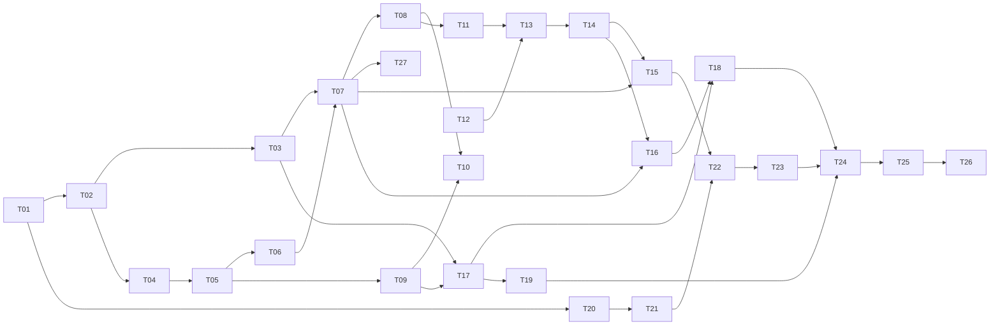

# Givsoner タスクリスト

v1（Phase 1〜9）の残作業を、人間が概ね 3 日で終える単位に割ったもの。

- **決定の記録**は [`docs/DESIGN.md`](docs/DESIGN.md)
- **実装中に毎回効く制約**は [`CLAUDE.md`](CLAUDE.md)
- **今やること（＝このファイル）** が進捗の唯一の正

---

## このファイルの規約

**着手前に必ずこの節を読むこと。**

1. **完了の記録はコミットと同時に行う。** タスクを終えたら、その実装と同じコミットで
   チェックを入れ、末尾の「完了済み」節へ 1 行に畳んで移す。別コミットにすると忘れる。

2. **ID は再利用しない。** タスクを削除・統合しても番号は空けたままにする。
   3 日に収まらないと判明したタスクは、**末尾に新しい ID を発番**して分割する
   （枝番 `T-13a` は使わない）。ID は発番順であり、実行順は「推奨する着手順」の表と
   各タスクの `依存:` 行が決める。

3. **受け入れ条件には 2 種類ある。**
   - `▸コマンド:` — 実行すれば判定できる。エージェントが自分で確認してよい
   - `▸目視:` — 人間の確認が必要
   
   **目視項目が 1 つでも残っているタスクを、エージェントが単独で「完了」と宣言してはいけない。**
   実装を終えたら「目視確認をお願いします」と述べて止まること。

4. **未着手タスクに書かれた型定義は着手時点の設計案であり、先行タスクの実装が正。**
   着手時に必ず実物と突き合わせ、食い違っていたらタスク本文を書き直してから実装する。

5. **T-11 以降は着手前に詳細化が必要。** ⑥実装内容と⑧受け入れ条件が骨子のままなので、
   詳細化そのものを各タスクの最初の作業として行う。

6. **制約の再掲は出典付き。** 各タスクの「制約」に書かれた内容は CLAUDE.md / DESIGN.md からの
   再掲であり、必ず出典を併記してある。**食い違いを見つけたら CLAUDE.md 側が正。**
   決定理由は再掲していないので、なぜそう決めたか知りたいときは DESIGN.md を読むこと。

---

## 現在地

**最終更新**: 2026-09-04

| 項目 | 内容 |
|---|---|
| 直前に完了 | T-17 fetch と放置警告（目視 2026-09-04 通過） |
| 次にやる | **T-18 checkout と FF マージのガード** |
| 未解決の判断事項 | なし |

**Phase 6 は fetch まで入った。** 残りは checkout と FF マージ（T-18）で、書き込み系の
入口は `src-tauri/src/git/ops.rs` に揃っている。**T-18 は詳細化済み**なので、その節を
読めばそのまま着手できる。

### 抱えている割り切り（承知の上で残してあるもの）

- **probe は 1 リポジトリあたり git を 5 回起動する。** T-17 でリモートの有無を足したぶん
  1 回増えた。この環境では 1 回 34ms（実測）なので、登録 7 件で一覧の更新が 240ms ほど伸びる。
  リモートの有無は「放置警告を永久に出し続けない」ための必須情報なので落とせない。
  気になるようになったら、**リポジトリごとの probe を並列にする**のが効く（いまは 1 件ずつ順）
- **中止で落とせるのは git 本体だけ。** `git-remote-https` のような子は残りうる。親が死ねば
  追って終わるが即座ではないので、理屈の上では「中止しています…」のまま返ってこない経路がある。
  プロセスツリーごと落とすには Windows の Job Object が要り、依存が増える。
  **clone は fetch より長く走るので、T-19 で決着を付けること**

### 済んだ Phase で決めたこと — 出典だけ置く

**毎回効く制約は CLAUDE.md、決定理由は DESIGN.md に移してある。**
ここへ書き写すと必ずどちらかが古くなるので、迷ったら出典を読むこと。

| Phase | 決まったこと | 出典 |
|---|---|---|
| 2 | レーン割り当てと描線（**判定ゲート合格 2026-09-03。以降動かさない**）／第 2 親のレーン合流は不採用 | CLAUDE.md §3 / DESIGN.md §5.1, §5.2, §15.1 |
| 3 | 可視 ref の絞り込みと ahead/behind ／ ref が数千本のときにペインが潰れる件 | CLAUDE.md §6 / DESIGN.md §4.4, §4.5, §6.4 |
| 4 | 3 ペイン配置 ／ 差分の色と語単位強調（強調の中では構文色をやめた）／ 文字コードの判別順 | DESIGN.md §6.1, §7.2, §9.1 |
| 5 | 任意 2 点比較（**`A...B` は 1 つの引数**）／ 作業ツリーの擬似行 | CLAUDE.md §6 / DESIGN.md §7.5, §10.3 |
| 6 | fetch の進捗・中止・放置警告・上流のタグ付け替え | CLAUDE.md §2, §8 / DESIGN.md §8.3, §8.3.1 |

**EUC-JP の判別が当たらない件は「当面このまま」で決着した**（2026-09-03、利用者の判断）。
EUC-JP を使う予定が無く、**UTF-8 と Shift_JIS が判定できれば足りる**ため。挙動は
`encoding.rs` の `euc_jp_hiragana_is_misdetected_as_shift_jis` が固定している（DESIGN.md §9.1）。

### 登録済みリポジトリ（判定と目視に使うもの）

| リポジトリ | コミット | max_lane | 同時レーン平均 | ルート |
|---|---|---|---|---|
| gitviewer / AerialSoldierMaker / save_temperature | 24 / 22 / 10 | 0 | 1.00 | 1 |
| drogon | 2,298 | 20 | 2.91 | 1 |
| vite | 10,186 | 54 | 5.45 | 1 |
| onyx | 20,285 | 52 | 11.43 | 4（orphan ブランチ 2 本）|
| linux | 148 万 | — | — | DESIGN.md §4.1 の非対象 |

小さい 3 つはマージが 1 件も無い一直線なので、枝分かれの確認には使えない。

**100 万コミット級の正式対応は v1.1 以降に送った**（DESIGN.md §1.1, §4.1 / 下の「v1.1」表）。
v1 では非対象のままだが、恒久的な非対象ではなくなった。

---

## 推奨する着手順

上から順に着手するのが効率的。

| 順 | Phase | タスク | 備考 |
|---|---|---|---|
| 1 | 1 | T-01 → T-02 → T-03 / T-04 | **済** |
| 2 | 2 | T-05 → T-06 → T-07 → T-08 → T-27 | **済**（T-08 は判定ゲート。合格） |
| 3 | 3 | T-09 → T-10 | **済** |
| 4 | 4 | T-11 → T-12 → T-13 → T-14 | **済** |
| 5 | 5 | T-15 → T-16 | **済** |
| 6 | 6-7 | T-17 → **T-18** / T-19 | T-17 済 |
| 7 | 8 | T-20 → T-21 → T-22 → T-23 | |
| 8 | 9 | T-24 → T-25 → T-26 | |

---

# Phase 6-7 — 書き込み系操作

## - [ ] T-18 [Phase 6] checkout と FF マージのガード

**目的**: checkout と fast-forward マージを、ユーザーの未保存作業を壊さない形で提供する。

**参照**: DESIGN.md §8.1, §8.2, §8.5, §3.6, §6.4 / CLAUDE.md §1, §2, §6

**依存**: T-17, T-16

**T-17 までの申し送り（着手時に確認すること。規約 4）**

- 書き込み系の入口は `src-tauri/src/git/ops.rs`。**checkout / merge --ff-only もここへ足す**
- **進捗は要らない。** どちらも一瞬で終わるので `exec::run` で足りる。
  `exec::run_progress` ＋ `exec::Cancel` は fetch / clone のための入口で、ここでは使わない
- 実行後の再読込は `snapshots.reload()`（`force: true`）＋ `repositories.refresh()`。
  **`useFetch` の `drive()` 末尾と同じ手順**にすること
- 確認ダイアログは `components/common/ProgressDialog.tsx` の `FetchConfirm` がひな形。
  `Esc` で閉じる `useEscape` も同じファイルにある
- **`.button--primary` の hover は `--accent-hover`。** 共通の `.button:hover` を効かせると
  文字が地に溶ける（実測 1.20 / 1.30）
- bare の判定は `RepositoryProbe.is_bare`。フロントには `RepositoryEntry.probe.isBare` で届く
- ahead/behind は `compute_branch_status` の `BranchStatus[]`（`refName` / `upstream` /
  `ahead` / `behind`）。**上流からの FF 可否はこれで判定できる**（`ahead === 0 && behind > 0`）
- ref ツリーの右クリックメニューに **checkout と「現在のブランチに FF マージ」の項目が既にある**
  （`RefTree.tsx` の `menuItems`）。`disabled: true` と `title: ja.refTree.notYet` を外して
  中身を入れる。**`ja.refTree.notYet` は使い切ったら消すこと**
- **グラフ行の右クリックメニューは無い。** `CommitRow.tsx` は `onClick` だけなので、
  `RefTree` と同じ形で `common/ContextMenu.tsx` を付ける

**T-16 の申し送りの訂正（規約 4。着手時に実物と突き合わせた結果）**

- 「dirty の判定は `is_clean()` 1 つで足りる」は**足りない。** `is_clean()` は未追跡ファイルも
  数える。擬似行を出すかどうかにはそれで正しいが、**checkout の可否は別の述語**にする
  （下の「未追跡だけなら止めない」）
- `WorkingTree::index_lock_present` は **`<path>/.git/index.lock` を組み立てている**
  （`status.rs`）。リンクされた作業ツリーでは `.git` がファイルなので**永久に false**、
  bare でも false になる。`repo.rs` は `git_dir` から正しく引いているので、
  **T-18 で `status.rs` 側を `git_dir` 起点に直す。** ここを gate にする以上、
  黙って通ってしまう経路を残せない（CLAUDE.md §2）

**作成・変更するファイル**

| 種別 | パス | 内容 |
|---|---|---|
| 変更 | `src-tauri/src/git/ops.rs` | `preflight` / `checkout` / `merge_ff` |
| 変更 | `src-tauri/src/git/status.rs` | `index.lock` を `git_dir` から引く |
| 変更 | `src-tauri/src/lib.rs` | 3 コマンドの登録 |
| 新規 | `src-tauri/tests/writeops.rs` | 生成リポジトリで実際に checkout / merge（結合） |
| 変更 | `scripts/make-test-repos.sh` | **FF できるクローン**を足す |
| 新規 | `src/components/common/ConfirmDialog.tsx` | `FetchConfirm` を一般化した確認ダイアログ |
| 新規 | `src/hooks/useWriteOps.ts` | 確認 → 実行 → 再読込の配線 |
| 変更 | `src/components/sidebar/RefTree.tsx` | checkout / FF マージを有効化 |
| 変更 | `src/components/commits/CommitRow.tsx` `CommitList.tsx` | 行の右クリックメニュー |
| 変更 | `src/App.tsx` `src/lib/ipc.ts` `src/i18n/ja.ts` `src/styles/app.css` | 配線 |

**実装内容**

*実行前の判定（`ops.rs`。**ここが T-18 の本体**）*

- **判定は 1 つの関数に集める**（fetch の `is_stale` と同じ考え方）。起動点が 4 つある
  （ref ツリーの右クリック / ダブルクリック / グラフ行の右クリック / 上流からの取り込み）ので、
  **判定をボタンの側に置くと結論が食い違う**
- 返すのは「止める理由」と「注意」の 2 本立て。**止める理由が 1 つでもあれば実行しない**

  | 止める理由 | 判定 | 出典 |
  |---|---|---|
  | bare である | `probe.is_bare` | DESIGN.md §3.6 |
  | 作業ツリーに変更がある | staged / unstaged / unmerged のどれかが空でない | DESIGN.md §8.1 |
  | `index.lock` が残っている | `git_dir/index.lock` | CLAUDE.md §2 |
  | コミットが 0 件 | `head.unborn` | — |

- **未追跡ファイルだけなら止めない。** checkout は未追跡ファイルを消さないし、上書きになる
  場合は git 自身が拒む。ここで止めると、新しいファイルを書きかけの間はブランチを
  切り替えられなくなる。**件数はダイアログに出す**（黙って通さない）
- **ダイアログを開いた時点と実行の瞬間で状態は変わりうる。** 表示用に 1 回、コマンドの中で
  もう 1 回、**同じ関数を通す**。判定するコードは 1 つのまま

*checkout — 対象の渡し方（**実測。ここを外すと ref が増える**）*

- **ローカルブランチは短い名前（`main`）で渡す。** 完全な ref 名（`refs/heads/main`）を渡すと
  git はブランチとして扱わず、**detached になる**
- **それ以外は完全な ref 名 ＋ `--detach`。** リモート追跡ブランチは
  `refs/remotes/origin/main`、タグは `refs/tags/v1`、コミットは SHA
- **短い名前だけを渡してはいけない。** ローカルに同名が無いと、git は
  **リモート追跡ブランチを追跡するローカルブランチを勝手に作る**（`checkout.guess` の既定が
  true）。実測で `git checkout sideline` が `branch 'sideline' set up to track ...` を出して
  ローカルブランチを 1 本増やした。**ref の新規作成であり CLAUDE.md §1 違反**
- **短い名前 ＋ `--detach` で塞ごうとしないこと。** DWIM が内部で `-b` を立てるため
  `fatal: '--detach' cannot be used with '-b/-B/--orphan'` という**見当違いのエラー**になる
  （実測）。**完全な ref 名で渡すのが正解**

*checkout — その他*

- 対象は **ローカルブランチ / リモート追跡ブランチ / タグ / 任意コミット**
- detached になる場合は**ダイアログに明示**する（DESIGN.md §8.1）
- **detached HEAD から離れるときは注意を出す。** いまの HEAD がどの ref からも到達できないなら、
  離れると辿る手段が無くなる。到達可能性は T-09 の `reach.rs` で手元のグラフから判定する
  （`git rev-list` を呼ばない。CLAUDE.md §2）
- `--force` と自動 stash は**提供しない**（CLAUDE.md §1）

*FF マージ*

- `git merge --ff-only <完全な ref 名>` 固定。**`--no-ff` も `--squash` も無い**
- 主動線は「**現在のブランチに上流を取り込む**」。ref ツリーの現在ブランチ行と、
  任意 ref の右クリックの 2 つから起動する
- **FF できるかは手元のグラフから判定する。**「HEAD が対象の祖先で、かつ HEAD ≠ 対象」。
  上流からの取り込みなら `BranchStatus` の `ahead === 0 && behind > 0` と同じこと
  - **祖先判定は可視 ref で絞る前の全コミット集合で行う。** 表示を絞ってもグラフから
    消えるだけで、履歴は変わらない
- **FF できないときは項目を出すが無効にし、理由をツールチップに書く**
  （「3 件進んでいるので fast-forward できません」）。押せない理由が分からないのが一番困る
- **detached HEAD では FF マージを出さない。** 取り込む先のブランチが無い

*起動点*

- ref ツリーの右クリック（既にある項目を有効化）＋ **ダブルクリックで checkout**
- グラフ行の右クリックに「このコミットを checkout（detached）」を足す
- **ショートカットは足さない**（DESIGN.md §6.5 の表に無い）

*実行後*

- **全コミットメタ情報を再取得してレーンを計算し直す**（DESIGN.md §8.5）。部分更新は持ち込まない
- 一覧も取り直す（HEAD の表示と ahead/behind が変わる）
- 失敗したら**人間向けメッセージ ＋ 展開で生 stderr**（DESIGN.md §3.6）。
  fetch の `explain` と同じ形にする

**制約**（すべて CLAUDE.md §1, §2）

- **`--force` 付き checkout と自動 stash を提供しない**
- **非 fast-forward マージを提供しない**（`merge` は常に `--ff-only`）
- **ローカル追跡ブランチを自動作成しない。** 完全な ref 名で渡すこと
- **ブランチ / タグの作成・削除・リネームをしない**
- **`.git/index.lock` を削除しない。** 検出して表示するだけ
- git 実行は `exec.rs` を通す（CLAUDE.md §2）
- 表示文言は `src/i18n/ja.ts` に集約する（CLAUDE.md §6）

**受け入れ条件**

- ▸コマンド: `npm run test:rust` — 判定（**bare / 汚れている / `index.lock` 残留 / unborn で
  止まること**、**未追跡だけなら止まらないこと**）と、生成リポジトリで
  **実際に checkout して HEAD が動くこと**、**リモート追跡ブランチを checkout しても
  ローカルブランチが増えないこと**、FF できるクローンで `merge --ff-only` が通ること、
  **分岐したクローン（`diverged`）でマージが実行されないこと**
- ▸コマンド: `npm run test:rust` — 引数の固定テスト（fetch の
  `fetch_args_stay_within_what_we_allow` と同じ形）で、checkout と merge の引数に
  `--force` / `-f` / `--no-ff` / `--squash` / `-b` / `--track` が現れないこと
- ▸コマンド: `grep -rn 'Command::new' src-tauri/src` が `exec.rs` だけであること（CLAUDE.md §2）
- ▸コマンド: `npm run test` / `npm run typecheck` / `npm run check:rust`
- ▸目視: 汚れたリポジトリで checkout が中止され、**何が汚れているかが分かる**こと
- ▸目視: タグを checkout すると detached になる旨が事前に出ること
- ▸目視: FF できない ref の項目が**無効で、理由が読める**こと
- ▸目視: checkout 後にグラフの HEAD 印と ahead/behind が更新されること
- ▸目視: bare リポジトリで checkout の項目が無効なこと

**テスト**: `npm run test:rust`, `npm run test`, `npm run typecheck`, 目視

**着手時に足すテスト用リポジトリ**

- **FF できるクローン**（`ff-client`）。上流だけを進め、手元は動かさない。
  既存の `diverged` は手元も進んでいるので**そのまま FF 不可の側**として使える

**非スコープ**: clone（T-19）／ブランチ作成（v1.1）／リモート追跡ブランチからの
ローカルブランチ作成（v1.1。DESIGN.md §8.1）

---

> **ここから先は骨子。着手前に詳細化すること**（このファイルの規約 5）。

## - [ ] T-19 [Phase 7] clone

**目的**: HTTPS / SSH の URL からリポジトリを clone して登録する。

**参照**: DESIGN.md §8.4, §3.3 / CLAUDE.md §1

**依存**: T-17

**作成・変更するファイル**: `src-tauri/src/git/ops.rs`(変更) / `src/components/setup/CloneDialog.tsx`(新)

**T-17 からの申し送り**

- **進捗と中止は `exec::run_progress` ＋ `exec::Cancel` がそのまま使える。**
  `clone --progress` の stderr は fetch と同じ形なので、`fetchprogress.rs` のパーサも
  そのまま通る（**ラベルは翻訳されうる**ので `(済/全)` と `%` だけを構造で取る）
- **中止で落とせるのは git 本体だけ。** `git-remote-https` のような子は残りうる。
  親が死ねば追って終わるが即座ではないので、**理屈の上では「中止しています…」のまま
  返ってこない**経路がある。プロセスツリーごと落とすには Windows の Job Object が要り、
  依存が増えるので T-17 では入れていない。**clone は fetch より長く走るので、
  ここで決着を付けること**（入れないなら入れない理由を DESIGN.md に書く）
- **中止しても取り込み済みのものは戻らない。** clone では**残骸ディレクトリ**がそれに当たる

**実装内容（骨子）**

- URL 入力 → 既定ワークスペースルートから `<root>/<name>` を埋めたダイアログを毎回出して確認
- `git clone --progress <url> <dir>` の stderr をパースして実バー表示
- 失敗時は確認ダイアログの上で残骸ディレクトリを削除
- 完了したら自動で登録して開く

**制約**（CLAUDE.md §1）

- **shallow clone (`--depth`) と `--recurse-submodules` を提供しない**
- 認証は git CLI（Git Credential Manager）に完全委譲する。アプリは資格情報を扱わない
- `GIT_TERMINAL_PROMPT=0` により端末待ちでハングしない

**受け入れ条件（骨子）**: 認証が必要なリポジトリで GCM のウィンドウが出て完了すること、
中断時に残骸が残らないこと、進捗バーが動くこと。

**テスト**: 目視（実リポジトリの clone）

**非スコープ**: submodule 対応（v2.0）

**注記**: 3 日基準の例外（2 日程度）。

---

# Phase 8 — AI レビュー

## - [ ] T-20 [Phase 8] LLM プロバイダ設定と資格情報保管

**目的**: OpenAI 互換の接続先をプロファイルとして保存し、API キーを安全に扱う。

**参照**: DESIGN.md §10.1, §10.2 / CLAUDE.md §4, §7

**依存**: T-01

**作成・変更するファイル**: `src-tauri/src/llm/client.rs`(新) / `src-tauri/src/secret.rs`(新) /
`src/components/settings/LlmProfiles.tsx`(新)

**実装内容（骨子）**

- プロファイル CRUD（名前 / base URL / モデル / コンテキスト長 / temperature / max tokens）
- **API キーは Windows 資格情報マネージャーに保存**し、`settings.json` には `credentialKey` のみ
- `/v1/models` を叩いてモデル名を補完する
- 接続テストボタン（1 リクエスト投げて応答を確認）
- Ollama も `http://localhost:11434/v1` で同じ経路を通す

**制約**（CLAUDE.md §4, §7）

- **API キーを `settings.json` に書かない**
- **OpenAI 互換 API 1 系統のみ。** Ollama ネイティブ API (`/api/chat`) を実装しない
- API キーが画面表示・ログに出る経路を作らない（`redact.rs` を通す）

**受け入れ条件（骨子）**: 資格情報マネージャーへの保存と読み出し、
`settings.json` に平文キーが現れないこと、接続テストが Ollama と OpenAI 互換の両方で通ること。

**テスト**: `cargo test`（モックサーバ）, 目視

**非スコープ**: skill（T-21）／レビュー実行（T-22）

---

## - [ ] T-21 [Phase 8] skill の読み込みと信頼モデル

**目的**: レビュー観点を定義した skill を読み込み、**リポジトリ内 skill を安全に扱う。**

**参照**: DESIGN.md §11 / CLAUDE.md §4

**依存**: T-20

**作成・変更するファイル**: `src-tauri/src/llm/skill.rs`(新) / `src/components/review/SkillPicker.tsx`(新)

**実装内容（骨子）**

- Markdown + YAML frontmatter（`name` / `description` / `globs` / `enabled`）のパース
- グローバル（`%APPDATA%\com.tatsu.givsoner\skills\`）とリポジトリ内（`<repo>/.gitviewer/skills/*.md`）。
  リポジトリ内が優先
- **リポジトリ内 skill は既定で無効。** リポジトリごとに一度だけ明示的な信頼操作を要求し、
  **ファイル内容のハッシュが変わったら再確認**する
- `globs` にマッチした skill を自動で有効化しつつ、手動 on/off できる
- 内蔵 skill「汎用コードレビュー（日本語出力）」を 1 つ同梱

**制約**（CLAUDE.md §4）

- **リポジトリ内 skill を既定で読み込まない。** 他人のリポジトリを開く用途がある以上、
  リポジトリ内の指示文でレビュー結果を操作されうる
- 信頼状態とハッシュは `settings.json` の `repoSkills` に保存する

**受け入れ条件（骨子）**: 未信頼リポジトリの skill が**プロンプトに一切含まれない**ことのテスト、
ハッシュ変化で再確認が要求されること、frontmatter のパーステスト。

**テスト**: `cargo test`

**非スコープ**: レビュー実行（T-22）

---

## - [ ] T-22 [Phase 8] レビュー実行エンジン

**目的**: 差分をファイル単位で LLM に投げ、結果を構造化して受け取る。**フォールバック経路が要。**

**参照**: DESIGN.md §10.4〜10.7 / CLAUDE.md §7

**依存**: T-21, T-15

**作成・変更するファイル**: `src-tauri/src/llm/review.rs`(新) / `src-tauri/src/llm/client.rs`(変更)

**実装内容（骨子）**

- 投入単位は**ファイル単位 ＋ 最後に全体サマリ**。コンテキスト長超過時のみ hunk 分割にフォールバック
- モデルに渡すのは**パス ＋ unified diff (`-U10`) ＋ コミットメッセージ ＋ skill 本文**のみ。
  **ファイル全文は渡さない**
- **JSON スキーマを要求し、パース失敗時は生出力を Markdown として表示するフォールバック**
  （スキーマは DESIGN.md §10.6）
- 既定は逐次（並列度 1）、設定で最大 3。いつでもキャンセル可
- **1 ファイルの失敗で全体を止めない。** ファイル単位でエラーを記録し、サマリに「N 件失敗」を明示
- ストリーミング表示（SSE のパース）

**制約**（CLAUDE.md §7）

- **ファイル全文を渡さない**
- **JSON → Markdown フォールバックは必須**。この経路をテストで必ず通す
- 1 ファイルの失敗で全体を止めない

**受け入れ条件（骨子）**: モックサーバで
①正しい JSON ②壊れた JSON ③JSON でない Markdown ④途中で切れた応答 ⑤HTTP エラー
のすべてを流し、いずれもレビューが失われないこと。キャンセルが即座に効くこと。

**テスト**: `cargo test`（OpenAI 互換モックサーバ）

**非スコープ**: レビュー UI（T-23）

---

## - [ ] T-23 [Phase 8] レビュー UI と結果の永続化

**目的**: レビューを起動・表示し、結果を履歴として積む。

**参照**: DESIGN.md §10.3, §10.4, §12.4 / CLAUDE.md §5

**依存**: T-22

**作成・変更するファイル**: `src/components/review/ReviewDrawer.tsx`(新) /
`src/components/review/PreflightPanel.tsx`(新) / `src/components/review/ReviewHistory.tsx`(新) /
`src-tauri/src/store/reviews.rs`(新)

**実装内容（骨子）**

- **実行前パネルを必ず出す**: 対象ファイル一覧 ＋ 個別除外チェック、skill 複数選択、
  プロファイル選択、概算トークン数（文字数 ÷ 4）、超過ファイルに「hunk 分割されます」バッジ
- 差分ペイン右のドロワーに結果を表示。構造化できた指摘は差分の該当行にインラインバッジ
- 結果を `reviews/<repo-id>/<timestamp>.json` に保存。**上書きせず履歴として積む**
- リポジトリごとの「レビュー履歴」一覧。開くと当時の差分と並べて再表示
- 「Markdown で書き出し」ボタン（保存形式は JSON のまま、Markdown は出力専用）

**制約**（CLAUDE.md §5）

- レビュー結果は**上書きせず履歴として積む**
- 保存先は `%APPDATA%\com.tatsu.givsoner\reviews\`（OneDrive 配下に置かない）

**受け入れ条件（骨子）**: 同じ差分を 2 回レビューすると 2 件残ること、
JSON パース失敗時に Markdown が表示され「構造化に失敗しました」が添えられること、
`Ctrl+Shift+A` で起動できること。

**テスト**: `npm run typecheck`, 目視

**非スコープ**: fetch 後の自動レビュー（v1 では持たない）

---

# Phase 9 — 仕上げと配布

## - [ ] T-24 [Phase 9] ログファイルとエラー処理の仕上げ

**目的**: 後から追える記録を残し、エラー表示を人間向けに整える。

**参照**: DESIGN.md §13.3, §13.4 / CLAUDE.md §4

**依存**: T-18, T-19, T-23

**作成・変更するファイル**: `src-tauri/src/logging.rs`(新) / `src-tauri/src/redact.rs`(変更) /
`src-tauri/src/lib.rs`(変更)

**実装内容（骨子）**

- `logs/givsoner-YYYY-MM-DD.log` に書き、7 日分でローテーション
- Rust 側の panic をキャッチしてエラーダイアログを出し、ログの場所を案内
- **マスキングの適用範囲を点検する。** 画面表示とログの両方が `redact.rs` を通っているか、
  全経路を洗い出して確認する
- 各エラーの「人間向けメッセージ ＋ 展開で生 stderr」を整備する

**制約**（CLAUDE.md §4）

- **全出力が `redact.rs` を通ること。** `%APPDATA%` に平文トークンを残さない

**受け入れ条件（骨子）**: 認証情報付き URL を含むリモートで操作し、
ログファイルにも画面にも平文が出ないこと。panic を意図的に起こしてダイアログが出ること。

**テスト**: `cargo test`, 目視

**非スコープ**: 設定画面（T-25）

---

## - [ ] T-25 [Phase 9] 設定画面とショートカット

**目的**: 散らばっている設定を 1 画面にまとめ、ショートカットを全実装する。

**参照**: DESIGN.md §6.5, §12.2 / CLAUDE.md §6

**依存**: T-24

**作成・変更するファイル**: `src/components/settings/SettingsDialog.tsx`(新) /
`src/hooks/useShortcuts.ts`(新) / `src/i18n/ja.ts`(変更)

**実装内容（骨子）**

- 設定画面（git パス / ワークスペースルート / テーマ / 日時形式 / 差分レイアウト /
  コンテキスト行 / fetch 放置閾値 / レビュー並列度 / LLM プロファイル / skill）
- DESIGN.md §6.5 のショートカットをすべて実装し、キーバインド一覧を設定画面に表示
- `Ctrl+,` で設定を開く、`Esc` で閉じる

**制約**: 表示文言は `src/i18n/ja.ts`（CLAUDE.md §6）

**受け入れ条件（骨子）**: 全ショートカットが効くこと、設定変更が即座に反映され再起動後も保持されること。

**テスト**: `npm run typecheck`, 目視

**非スコープ**: 新機能の追加

---

## - [ ] T-26 [Phase 9] 配布ビルドと DoD 検証

**目的**: ポータブル zip を作り、実運用で v1 の完成を判定する。

**参照**: DESIGN.md §2.3, §15.2 / CLAUDE.md §10

**依存**: T-25

**作成・変更するファイル**: `package.json`(変更) / `README.md`(新)

**実装内容（骨子）**

- `npm run package:zip` が動作することを確認する（Phase 0 で用意済みのスクリプト）
- リリースビルドで起動し、開発ビルドとの差異（パス解決・アイコン・ウィンドウ）を確認する
- README を書く（何ができて何をしないか、起動方法、設定の場所）
- **実リポジトリを 5 個以上登録し、1 週間実運用する**

**制約**: Tauri の bundler に zip ターゲットは無いので、
`src-tauri/target/release/Givsoner.exe` を npm script で zip 化する（CLAUDE.md §10）

**受け入れ条件**

- ▸コマンド: `npm run package:zip` が `dist-zip/Givsoner-portable.zip` を生成する
- ▸目視: zip を展開した exe が単体で起動する
- ▸目視: **実リポジトリ 5 個以上で 1 週間実運用し、既存 GUI クライアントを一度も開かずに済んだ**

**⚠️ このタスクはエージェントが単独で完了を宣言してはいけない。**

**非スコープ**: 自動更新／コード署名／インストーラ（すべて恒久的に非対象）

**注記**: 3 日基準の例外。作業時間ではなくカレンダー時間（実運用 1 週間）。

---

# v1.1 以降（ID は振らない）

着手が近づいた時点で詳細化し、末尾から新しい ID を発番する。

## v1.1

| 項目 | 内容 | 参照 |
|---|---|---|
| コミット検索 | メッセージ / 作者 / `log -S` によるコード内容検索 | DESIGN.md §15.3 |
| stash 一覧 | stash の閲覧のみ（作成・適用はしない） | DESIGN.md §15.3 |
| ファイル単位の履歴 | `log --follow` によるファイルの変更履歴 | DESIGN.md §15.3 |
| ブランチ同士の比較 | `origin/main...HEAD` 形式の比較を専用 UI から起動 | DESIGN.md §10.3 |
| `--cc` マージ差分 | マージコミットで両親と異なる部分だけを示す combined diff | DESIGN.md §7.4 |
| 画像差分 | 画像ファイルの変更を並べて表示 | DESIGN.md §7.2 |
| リポジトリのグループ分け | サイドバーでフォルダによる分類 | DESIGN.md §6.2 |
| ローカル追跡ブランチ作成 | `checkout -b --track` を明示的なメニュー項目として追加 | DESIGN.md §8.1 |
| 100 万コミット級リポジトリ | 「全件をフロントへ渡す」前提の見直し。v1 は自動で読まないだけ | DESIGN.md §1.1, §4.1 |

## v2.0

| 項目 | 内容 | 参照 |
|---|---|---|
| blame | 行ごとの最終変更コミットの表示 | DESIGN.md §15.3 |
| reflog | reflog の閲覧 | DESIGN.md §15.3 |
| submodule 対応 | submodule の中身を辿れるようにする（v1 は「壊れない」だけ担保） | DESIGN.md §15.3 |

---

# 完了済み

| ID | Phase | タイトル | コミット |
|---|---|---|---|
| — | 0 | Tauri v2 雛形 ＋ git 検出 ＋ git コマンドログパネル | `93867ed` |
| T-01 | 1 | 設定ストアと %APPDATA% レイアウト（settings.json / state.json） | `cf5fd37` |
| T-02 | 1 | リポジトリの登録・判定・フォルダスキャン ＋ テスト用リポジトリ生成 | `1f368b7` |
| T-03 | 1 | リポジトリ一覧サイドバーと切替 ＋ 右クリック登録解除・D&D 並べ替え | `80189ea` |
| T-04 | 1 | コミットメタ情報の全件取得とパース ＋ 読み込み進捗と大規模リポジトリの確認 | `c9aae9d` |
| T-05 | 2 | レーン割り当てアルゴリズム ＋ topo / date の並び順 | `6601800` |
| T-06 | 2 | レーン配列 → SVG パス生成と描線 | `e6e877f` `7793d6a` `4bce75b` |
| T-07 | 2 | コミットリストの仮想スクロールと列表示 | `a419547` `f1da933` |
| T-08 | 2 | 判定ゲート — 美しさの検証と調整（**合格**） | `d861dba` `1a5f36a` `1662e52` |
| T-27 | 2 | orphan ブランチと履歴の終端に印を付ける | `3339a0c` |
| T-09 | 3 | 到達可能集合と ahead/behind の計算 | `01a1571` |
| T-10 | 3 | ブランチ / タグツリー UI | `79e5311` `4fb5ec9` |
| T-11 | 4 | コミット詳細と変更ファイル一覧（＋ 3 ペインへの配置替え） | `f0a7906` `041197b` |
| T-12 | 4 | 文字コード自動判別と改行コード検出 | `415e71f` |
| T-13 | 4 | 差分の取得・パースと side-by-side 描画 | `f6ff002` `012364a` |
| T-14 | 4 | Shiki ハイライトと大差分の折りたたみ | `9489720` |
| T-15 | 5 | 任意 2 コミット間差分 | `50a12fb` |
| T-16 | 5 | 作業ツリーの read-only 表示 | `fa7f998` |
| T-17 | 6 | fetch と放置警告 | `b12ec13` `6677914` `4e61936` |
