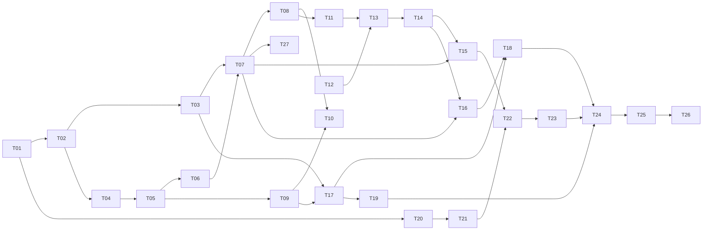

# Givsoner タスクリスト

v1（Phase 1〜9）の残作業を、人間が概ね 3 日で終える単位に割ったもの。

- **決定の記録**は [`docs/DESIGN.md`](docs/DESIGN.md)
- **実装中に毎回効く制約**は [`CLAUDE.md`](CLAUDE.md)
- **今やること（＝このファイル）** が進捗の唯一の正

---

## このファイルの規約

**着手前に必ずこの節を読むこと。**

1. **完了の記録はコミットと同時に行う。** タスクを終えたら、その実装と同じコミットで
   チェックを入れ、末尾の「完了済み」節へ 1 行に畳んで移す。別コミットにすると忘れる。

2. **ID は再利用しない。** タスクを削除・統合しても番号は空けたままにする。
   3 日に収まらないと判明したタスクは、**末尾に新しい ID を発番**して分割する
   （枝番 `T-13a` は使わない）。ID は発番順であり、実行順は「推奨する着手順」の表と
   各タスクの `依存:` 行が決める。

3. **受け入れ条件には 2 種類ある。**
   - `▸コマンド:` — 実行すれば判定できる。エージェントが自分で確認してよい
   - `▸目視:` — 人間の確認が必要
   
   **目視項目が 1 つでも残っているタスクを、エージェントが単独で「完了」と宣言してはいけない。**
   実装を終えたら「目視確認をお願いします」と述べて止まること。

4. **未着手タスクに書かれた型定義は着手時点の設計案であり、先行タスクの実装が正。**
   着手時に必ず実物と突き合わせ、食い違っていたらタスク本文を書き直してから実装する。

5. **T-11 以降は着手前に詳細化が必要。** ⑥実装内容と⑧受け入れ条件が骨子のままなので、
   詳細化そのものを各タスクの最初の作業として行う。

6. **制約の再掲は出典付き。** 各タスクの「制約」に書かれた内容は CLAUDE.md / DESIGN.md からの
   再掲であり、必ず出典を併記してある。**食い違いを見つけたら CLAUDE.md 側が正。**
   決定理由は再掲していないので、なぜそう決めたか知りたいときは DESIGN.md を読むこと。

---

## 現在地

**最終更新**: 2026-09-05

| 項目 | 内容 |
|---|---|
| 直前に完了 | T-18 checkout と FF マージ（**Phase 6 完了**。目視 2026-09-05 通過） |
| 次にやる | **T-19 clone — 目視 5 件通過。「既定の保存先」の直しを再確認待ち** |
| 未解決の判断事項 | なし |

**T-19 の目視は 4 件 ＋ サブモジュールの 1 件が通過した**（2026-09-05）。
残りは「既定の保存先」の 1 件で、**1 巡目で 2 つ壊れていたのを直した**ところ。
規約 3 のとおり、まだ完了にはしていない。

**押せる条件でだけ選択肢を出すと、画面から消えて何も読めなくなる**（この目視で分かった）。
「この保存先を次回から既定にする」を「既定と違う場所のときだけ出す」にしていたが、
**保存先の欄は既定で初期化される**ので条件が常に成立せず、一度決めたあとは二度と現れない。
いまの既定も画面に出していなかったので、**勝手に変わっているようにしか見えなかった**。
押せない状態で残し、どの状態でもいまの既定を文言に出すようにした（CLAUDE.md §6 に追記）。

**パスの比較をフロントだけ素の `!==` にしていた。** Rust 側 (`store/mod.rs` の `same_path`) は
末尾の区切りと大文字小文字を吸収しているのに揃えておらず、`C:\Gitwork` と `C:\Gitwork\` が
別の場所と判定される。既定がその 2 つの間で往復しうる状態だった。

**どちらも判定をコンポーネントに直書きしていたのが原因。** 純関数へ出して
（`lib/clonePath.ts` の `samePath` / `rememberOption`）テストで固定した。
**T-18 の「画面まで通していない経路は動かない」と同じ話が、こんどはテストの側で出た**
— フロントは純関数だけテストするので、直書きした判定にはテストが 1 つも当たらない。

**サブモジュールの自動取り込みを「選べる」に変えた**（2026-09-05、利用者の判断）。
CLAUDE.md §1 の非対象から外したが、外したのは**利用者が確認画面でチェックしたときだけ**で、
黙って取り込まないことは守っている。リモート追跡ブランチの件（2026-09-04）と同じ形の緩和。

**サブモジュールが実際に取り込まれることは結合テストで確かめられない。** git 2.38 以降は
サブモジュールの `file` トランスポートを拒む（この環境の git 2.43 で実測）ので、生成した
ローカルの上流では成功しない。`protocol.file.allow` を緩めると全 git 呼び出しに効いてしまう
ので行わず、**フラグが実際のプロセスへ届いていること**をコマンドログで固定してある。

**子プロセスを Job Object で落とすのは入れないことにした**（2026-09-05。T-19 で決着）。
`windows` crate への直接依存が増えるのに対し、利用者から見える違いは**残骸フォルダを
消せるかどうかに集約される**。そちらは再試行（100ms × 20 回）で足りる — 中止直後に消せない
のは子がまだ pack の一時ファイルを掴んでいる短い間だけで、親が死ねば追って終わる。
2 秒待っても消せなければ、消せなかったことと場所を結果に出す（DESIGN.md §8.4）。

**clone の残骸を消してよいのは「実行の直前に無かったと確かめられた」ときだけ。**
確かめられなければ消さずに場所を伝える。利用者の既存フォルダを消す事故を、条件分岐ではなく
構造で潰してある（`tests/clone.rs` の `a_failed_clone_leaves_folders_it_did_not_create`）。

**リモート追跡ブランチの扱いを変えた**（2026-09-04、利用者の判断）。detached 固定をやめ、
**確認画面で「ローカル追跡ブランチを作って切り替える」か「detached で開く」を選ばせる**。
守っているのは「**黙って ref を作らない**」のほうで、ブランチの削除・リネームとタグの操作は
引き続き提供しない（CLAUDE.md §1 / DESIGN.md §8.1）。

**T-18 の目視は 3 巡かかった。9 件直している。** 内訳は
①受け渡しの形（serde）②文言 ③グラフの追従 ④はみ出し ⑤起動点の不足 ⑥コピーの範囲、
そして着手中に見つけた既存不具合 3 件（HEAD の印 / `index.lock` の場所 / `%s` の潰れ）。
**画面まで一度も通していない経路は、テストが緑でも動かないと思ったほうがよい**
（`rename_all_fields` はその典型で、引数の組み立てだけ固定していても受け取りの形は守れない）。

### 抱えている割り切り（承知の上で残してあるもの）

- **probe は 1 リポジトリあたり git を 5 回起動する。** T-17 でリモートの有無を足したぶん
  1 回増えた。この環境では 1 回 34ms（実測）なので、登録 7 件で一覧の更新が 240ms ほど伸びる。
  リモートの有無は「放置警告を永久に出し続けない」ための必須情報なので落とせない。
  気になるようになったら、**リポジトリごとの probe を並列にする**のが効く（いまは 1 件ずつ順）
- **中止で落とせるのは git 本体だけ。** `git-remote-https` のような子は残りうる。親が死ねば
  追って終わるが即座ではないので、理屈の上では「中止しています…」のまま返ってこない経路がある。
  **T-19 で「Job Object は入れない」と決着した**（DESIGN.md §8.4）。clone の残骸は
  再試行で消しており、消せなければ場所を出す。fetch 側はそもそも残骸の概念が無い
- **確認画面を出すまでに git を 9 回起動する**（T-18）。判定に probe（5 回）と
  `status`（4 回）を通すため、この環境では 300ms ほど無反応になる。判定を 1 箇所に
  保つほうを取った（probe を分解すると bare / unborn / `index.lock` の判定が 2 系統になる）。
  気になるようになったら、**確認画面を先に出して判定を後から差し込む**のが素直

### 済んだ Phase で決めたこと — 出典だけ置く

**毎回効く制約は CLAUDE.md、決定理由は DESIGN.md に移してある。**
ここへ書き写すと必ずどちらかが古くなるので、迷ったら出典を読むこと。

| Phase | 決まったこと | 出典 |
|---|---|---|
| 2 | レーン割り当てと描線（**判定ゲート合格 2026-09-03。以降動かさない**）／第 2 親のレーン合流は不採用 | CLAUDE.md §3 / DESIGN.md §5.1, §5.2, §15.1 |
| 3 | 可視 ref の絞り込みと ahead/behind ／ ref が数千本のときにペインが潰れる件 | CLAUDE.md §6 / DESIGN.md §4.4, §4.5, §6.4 |
| 4 | 3 ペイン配置 ／ 差分の色と語単位強調（強調の中では構文色をやめた）／ 文字コードの判別順 | DESIGN.md §6.1, §7.2, §9.1 |
| 5 | 任意 2 点比較（**`A...B` は 1 つの引数**）／ 作業ツリーの擬似行 | CLAUDE.md §6 / DESIGN.md §7.5, §10.3 |
| 6 | fetch の進捗・中止・放置警告・上流のタグ付け替え | CLAUDE.md §2, §8 / DESIGN.md §8.3, §8.3.1 |
| 6 | checkout の渡し分け ／ 確認画面 ／ FF マージ ／ 書き込み後は HEAD へ寄せる | CLAUDE.md §1, §2, §6 / DESIGN.md §8.1, §8.2, §8.5 |

**EUC-JP の判別が当たらない件は「当面このまま」で決着した**（2026-09-03、利用者の判断）。
EUC-JP を使う予定が無く、**UTF-8 と Shift_JIS が判定できれば足りる**ため。挙動は
`encoding.rs` の `euc_jp_hiragana_is_misdetected_as_shift_jis` が固定している（DESIGN.md §9.1）。

### 登録済みリポジトリ（判定と目視に使うもの）

| リポジトリ | コミット | max_lane | 同時レーン平均 | ルート |
|---|---|---|---|---|
| gitviewer / AerialSoldierMaker / save_temperature | 24 / 22 / 10 | 0 | 1.00 | 1 |
| drogon | 2,298 | 20 | 2.91 | 1 |
| vite | 10,186 | 54 | 5.45 | 1 |
| onyx | 20,285 | 52 | 11.43 | 4（orphan ブランチ 2 本）|
| linux | 148 万 | — | — | DESIGN.md §4.1 の非対象 |

小さい 3 つはマージが 1 件も無い一直線なので、枝分かれの確認には使えない。

**100 万コミット級の正式対応は v1.1 以降に送った**（DESIGN.md §1.1, §4.1 / 下の「v1.1」表）。
v1 では非対象のままだが、恒久的な非対象ではなくなった。

---

## 推奨する着手順

上から順に着手するのが効率的。

| 順 | Phase | タスク | 備考 |
|---|---|---|---|
| 1 | 1 | T-01 → T-02 → T-03 / T-04 | **済** |
| 2 | 2 | T-05 → T-06 → T-07 → T-08 → T-27 | **済**（T-08 は判定ゲート。合格） |
| 3 | 3 | T-09 → T-10 | **済** |
| 4 | 4 | T-11 → T-12 → T-13 → T-14 | **済** |
| 5 | 5 | T-15 → T-16 | **済** |
| 6 | 6-7 | T-17 → T-18 → **T-19** | T-17 / T-18 済 |
| 7 | 8 | T-20 → T-21 → T-22 → T-23 | |
| 8 | 9 | T-24 → T-25 → T-26 | |

---

# Phase 6-7 — 書き込み系操作

## - [ ] T-19 [Phase 7] clone

**目的**: HTTPS / SSH の URL からリポジトリを clone して登録する。**Phase 7 はこれで終わり。**

**参照**: DESIGN.md §8.4, §3.3, §3.6, §12.2 / CLAUDE.md §1, §2, §4, §6

**依存**: T-17

**T-18 までの申し送り（着手時に確認すること。規約 4）**

- **進捗と中止は `exec::run_progress` ＋ `exec::Cancel` がそのまま使える。**
  `clone --progress` の stderr は fetch と同じ形なので、`fetchprogress.rs` のパーサも
  そのまま通る（**ラベルは翻訳されうる**ので `(済/全)` と `%` だけを構造で取る）
- **中止で落とせるのは git 本体だけ。** `git-remote-https` のような子は残りうる。
  親が死ねば追って終わるが即座ではないので、理屈の上では「中止しています…」のまま
  返ってこない経路がある。プロセスツリーごと落とすには Windows の Job Object が要り、
  依存が増えるので T-17 では入れていない。**clone は fetch より長く走るので、ここで
  決着を付けること**（入れないなら、入れない理由を DESIGN.md §8.4 に書く）
- 進捗バーは `components/common/LoadProgress.tsx`。**総数 `null` で不定表示**になるので、
  割合の出ない段階もそのまま流せる。`estimated={false}`（git が数えた実数なので「約」は嘘）
- ダイアログは `components/common/ConfirmDialog.tsx` の `ConfirmDialog` / `ResultDialog`。
  **止める理由（`blockers`）は実行ボタンごと消える**ので、入力の検証はそちらに載せない
- `settings.workspaceRoot` は **T-01 で既にある**（`Option<String>`、既定 `None`）。新設不要
- 登録は `add_repository(path)`。**同じパスが登録済みならその登録が返る**ので、
  clone 後にそのまま呼んでよい
- **`exec::run_progress` の `repo` は `Option<&Path>`。** clone は「まだ無いフォルダ」を
  作る操作なので、`-C` は**親ディレクトリ**に向けるか `None` にして絶対パスで渡すこと
- **serde の `rename_all` は変種の名前しか変えない。** フロントから構造体を送るなら
  `rename_all_fields` を忘れないこと（T-18 でここに嵌まった）
- **ダイアログのボタンは `.modal__actions .button` で折り返す。** URL やパスを
  ラベルに入れると箱から出る（CLAUDE.md §6）

**作成・変更するファイル**

| 種別 | パス | 内容 |
|---|---|---|
| 変更 | `src-tauri/src/git/ops.rs` | `clone` の実行と結果、残骸の後始末 |
| 変更 | `src-tauri/src/lib.rs` | `clone_repository` / 進捗イベントの登録 |
| 新規 | `src/components/setup/CloneDialog.tsx` | URL と保存先の入力 ＋ 進捗 |
| 新規 | `src/lib/clonePath.ts` | URL → 既定のフォルダ名（純関数。テストはここ） |
| 変更 | `src/components/sidebar/RepositoryList.tsx` | 「clone」ボタン |
| 変更 | `src/components/setup/EmptyState.tsx` | 空状態からも clone できるようにする |
| 変更 | `src/App.tsx` / `src/lib/ipc.ts` / `src/i18n/ja.ts` / `src/styles/app.css` | 配線 |

**実装内容**

*実行（Rust）*

- コマンドは **`clone --progress <url> <dir>`** で固定（DESIGN.md §8.4）
  - **`--depth` / `--recurse-submodules` / `--branch` / `--single-branch` を付けない**
    （CLAUDE.md §1。履歴グラフが目的なので shallow は本末転倒）
  - **`--progress` は必須**（stderr が端末でないと git は進捗を出さない）
  - 引数の固定は `fetch_args_stay_within_what_we_allow` と同じ形のテストで縛る
- **`-C` を clone 先に向けない**（まだ存在しない）。`exec::run_progress` の `repo` は
  `None` にして、URL と保存先を絶対パスで渡す
- 認証は git CLI に完全委譲する。**アプリは URL 以外の資格情報を受け取らない**（CLAUDE.md §4）

*保存先の決定（`clonePath.ts`。ここが単体テストの本体）*

- URL から既定のフォルダ名を作る。**`.git` を落とし、末尾の `/` を無視する**
  - `https://github.com/o/repo.git` → `repo`
  - `git@github.com:o/repo.git` → `repo`（**SCP 形式は `:` が区切り**。URL としてパースできない）
  - `https://host/o/repo/` → `repo`
  - `https://host/o/repo` → `repo`
- **決められないときは空を返す**（利用者に入力させる）。適当な名前を作らない
- 保存先は `<workspaceRoot>/<名前>`。`workspaceRoot` が未設定なら**保存先を必ず選ばせる**
- **既にあるフォルダには clone しない。** git も拒むが、先に検出して
  「そのフォルダは既にあります」と言う（git の英語 stderr より読みやすい）

*進捗と中止*

- fetch と同じ `run_progress` ＋ `Cancel`。イベント名は clone 専用に分ける
  （fetch の受け口と混ざると、どちらのバーか分からなくなる）
- **中止したら残骸ディレクトリを消す。** clone は「途中まで取り込まれた」が意味を持たない
  （中途半端なリポジトリは開けない）ので、fetch とは扱いを変える
  - **消してよいのは自分が作ったフォルダだけ。** 実行前に存在しなかったことを確認し、
    確認できなければ**消さずに場所を伝える**。利用者の既存フォルダを消す事故を構造的に潰す
- 失敗時も同じ後始末をする

*結果*

- 成功したら `add_repository` で登録し、**そのまま開く**
- 失敗は人間向けの 1 行 ＋ 展開で生 stderr（DESIGN.md §3.6）。認証まわりの言い換えは
  `ops.rs` の `explain` を使い回す（fetch と同じ文言でよい）
- **stderr は `redact.rs` を通す**（CLAUDE.md §4）。`https://<user>:<token>@…` を
  URL 欄に貼られる可能性があるので、**入力した URL も画面とログではマスクする**

*起動点*

- リポジトリ一覧のヘッダに「clone」。**空状態（登録 0 件）からも押せること**
- ショートカットは足さない（DESIGN.md §6.5 の表に無い）

**制約**

- **shallow clone (`--depth`) と `--recurse-submodules` を提供しない**（CLAUDE.md §1）
- **ブランチ指定 (`--branch`) と `--single-branch` も提供しない**（グラフが欠ける）
- アプリは資格情報を扱わない。`GIT_TERMINAL_PROMPT=0` で端末待ちにならない（CLAUDE.md §2）
- 秘匿情報は `redact.rs` を通す（CLAUDE.md §4）
- 表示文言は `src/i18n/ja.ts` に集約する（CLAUDE.md §6）
- git 実行は `exec.rs` を通す（CLAUDE.md §2）

**受け入れ条件**

- ▸コマンド: `npm run test` — URL → フォルダ名（**`.git` 付き / 無し / 末尾スラッシュ /
  SCP 形式 (`git@host:o/repo.git`) / 決められない入力**）
- ▸コマンド: `npm run test:rust` — 引数の固定テストで `--depth` / `--branch` /
  `--single-branch` / `--shallow-submodules` が現れないこと ＋
  **`--recurse-submodules` が既定で現れず、選ばれたときだけ実際のプロセスへ届くこと**
- ▸コマンド: `npm run test:rust` — **生成した bare からローカル clone できる**こと、
  **既にあるフォルダを指定すると実行前に止まる**こと、
  **失敗しても自分が作らなかったフォルダを消さない**こと
- ▸コマンド: `npm run test:rust` — 資格情報付き URL が結果とログでマスクされること
- ▸コマンド: `npm run test` / `npm run typecheck` / `npm run check:rust`
- ▸目視: 認証が必要なリポジトリで GCM のウィンドウが出て完了すること
- ▸目視: 進捗バーが動き、完了後にそのリポジトリが開くこと
- ▸目視: **中断すると残骸フォルダが残らない**こと
- ▸目視: 既存フォルダを指定したときに、**消さずに**その旨が出ること
- ▸目視: **サブモジュールを持つ実物のリポジトリ**で、チェックを入れたときだけ中身が入ること
  （結合テストでは確かめられない — git 2.38 以降はサブモジュールの `file` トランスポートを
  拒むため。DESIGN.md §8.4）
- ▸目視: 「この保存先を次回から既定にする」で `settings.json` の `workspaceRoot` が変わり、
  次に開いたとき欄が埋まっていること

**テスト**: `npm run test:rust`, `npm run test`, `npm run typecheck`, 目視

**非スコープ**: リモートの追加・削除・URL 変更（v1 の範囲外）

**着手後に足したもの**（2026-09-05、利用者の要望）: 確認画面のチェックボックス 2 つ。
「サブモジュールも取り込む」（`--recurse-submodules`。**既定 OFF**。CLAUDE.md §1 を書き換え）と
「この保存先を次回から既定にする」（`workspaceRoot` を書く。設定画面は T-25 なので、
いまはここが唯一の入口）。**`--depth` / `--filter=blob:none` は足していない**（DESIGN.md §8.4）。

**注記**: 3 日基準の例外（2 日程度）。

---

> **ここから先は骨子。着手前に詳細化すること**（このファイルの規約 5）。

# Phase 8 — AI レビュー

## - [ ] T-20 [Phase 8] LLM プロバイダ設定と資格情報保管

**目的**: OpenAI 互換の接続先をプロファイルとして保存し、API キーを安全に扱う。

**参照**: DESIGN.md §10.1, §10.2 / CLAUDE.md §4, §7

**依存**: T-01

**作成・変更するファイル**: `src-tauri/src/llm/client.rs`(新) / `src-tauri/src/secret.rs`(新) /
`src/components/settings/LlmProfiles.tsx`(新)

**実装内容（骨子）**

- プロファイル CRUD（名前 / base URL / モデル / コンテキスト長 / temperature / max tokens）
- **API キーは Windows 資格情報マネージャーに保存**し、`settings.json` には `credentialKey` のみ
- `/v1/models` を叩いてモデル名を補完する
- 接続テストボタン（1 リクエスト投げて応答を確認）
- Ollama も `http://localhost:11434/v1` で同じ経路を通す

**制約**（CLAUDE.md §4, §7）

- **API キーを `settings.json` に書かない**
- **OpenAI 互換 API 1 系統のみ。** Ollama ネイティブ API (`/api/chat`) を実装しない
- API キーが画面表示・ログに出る経路を作らない（`redact.rs` を通す）

**受け入れ条件（骨子）**: 資格情報マネージャーへの保存と読み出し、
`settings.json` に平文キーが現れないこと、接続テストが Ollama と OpenAI 互換の両方で通ること。

**テスト**: `cargo test`（モックサーバ）, 目視

**非スコープ**: skill（T-21）／レビュー実行（T-22）

---

## - [ ] T-21 [Phase 8] skill の読み込みと信頼モデル

**目的**: レビュー観点を定義した skill を読み込み、**リポジトリ内 skill を安全に扱う。**

**参照**: DESIGN.md §11 / CLAUDE.md §4

**依存**: T-20

**作成・変更するファイル**: `src-tauri/src/llm/skill.rs`(新) / `src/components/review/SkillPicker.tsx`(新)

**実装内容（骨子）**

- Markdown + YAML frontmatter（`name` / `description` / `globs` / `enabled`）のパース
- グローバル（`%APPDATA%\com.tatsu.givsoner\skills\`）とリポジトリ内（`<repo>/.gitviewer/skills/*.md`）。
  リポジトリ内が優先
- **リポジトリ内 skill は既定で無効。** リポジトリごとに一度だけ明示的な信頼操作を要求し、
  **ファイル内容のハッシュが変わったら再確認**する
- `globs` にマッチした skill を自動で有効化しつつ、手動 on/off できる
- 内蔵 skill「汎用コードレビュー（日本語出力）」を 1 つ同梱

**制約**（CLAUDE.md §4）

- **リポジトリ内 skill を既定で読み込まない。** 他人のリポジトリを開く用途がある以上、
  リポジトリ内の指示文でレビュー結果を操作されうる
- 信頼状態とハッシュは `settings.json` の `repoSkills` に保存する

**受け入れ条件（骨子）**: 未信頼リポジトリの skill が**プロンプトに一切含まれない**ことのテスト、
ハッシュ変化で再確認が要求されること、frontmatter のパーステスト。

**テスト**: `cargo test`

**非スコープ**: レビュー実行（T-22）

---

## - [ ] T-22 [Phase 8] レビュー実行エンジン

**目的**: 差分をファイル単位で LLM に投げ、結果を構造化して受け取る。**フォールバック経路が要。**

**参照**: DESIGN.md §10.4〜10.7 / CLAUDE.md §7

**依存**: T-21, T-15

**作成・変更するファイル**: `src-tauri/src/llm/review.rs`(新) / `src-tauri/src/llm/client.rs`(変更)

**実装内容（骨子）**

- 投入単位は**ファイル単位 ＋ 最後に全体サマリ**。コンテキスト長超過時のみ hunk 分割にフォールバック
- モデルに渡すのは**パス ＋ unified diff (`-U10`) ＋ コミットメッセージ ＋ skill 本文**のみ。
  **ファイル全文は渡さない**
- **JSON スキーマを要求し、パース失敗時は生出力を Markdown として表示するフォールバック**
  （スキーマは DESIGN.md §10.6）
- 既定は逐次（並列度 1）、設定で最大 3。いつでもキャンセル可
- **1 ファイルの失敗で全体を止めない。** ファイル単位でエラーを記録し、サマリに「N 件失敗」を明示
- ストリーミング表示（SSE のパース）

**制約**（CLAUDE.md §7）

- **ファイル全文を渡さない**
- **JSON → Markdown フォールバックは必須**。この経路をテストで必ず通す
- 1 ファイルの失敗で全体を止めない

**受け入れ条件（骨子）**: モックサーバで
①正しい JSON ②壊れた JSON ③JSON でない Markdown ④途中で切れた応答 ⑤HTTP エラー
のすべてを流し、いずれもレビューが失われないこと。キャンセルが即座に効くこと。

**テスト**: `cargo test`（OpenAI 互換モックサーバ）

**非スコープ**: レビュー UI（T-23）

---

## - [ ] T-23 [Phase 8] レビュー UI と結果の永続化

**目的**: レビューを起動・表示し、結果を履歴として積む。

**参照**: DESIGN.md §10.3, §10.4, §12.4 / CLAUDE.md §5

**依存**: T-22

**作成・変更するファイル**: `src/components/review/ReviewDrawer.tsx`(新) /
`src/components/review/PreflightPanel.tsx`(新) / `src/components/review/ReviewHistory.tsx`(新) /
`src-tauri/src/store/reviews.rs`(新)

**実装内容（骨子）**

- **実行前パネルを必ず出す**: 対象ファイル一覧 ＋ 個別除外チェック、skill 複数選択、
  プロファイル選択、概算トークン数（文字数 ÷ 4）、超過ファイルに「hunk 分割されます」バッジ
- 差分ペイン右のドロワーに結果を表示。構造化できた指摘は差分の該当行にインラインバッジ
- 結果を `reviews/<repo-id>/<timestamp>.json` に保存。**上書きせず履歴として積む**
- リポジトリごとの「レビュー履歴」一覧。開くと当時の差分と並べて再表示
- 「Markdown で書き出し」ボタン（保存形式は JSON のまま、Markdown は出力専用）

**制約**（CLAUDE.md §5）

- レビュー結果は**上書きせず履歴として積む**
- 保存先は `%APPDATA%\com.tatsu.givsoner\reviews\`（OneDrive 配下に置かない）

**受け入れ条件（骨子）**: 同じ差分を 2 回レビューすると 2 件残ること、
JSON パース失敗時に Markdown が表示され「構造化に失敗しました」が添えられること、
`Ctrl+Shift+A` で起動できること。

**テスト**: `npm run typecheck`, 目視

**非スコープ**: fetch 後の自動レビュー（v1 では持たない）

---

# Phase 9 — 仕上げと配布

## - [ ] T-24 [Phase 9] ログファイルとエラー処理の仕上げ

**目的**: 後から追える記録を残し、エラー表示を人間向けに整える。

**参照**: DESIGN.md §13.3, §13.4 / CLAUDE.md §4

**依存**: T-18, T-19, T-23

**作成・変更するファイル**: `src-tauri/src/logging.rs`(新) / `src-tauri/src/redact.rs`(変更) /
`src-tauri/src/lib.rs`(変更)

**実装内容（骨子）**

- `logs/givsoner-YYYY-MM-DD.log` に書き、7 日分でローテーション
- Rust 側の panic をキャッチしてエラーダイアログを出し、ログの場所を案内
- **マスキングの適用範囲を点検する。** 画面表示とログの両方が `redact.rs` を通っているか、
  全経路を洗い出して確認する
- 各エラーの「人間向けメッセージ ＋ 展開で生 stderr」を整備する

**制約**（CLAUDE.md §4）

- **全出力が `redact.rs` を通ること。** `%APPDATA%` に平文トークンを残さない

**受け入れ条件（骨子）**: 認証情報付き URL を含むリモートで操作し、
ログファイルにも画面にも平文が出ないこと。panic を意図的に起こしてダイアログが出ること。

**テスト**: `cargo test`, 目視

**非スコープ**: 設定画面（T-25）

---

## - [ ] T-25 [Phase 9] 設定画面とショートカット

**目的**: 散らばっている設定を 1 画面にまとめ、ショートカットを全実装する。

**参照**: DESIGN.md §6.5, §12.2 / CLAUDE.md §6

**依存**: T-24

**作成・変更するファイル**: `src/components/settings/SettingsDialog.tsx`(新) /
`src/hooks/useShortcuts.ts`(新) / `src/i18n/ja.ts`(変更)

**実装内容（骨子）**

- 設定画面（git パス / ワークスペースルート / テーマ / 日時形式 / 差分レイアウト /
  コンテキスト行 / fetch 放置閾値 / レビュー並列度 / LLM プロファイル / skill）
- DESIGN.md §6.5 のショートカットをすべて実装し、キーバインド一覧を設定画面に表示
- `Ctrl+,` で設定を開く、`Esc` で閉じる

**制約**: 表示文言は `src/i18n/ja.ts`（CLAUDE.md §6）

**受け入れ条件（骨子）**: 全ショートカットが効くこと、設定変更が即座に反映され再起動後も保持されること。

**テスト**: `npm run typecheck`, 目視

**非スコープ**: 新機能の追加

---

## - [ ] T-26 [Phase 9] 配布ビルドと DoD 検証

**目的**: ポータブル zip を作り、実運用で v1 の完成を判定する。

**参照**: DESIGN.md §2.3, §15.2 / CLAUDE.md §10

**依存**: T-25

**作成・変更するファイル**: `package.json`(変更) / `README.md`(新)

**実装内容（骨子）**

- `npm run package:zip` が動作することを確認する（Phase 0 で用意済みのスクリプト）
- リリースビルドで起動し、開発ビルドとの差異（パス解決・アイコン・ウィンドウ）を確認する
- README を書く（何ができて何をしないか、起動方法、設定の場所）
- **実リポジトリを 5 個以上登録し、1 週間実運用する**

**制約**: Tauri の bundler に zip ターゲットは無いので、
`src-tauri/target/release/Givsoner.exe` を npm script で zip 化する（CLAUDE.md §10）

**受け入れ条件**

- ▸コマンド: `npm run package:zip` が `dist-zip/Givsoner-portable.zip` を生成する
- ▸目視: zip を展開した exe が単体で起動する
- ▸目視: **実リポジトリ 5 個以上で 1 週間実運用し、既存 GUI クライアントを一度も開かずに済んだ**

**⚠️ このタスクはエージェントが単独で完了を宣言してはいけない。**

**非スコープ**: 自動更新／コード署名／インストーラ（すべて恒久的に非対象）

**注記**: 3 日基準の例外。作業時間ではなくカレンダー時間（実運用 1 週間）。

---

# v1.1 以降（ID は振らない）

着手が近づいた時点で詳細化し、末尾から新しい ID を発番する。

## v1.1

| 項目 | 内容 | 参照 |
|---|---|---|
| コミット検索 | メッセージ / 作者 / `log -S` によるコード内容検索 | DESIGN.md §15.3 |
| stash 一覧 | stash の閲覧のみ（作成・適用はしない） | DESIGN.md §15.3 |
| ファイル単位の履歴 | `log --follow` によるファイルの変更履歴 | DESIGN.md §15.3 |
| ブランチ同士の比較 | `origin/main...HEAD` 形式の比較を専用 UI から起動 | DESIGN.md §10.3 |
| `--cc` マージ差分 | マージコミットで両親と異なる部分だけを示す combined diff | DESIGN.md §7.4 |
| 画像差分 | 画像ファイルの変更を並べて表示 | DESIGN.md §7.2 |
| リポジトリのグループ分け | サイドバーでフォルダによる分類 | DESIGN.md §6.2 |
| ローカル追跡ブランチ作成 | `checkout -b --track` を明示的なメニュー項目として追加 | DESIGN.md §8.1 |
| 100 万コミット級リポジトリ | 「全件をフロントへ渡す」前提の見直し。v1 は自動で読まないだけ | DESIGN.md §1.1, §4.1 |

## v2.0

| 項目 | 内容 | 参照 |
|---|---|---|
| blame | 行ごとの最終変更コミットの表示 | DESIGN.md §15.3 |
| reflog | reflog の閲覧 | DESIGN.md §15.3 |
| submodule 対応 | submodule の中身を辿れるようにする（v1 は「壊れない」だけ担保） | DESIGN.md §15.3 |

---

# 完了済み

| ID | Phase | タイトル | コミット |
|---|---|---|---|
| — | 0 | Tauri v2 雛形 ＋ git 検出 ＋ git コマンドログパネル | `93867ed` |
| T-01 | 1 | 設定ストアと %APPDATA% レイアウト（settings.json / state.json） | `cf5fd37` |
| T-02 | 1 | リポジトリの登録・判定・フォルダスキャン ＋ テスト用リポジトリ生成 | `1f368b7` |
| T-03 | 1 | リポジトリ一覧サイドバーと切替 ＋ 右クリック登録解除・D&D 並べ替え | `80189ea` |
| T-04 | 1 | コミットメタ情報の全件取得とパース ＋ 読み込み進捗と大規模リポジトリの確認 | `c9aae9d` |
| T-05 | 2 | レーン割り当てアルゴリズム ＋ topo / date の並び順 | `6601800` |
| T-06 | 2 | レーン配列 → SVG パス生成と描線 | `e6e877f` `7793d6a` `4bce75b` |
| T-07 | 2 | コミットリストの仮想スクロールと列表示 | `a419547` `f1da933` |
| T-08 | 2 | 判定ゲート — 美しさの検証と調整（**合格**） | `d861dba` `1a5f36a` `1662e52` |
| T-27 | 2 | orphan ブランチと履歴の終端に印を付ける | `3339a0c` |
| T-09 | 3 | 到達可能集合と ahead/behind の計算 | `01a1571` |
| T-10 | 3 | ブランチ / タグツリー UI | `79e5311` `4fb5ec9` |
| T-11 | 4 | コミット詳細と変更ファイル一覧（＋ 3 ペインへの配置替え） | `f0a7906` `041197b` |
| T-12 | 4 | 文字コード自動判別と改行コード検出 | `415e71f` |
| T-13 | 4 | 差分の取得・パースと side-by-side 描画 | `f6ff002` `012364a` |
| T-14 | 4 | Shiki ハイライトと大差分の折りたたみ | `9489720` |
| T-15 | 5 | 任意 2 コミット間差分 | `50a12fb` |
| T-16 | 5 | 作業ツリーの read-only 表示 | `fa7f998` |
| T-17 | 6 | fetch と放置警告 | `b12ec13` `6677914` `4e61936` |
| T-18 | 6 | checkout と FF マージのガード（**Phase 6 完了**） | `6ee4e1f` `cde5db4` `46ed744` |
