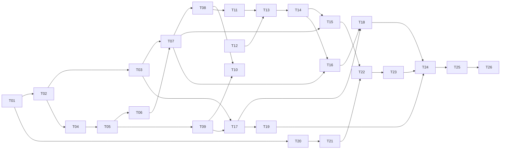

# Givsoner タスクリスト

v1（Phase 1〜9）の残作業を、人間が概ね 3 日で終える単位に割ったもの。

- **決定の記録**は [`docs/DESIGN.md`](docs/DESIGN.md)
- **実装中に毎回効く制約**は [`CLAUDE.md`](CLAUDE.md)
- **今やること（＝このファイル）** が進捗の唯一の正

---

## このファイルの規約

**着手前に必ずこの節を読むこと。**

1. **完了の記録はコミットと同時に行う。** タスクを終えたら、その実装と同じコミットで
   チェックを入れ、末尾の「完了済み」節へ 1 行に畳んで移す。別コミットにすると忘れる。

2. **ID は再利用しない。** タスクを削除・統合しても番号は空けたままにする。
   3 日に収まらないと判明したタスクは、**末尾に新しい ID を発番**して分割する
   （枝番 `T-13a` は使わない）。ID は発番順であり、実行順は「推奨する着手順」の表と
   各タスクの `依存:` 行が決める。

3. **受け入れ条件には 2 種類ある。**
   - `▸コマンド:` — 実行すれば判定できる。エージェントが自分で確認してよい
   - `▸目視:` — 人間の確認が必要
   
   **目視項目が 1 つでも残っているタスクを、エージェントが単独で「完了」と宣言してはいけない。**
   実装を終えたら「目視確認をお願いします」と述べて止まること。

4. **未着手タスクに書かれた型定義は着手時点の設計案であり、先行タスクの実装が正。**
   着手時に必ず実物と突き合わせ、食い違っていたらタスク本文を書き直してから実装する。

5. **T-11 以降は着手前に詳細化が必要。** ⑥実装内容と⑧受け入れ条件が骨子のままなので、
   詳細化そのものを各タスクの最初の作業として行う。

6. **制約の再掲は出典付き。** 各タスクの「制約」に書かれた内容は CLAUDE.md / DESIGN.md からの
   再掲であり、必ず出典を併記してある。**食い違いを見つけたら CLAUDE.md 側が正。**
   決定理由は再掲していないので、なぜそう決めたか知りたいときは DESIGN.md を読むこと。

---

## 現在地

**最終更新**: 2026-09-03

| 項目 | 内容 |
|---|---|
| 直前に完了 | T-07 コミットリストの仮想スクロールと列表示 |
| 次にやる | **T-08 判定ゲート — 美しさの検証と調整** |
| 未解決の判断事項 | 第 2 親のレーン起こし方（下記） |

**第 2 親のレーンを、同じ親を既に待っているレーンに合流させるか。T-08 で必ず決着させること。** onyx（20,285 コミット）で
maxLane が 49 まで伸びており、第 2 親の辺 597 本のうち 174 本が「既に同じ親を待っている
レーンがあるのに新しく起こした」ものだった。合流させればレーン数はかなり減るが、
CLAUDE.md §3-3「第 2 親は右側に新レーンを起こす」の改訂が要る。**T-08（判定ゲート）で判断する。**

**100 万コミット級の正式対応は v1.1 以降に送った**（DESIGN.md §1.1, §4.1 / 下の「v1.1」表）。
v1 では非対象のままだが、恒久的な非対象ではなくなった。

---

## 推奨する着手順

上から順に着手するのが効率的。T-12 だけは依存が無いので、いつ差し込んでもよい。

| 順 | Phase | タスク | 備考 |
|---|---|---|---|
| 1 | 1 | T-01 → T-02 → T-03 / T-04 | T-03 と T-04 は T-02 の後なら順不同 |
| 2 | 2 | T-05 → T-06 → T-07 → **T-08** | **T-08 は判定ゲート。飛ばさない** |
| 3 | 3 | T-09 → T-10 | |
| 4 | 4 | T-11 → T-13 → T-14 | T-12 を T-13 より前に済ませておく |
| 5 | 5 | T-15 / T-16 | 順不同 |
| 6 | 6-7 | T-17 → T-18 / T-19 | |
| 7 | 8 | T-20 → T-21 → T-22 → T-23 | |
| 8 | 9 | T-24 → T-25 → T-26 | |



---

# Phase 2 — グラフ（最初の判定ポイント）

## - [ ] T-08 [Phase 2] 判定ゲート — 美しさの検証と調整

**目的**: Phase 2 の成果物を実リポジトリで検証し、「美しいグラフ」の合否を出す。
**不合格なら T-05 / T-06 の決定に戻る。後の Phase を作ってからでは戻れない。**

**T-06 からの申し送り**: 目視で「なんとなく変」となったときは、**実リポジトリのレーンを
JSON に吐いて数える**のが早い。`graph::layout` を呼んで行ごとの lane / passing / edges を
出す使い捨てのテストを書けばよい（T-06 の不具合 4 件はすべてこれで特定した）。
恒久的な道具にはしていないので、必要になったら書き捨てること。

**参照**: DESIGN.md §15.1, §5 / CLAUDE.md §9

**依存**: T-07

**作成・変更するファイル**

新規ファイルは無い。調整の結果として `graph/lane.rs`、`lib/graphPath.ts`、`styles/theme.css`、
`components/graph/` を変更しうる。

**作業内容**

1. 検証用に最低 5 種類のリポジトリを用意する。
   - 自分の実プロジェクト（小〜中規模）
   - OSS の中規模リポジトリ
   - マージが多いリポジトリ
   - リモート追跡ブランチが 20 本以上あるリポジトリ
   - 1 万コミット超のリポジトリ
2. 各リポジトリで次を評価する。
   - 幹が一直線に通っているか
   - 1 本の線が無関係なブランチへ「化けて」見えないか
   - 分岐 / 合流の曲線が滑らかか
   - 隣接レーンで似た色が並んでいないか
   - レーン数が多いとき横スクロールで破綻しないか
   - ライト / ダーク両方で成立するか
3. 調整できるつまみ: `RESERVE_ROWS`（1 or 2）、`CORNER_RADIUS`（8〜12）、パレット、
   行高、レーン幅、ノード半径。
4. 合否を「現在地」節に記録する。

**制約**

- **このタスクで新機能を追加しない。** やるのは調整だけ
- レーン割り当ての不変条件（CLAUDE.md §3）を崩す調整をしない

**受け入れ条件**

- ▸目視: **上記 5 種類のリポジトリすべてについて、ユーザー本人が「美しい」と判断した**
- ▸目視: 不合格の場合、何が不足かを「現在地」節に記録し、
  やり直し用のタスクを**末尾に新 ID で発番**して T-05 / T-06 を再オープンする

**⚠️ このタスクはエージェントが単独で完了を宣言してはいけない。** 実装・調整を終えたら
評価をユーザーに依頼して止まること。

**非スコープ**

Phase 3 以降のあらゆる機能。

**注記**: 3 日基準の例外（1〜3 日）。成果物はコードではなく判定。

---

# Phase 3 — ref ツリーと到達可能性

## - [ ] T-09 [Phase 3] 到達可能集合と ahead/behind の計算

**目的**: 可視 ref を絞ったときのレーン再計算と、全ブランチの ahead/behind を
**git を追加で呼ばずに**メモリ上のグラフから求める。

**参照**: DESIGN.md §4.4, §4.5 / CLAUDE.md §2, §3-7

**依存**: T-05

**作成・変更するファイル**

| 種別 | パス | 内容 |
|---|---|---|
| 新規 | `src-tauri/src/graph/reach.rs` | 到達可能集合と ahead/behind |
| 変更 | `src-tauri/src/graph/mod.rs`, `lane.rs` | 可視 ref による絞り込み |
| 変更 | `src-tauri/src/lib.rs` | コマンド登録 |
| 変更 | `src/lib/ipc.ts` | 型と invoke ラッパ |

**実装内容**

```rust
/// tips から第一親・第二親を問わず辿れるコミットの集合。
pub fn reachable_from(commits: &[CommitMeta], tips: &[String]) -> HashSet<String>;

/// (ahead, behind) = (a から到達可能で b から不能な数, その逆)
pub fn ahead_behind(index: &CommitIndex, a: &str, b: &str) -> (u32, u32);

#[derive(Debug, Clone, Serialize)]
#[serde(rename_all = "camelCase")]
pub struct BranchStatus { pub ref_name: String, pub ahead: u32, pub behind: u32 }

/// 全ブランチ分をまとめて計算する。1 本ずつ呼ぶと O(n × refs) になるため。
pub fn all_branch_status(snapshot: &RepositorySnapshot) -> Vec<BranchStatus>;
```

- `CommitIndex` は SHA → 添字の `HashMap` と、topo 順の添字配列を持つ補助構造。
- ahead/behind は、対象ペアから双方向 BFS で共通祖先へ到達するまで辿る実装でよい。
  全 ref 分のビットセットを持つ実装はメモリが厳しいので採らない。
- `compute_lane_layout` に `visibleRefs` 引数を追加し、可視 ref から
  `reachable_from` で集合を作ってコミットを絞ってから `assign_lanes` を呼ぶ。

**T-05 からの申し送り（着手時に確認すること）**

- `assign_lanes(commits, trunk)` は**スライスを受けるだけ**なので、絞った `Vec<CommitMeta>` を
  作って渡せば再計算になる。`lane.rs` 側に絞り込みの知識を入れないこと。
- **幹の ref を非表示にされた場合の扱いを決めること。** `trunk_start` は ref 名から SHA を
  引くだけで可視性を見ない。現状は「起点がグラフ外なら先頭コミットを幹にする」に落ちるので、
  絞った集合に幹が残っていなければ自動的に別の幹になる。これで良いかを判断する。

**Tauri コマンド**

```
compute_lane_layout(repositoryId: String, visibleRefs: VisibleRefs, order: "topo"|"date")
    -> Result<LaneLayout, String>
compute_branch_status(repositoryId: String) -> Result<Vec<BranchStatus>, String>
```

**制約**

- **ahead/behind は `git rev-list --count` を呼ばず、メモリ上のグラフから計算する**（CLAUDE.md §2）。
  ただし**テストコードでは検証のために `git rev-list --count` を呼んでよい**
- ブランチ表示 ON/OFF は淡色化ではなく**到達可能集合を再計算してレーンを振り直す**（CLAUDE.md §3-7）
- 可視 ref を絞っても **lane 0 の幹予約は維持**する

**受け入れ条件**

- ▸コマンド: `cargo test` — ahead/behind（同一 / 片側だけ進む / 両方進む / 共通祖先なし / 自分自身）
- ▸コマンド: `cargo test` — 到達可能集合（ブランチを 1 本外すと該当コミットだけが消える）
- ▸コマンド: テスト用リポジトリで、算出した ahead/behind が
  `git rev-list --count a..b` / `b..a` と一致する
- ▸コマンド: 数万コミット規模の入力で `compute_lane_layout` が 100ms 未満（ベンチではなく雑な計測でよい）
- ▸コマンド: `cargo clippy --all-targets -- -D warnings`

**非スコープ**

ツリー UI（T-10）／fetch 後の再計算トリガ（T-17）

---

## - [ ] T-10 [Phase 3] ブランチ / タグツリー UI

**目的**: サイドバー下段に ref ツリーを作り、表示 ON/OFF でグラフを実際に絞れるようにする。

**参照**: DESIGN.md §6.4, §4.4 / CLAUDE.md §6

**依存**: T-09, T-08

**作成・変更するファイル**

| 種別 | パス | 内容 |
|---|---|---|
| 新規 | `src/components/sidebar/RefTree.tsx` | ツリー本体 |
| 新規 | `src/components/sidebar/RefTreeNode.tsx` | ノード 1 個 |
| 新規 | `src/components/common/ContextMenu.tsx` | 右クリックメニュー |
| 新規 | `src/lib/refTree.ts` + `.test.ts` | フラットな ref 一覧 → 階層構造（純関数） |
| 変更 | `src/components/sidebar/Sidebar.tsx` | 下段に組み込み |
| 変更 | `src/store/` | 可視 ref の状態 |

**実装内容**

- **3 グループ**: `ローカル` / `リモート > origin` / `タグ`。タグは既定で折りたたむ。
- **階層フォルダ**: `feature/foo` のスラッシュ区切りを畳む。
  **同一プレフィックス配下が 3 件以上のときだけ**自動でフォルダ化する。開閉は `state.json` に永続化。
- **絞り込み入力欄**をツリー上部に常設（ブランチもタグも同じ欄で絞る）。
- **表示 ON/OFF**: チェックボックス ＋ プリセット（全選択 / 全解除 / ローカルのみ / リモートのみ）。
  変更時に `compute_lane_layout` を可視 ref 付きで呼び直す。選択状態はリポジトリごとに永続化。
- **ahead/behind** を各ブランチ行に表示（T-09 の `compute_branch_status`）。
- **右クリックメニュー**: checkout / 現在のブランチに FF マージ（**T-18 まで無効化**）/
  このブランチだけ表示 / このブランチの先頭へジャンプ / ブランチ名をコピー / SHA をコピー。
- `out_of_graph` のタグはジャンプを無効化し、「グラフ外」の印を付ける。

**制約**

- 表示文言は `src/i18n/ja.ts`、色はテーマトークン経由（CLAUDE.md §6）
- タグを**グラフの起点 ref にしない**。ツリーには表示するがチェックの有無はグラフ構築に影響しない
  （CLAUDE.md §2 / DESIGN.md §4.2）

**受け入れ条件**

- ▸コマンド: `npm run test` — `refTree` の階層化（2 件は畳まない / 3 件で畳む / 多段ネスト /
  フォルダ名とブランチ名が同名のケース）
- ▸コマンド: `npm run typecheck`
- ▸目視: ブランチのチェックを外すと**グラフの行数と線が実際に減る**（淡色化ではない）
- ▸目視: リモートブランチが 20 本以上あるリポジトリで「ローカルのみ」プリセットが効く
- ▸目視: ahead/behind が `git rev-list --count` の値と一致する（1 本を手で確認）
- ▸目視: 可視 ref を絞っても幹が lane 0 を一直線に通っている
- ▸目視: 開閉状態と可視 ref がリポジトリごとに復元される

**非スコープ**

checkout / FF マージの実処理（T-18）／コミット検索（v1.1）

---

# Phase 4 — コミット詳細と差分

> **ここから先（T-11 以降）は骨子。着手前に詳細化すること**（このファイルの規約 5）。

## - [ ] T-11 [Phase 4] コミット詳細と変更ファイル一覧

**目的**: コミットを選ぶと詳細と変更ファイル一覧が出るようにする。

**参照**: DESIGN.md §7.3, §7.4, 付録 A / CLAUDE.md §2

**依存**: T-08

**作成・変更するファイル**: `src-tauri/src/git/diff.rs`(新) / `src/components/diff/CommitDetail.tsx`(新) /
`src/components/diff/FileList.tsx`(新) / `src/components/diff/DiffPane.tsx`(新) / `src/App.tsx`(変更)

**実装内容（骨子）**

- `show -s --format=...` でコミット本文（full message / 作者・コミッター / 親 / SHA）を取得
- `diff --numstat -z -M <A> <B>` で変更ファイル一覧と増減行数
- ファイル一覧はフラットなパス（既定）／ディレクトリツリー切替。ファイルごとに +N / -M と横バー
- 差分ペインを 3 段構成（コミット詳細 → ファイル一覧 → 選択ファイルの差分）にする。
  差分本体は T-13 まで空でよい
- **マージコミットは既定で第 1 親との差分**。ヘッダに親を選ぶドロップダウンを出す

**制約**

- git 実行は `git::exec::run` を通す（CLAUDE.md §2）
- リネーム検出は `-M` のみ。`-C` を付けない（DESIGN.md §7.2）
- `--cc` は v1 では使わない（DESIGN.md §7.4）

**受け入れ条件（骨子）**: numstat のパース（日本語ファイル名 / リネーム / バイナリ）のテスト、
マージコミットで親を切り替えられること。

**テスト**: `cargo test`（numstat パーサ）、`npm run typecheck`

**非スコープ**: 差分本体の描画（T-13）／シンタックスハイライト（T-14）／作業ツリー（T-16）

---

## - [ ] T-12 [Phase 4] 文字コード自動判別と改行コード検出

**目的**: Linux 由来のソースを Windows で正しく表示するための基盤を作る。

**参照**: DESIGN.md §9 / CLAUDE.md §10

**依存**: なし（いつ着手してもよい）

**作成・変更するファイル**: `src-tauri/src/encoding.rs`(新) / `src-tauri/Cargo.toml`(変更) /
`src/lib/ipc.ts`(変更)

**実装内容（骨子）**

- UTF-8 として妥当なら UTF-8。失敗したら Shift_JIS → EUC-JP の順に試行
- 判別結果を返し、手動上書きできる API にする（`decode(bytes, forced: Option<Encoding>)`）
- 改行コード（LF / CRLF / CR）を検出し、**1 ファイル内の混在**を検出する
- バイナリ判定（NUL バイトの有無）

**制約**

- `git::exec::run` の `GitOutput.stdout` は**生バイト列**である。文字コード判別はこのモジュールが行う
  （DESIGN.md §9.1、`exec.rs` の `stdout_lossy` をファイル内容に使ってはいけない）

**受け入れ条件（骨子）**: 各エンコーディングのサンプル、BOM 付き UTF-8、混在改行、バイナリの判定テスト。

**テスト**: `cargo test`

**非スコープ**: UI での表示（T-13）／改行可視化トグル（T-13）

---

## - [ ] T-13 [Phase 4] 差分の取得・パースと side-by-side 描画

**目的**: unified diff を取得・パースし、side-by-side / unified を切り替えて表示する。

**参照**: DESIGN.md §7.2, §9.2, §9.3 / CLAUDE.md §2

**依存**: T-11, T-12

**作成・変更するファイル**: `src-tauri/src/git/diff.rs`(変更) / `src/lib/diffParse.ts` + `.test.ts`(新) /
`src/components/diff/SideBySide.tsx`(新) / `src/components/diff/Unified.tsx`(新) /
`src/components/diff/WordDiff.tsx`(新)

**実装内容（骨子）**

- `diff -M -U<N> [-w] <A> <B> -- <path>` を実行し、hunk 単位にパース
- side-by-side / unified 切替（既定 side-by-side）、word-level ハイライト
- 空白無視トグル（`-w`）、コンテキスト行の増減ボタン（既定 `-U3`）
- 改行コードをステータスバーに常時表示、可視化記号はトグル（既定オフ）、混在は警告アイコン
- ファイルモード変更（`100644` → `100755`）とシンボリックリンクを差分ヘッダに明示
- 文字コードの判別結果をファイルごとに表示し、手動上書きできるようにする

**制約**

- 差分パーサは機械可読出力のみに依存（CLAUDE.md §2）
- 色はテーマトークン経由（CLAUDE.md §6）

**受け入れ条件（骨子）**: diff パーサのテスト（追加のみ / 削除のみ / 複数 hunk / 改行なし終端 /
モード変更 / シンボリックリンク / リネーム）、side-by-side の行対応が崩れないこと。

**テスト**: `npm run test`, `cargo test`

**非スコープ**: シンタックスハイライト（T-14）／大差分の折りたたみ（T-14）

---

## - [ ] T-14 [Phase 4] Shiki ハイライトと大差分の折りたたみ

**目的**: 差分の可読性を仕上げ、大きな差分で画面が固まらないようにする。

**参照**: DESIGN.md §7.2

**依存**: T-13

**作成・変更するファイル**: `src/lib/highlight.ts`(新) / `src/components/diff/`(変更) / `package.json`(変更)

**実装内容（骨子）**

- Shiki を導入し、言語別文法を遅延ロードする
- 1 ファイル 3000 行または 500KB 超は既定で折りたたみ、明示操作で展開
- バイナリは「バイナリファイル（サイズ変化）」の表示のみ
- ハイライトはワーカーまたは非同期で行い、スクロールを止めない

**制約**

- 外部 CDN からの文法取得をしない（外部通信禁止 — CLAUDE.md §1）。文法はバンドルに含める
- 色はテーマトークンと Shiki のテーマを対応付ける

**受け入れ条件（骨子）**: 大きな差分（5000 行以上）でスクロールが止まらないこと、
ライト / ダークでハイライト色が破綻しないこと。

**テスト**: `npm run typecheck`, 目視

**非スコープ**: 画像差分（v1.1）／`--cc`（v1.1）

---

# Phase 5 — 比較と作業ツリー

## - [ ] T-15 [Phase 5] 任意 2 コミット間差分

**目的**: グラフ上で 2 点を選び、その間の差分を見られるようにする。AI レビューの入口にもなる。

**参照**: DESIGN.md §10.3, §7.2

**依存**: T-14, T-07

**作成・変更するファイル**: `src/components/commits/CommitList.tsx`(変更) /
`src/components/diff/CompareView.tsx`(新) / `src-tauri/src/git/diff.rs`(変更)

**実装内容（骨子）**

- グラフ上で 1 点目クリック → `Ctrl+クリック`で 2 点目を選択
- 既定は `git diff A B`（2 点間のツリー差分）、トグルで `git diff A...B`（マージベース起点）
- 比較ビューは通常の差分ペインを再利用する
- 選択中の 2 点をグラフ上で強調表示する

**制約**: git 実行は `exec.rs` 経由（CLAUDE.md §2）

**受け入れ条件（骨子）**: 2 点選択の解除・入れ替えが直感的に動くこと、
`A B` と `A...B` の結果が git CLI と一致すること。

**テスト**: `npm run typecheck`, 目視

**非スコープ**: ブランチ同士の比較（v1.1）／AI レビューの起動（T-23）

---

## - [ ] T-16 [Phase 5] 作業ツリーの read-only 表示

**目的**: 未コミットの変更を read-only で見せる。**stage / discard / stash は一切提供しない。**

**参照**: DESIGN.md §7.5 / CLAUDE.md §1, §3-6

**依存**: T-14, T-07

**作成・変更するファイル**: `src-tauri/src/git/status.rs`(新) /
`src/components/commits/WorkingTreeRow.tsx`(新) / `src/components/diff/WorkingTreeDiff.tsx`(新)

**実装内容（骨子）**

- `status --porcelain=v2 -z` をパースし、**ステージ済み / 未ステージ / 未追跡**の 3 セクションに分ける
- 未追跡ファイルは名前を列挙し、クリックで**全文表示**（差分としては見せない）
- `diff --cached`（ステージ済み）と `diff`（未ステージ）を使い分ける
- コミットリスト最上部に**擬似行**を 1 つ置く。**レーン計算の対象外**とし、HEAD へ点線で接続する。
  作業ツリーがクリーンなときは行を出さない
- 更新はリポジトリ選択時・ウィンドウフォーカス復帰時・`F5` のみ。**ファイル監視は入れない**

**制約**

- **stage / unstage / discard / stash の操作を一切提供しない**（CLAUDE.md §1）
- 作業ツリーの擬似行は**レーン計算の対象外**（CLAUDE.md §3-6）
- ファイル監視を入れない（DESIGN.md §7.5）

**受け入れ条件（骨子）**: `--porcelain=v2` のパーステスト（日本語ファイル名 / リネーム /
未追跡 / 衝突状態）、dirty なリポジトリで 3 セクションが正しく出ること。

**テスト**: `cargo test`, 目視

**非スコープ**: checkout 時の dirty ガード（T-18 で本モジュールを使う）

---

# Phase 6-7 — 書き込み系操作

## - [ ] T-17 [Phase 6] fetch と放置警告

**目的**: fetch を実行し、上流との差分と「しばらく fetch していない」状態を可視化する。

**参照**: DESIGN.md §8.3 / CLAUDE.md §2

**依存**: T-09, T-03

**作成・変更するファイル**: `src-tauri/src/git/ops.rs`(新) / `src/components/sidebar/RepositoryList.tsx`(変更) /
`src/components/common/ProgressDialog.tsx`(新)

**実装内容（骨子）**

- `fetch --all --prune --tags --progress` を実行し、stderr の進捗をパースしてバー表示
- 現在のリポジトリ / 全リポジトリ一括の両方のボタン。**一括は実行前に確認ダイアログを 1 回**
  （対象数と、認証ウィンドウが出る可能性を明示）。実行中はキャンセル可、完了後に成功 / 失敗サマリ
- **放置警告は `.git/FETCH_HEAD` の mtime で判定**（ファイルが無い＝一度も fetch していない）。
  閾値は既定 7 日、`settings.json` で変更可、0 で無効
- 表示は一覧行の控えめなアイコン ＋ ツールチップのみ。モーダルもバナーも出さない
- fetch 後にスナップショットを再取得してレーン再計算し、ahead/behind バッジを更新する

**制約**

- **定期自動 fetch を持たない**（DESIGN.md §8.3）
- `GIT_TERMINAL_PROMPT=0` は `exec.rs` が付ける。認証失敗時は人間向けメッセージへ整形する（CLAUDE.md §2）
- 最終 fetch 時刻をアプリ独自に記録しない（CLI 併用と整合しなくなる）

**受け入れ条件（骨子）**: 進捗パースのテスト、認証が必要なリモートで無言でハングしないこと、
CLI で `git fetch` した直後にアプリが誤警告しないこと。

**テスト**: `cargo test`, 目視

**非スコープ**: checkout / FF マージ（T-18）／clone（T-19）

---

## - [ ] T-18 [Phase 6] checkout と FF マージのガード

**目的**: checkout と fast-forward マージを、ユーザーの未保存作業を壊さない形で提供する。

**参照**: DESIGN.md §8.1, §8.2, §8.5, §3.6 / CLAUDE.md §1, §2

**依存**: T-17, T-16

**作成・変更するファイル**: `src-tauri/src/git/ops.rs`(変更) / `src/components/sidebar/RefTree.tsx`(変更) /
`src/components/common/ConfirmDialog.tsx`(新)

**実装内容（骨子）**

- **checkout**: ブランチツリーの右クリック ＋ ダブルクリック、グラフ上コミットの右クリックから起動。
  対象はローカルブランチ / タグ / 任意コミット。**タグとコミットは detached になる旨をダイアログで明示**
- **リモート追跡ブランチは detached HEAD にする。** `checkout -b --track` を実行しない
- **dirty なら事前検出して中止**し、理由を明示する（T-16 の status を使う）
- **FF マージ**: `merge --ff-only` 固定。主動線は「現在のブランチに upstream (`@{u}`) を取り込む」。
  任意 ref の右クリックからも可。FF 不可なら実行せず理由を表示するだけ
- bare は checkout を無効化、`index.lock` 残留は検出して明示
- 実行後は**全コミットメタ情報を再取得してレーン再計算**する

**制約**（すべて CLAUDE.md §1, §2）

- **`--force` 付き checkout と自動 stash を提供しない**
- **非 fast-forward マージを提供しない**（`merge` は常に `--ff-only`）
- **ローカル追跡ブランチを自動作成しない**（v1）
- **`.git/index.lock` を削除しない**

**受け入れ条件（骨子）**: dirty なリポジトリで checkout が中止されること、
FF 不可のときにマージが実行されないこと、bare で checkout が無効なこと、
`grep -rn '\-\-force\|--ff\b\|stash' src-tauri/src` に違反が無いこと。

**テスト**: `cargo test`（テスト用リポジトリで実際に checkout / merge）, 目視

**非スコープ**: clone（T-19）／ブランチ作成（v1.1）

---

## - [ ] T-19 [Phase 7] clone

**目的**: HTTPS / SSH の URL からリポジトリを clone して登録する。

**参照**: DESIGN.md §8.4, §3.3 / CLAUDE.md §1

**依存**: T-17

**作成・変更するファイル**: `src-tauri/src/git/ops.rs`(変更) / `src/components/setup/CloneDialog.tsx`(新)

**実装内容（骨子）**

- URL 入力 → 既定ワークスペースルートから `<root>/<name>` を埋めたダイアログを毎回出して確認
- `git clone --progress <url> <dir>` の stderr をパースして実バー表示
- 失敗時は確認ダイアログの上で残骸ディレクトリを削除
- 完了したら自動で登録して開く

**制約**（CLAUDE.md §1）

- **shallow clone (`--depth`) と `--recurse-submodules` を提供しない**
- 認証は git CLI（Git Credential Manager）に完全委譲する。アプリは資格情報を扱わない
- `GIT_TERMINAL_PROMPT=0` により端末待ちでハングしない

**受け入れ条件（骨子）**: 認証が必要なリポジトリで GCM のウィンドウが出て完了すること、
中断時に残骸が残らないこと、進捗バーが動くこと。

**テスト**: 目視（実リポジトリの clone）

**非スコープ**: submodule 対応（v2.0）

**注記**: 3 日基準の例外（2 日程度）。

---

# Phase 8 — AI レビュー

## - [ ] T-20 [Phase 8] LLM プロバイダ設定と資格情報保管

**目的**: OpenAI 互換の接続先をプロファイルとして保存し、API キーを安全に扱う。

**参照**: DESIGN.md §10.1, §10.2 / CLAUDE.md §4, §7

**依存**: T-01

**作成・変更するファイル**: `src-tauri/src/llm/client.rs`(新) / `src-tauri/src/secret.rs`(新) /
`src/components/settings/LlmProfiles.tsx`(新)

**実装内容（骨子）**

- プロファイル CRUD（名前 / base URL / モデル / コンテキスト長 / temperature / max tokens）
- **API キーは Windows 資格情報マネージャーに保存**し、`settings.json` には `credentialKey` のみ
- `/v1/models` を叩いてモデル名を補完する
- 接続テストボタン（1 リクエスト投げて応答を確認）
- Ollama も `http://localhost:11434/v1` で同じ経路を通す

**制約**（CLAUDE.md §4, §7）

- **API キーを `settings.json` に書かない**
- **OpenAI 互換 API 1 系統のみ。** Ollama ネイティブ API (`/api/chat`) を実装しない
- API キーが画面表示・ログに出る経路を作らない（`redact.rs` を通す）

**受け入れ条件（骨子）**: 資格情報マネージャーへの保存と読み出し、
`settings.json` に平文キーが現れないこと、接続テストが Ollama と OpenAI 互換の両方で通ること。

**テスト**: `cargo test`（モックサーバ）, 目視

**非スコープ**: skill（T-21）／レビュー実行（T-22）

---

## - [ ] T-21 [Phase 8] skill の読み込みと信頼モデル

**目的**: レビュー観点を定義した skill を読み込み、**リポジトリ内 skill を安全に扱う。**

**参照**: DESIGN.md §11 / CLAUDE.md §4

**依存**: T-20

**作成・変更するファイル**: `src-tauri/src/llm/skill.rs`(新) / `src/components/review/SkillPicker.tsx`(新)

**実装内容（骨子）**

- Markdown + YAML frontmatter（`name` / `description` / `globs` / `enabled`）のパース
- グローバル（`%APPDATA%\com.tatsu.givsoner\skills\`）とリポジトリ内（`<repo>/.gitviewer/skills/*.md`）。
  リポジトリ内が優先
- **リポジトリ内 skill は既定で無効。** リポジトリごとに一度だけ明示的な信頼操作を要求し、
  **ファイル内容のハッシュが変わったら再確認**する
- `globs` にマッチした skill を自動で有効化しつつ、手動 on/off できる
- 内蔵 skill「汎用コードレビュー（日本語出力）」を 1 つ同梱

**制約**（CLAUDE.md §4）

- **リポジトリ内 skill を既定で読み込まない。** 他人のリポジトリを開く用途がある以上、
  リポジトリ内の指示文でレビュー結果を操作されうる
- 信頼状態とハッシュは `settings.json` の `repoSkills` に保存する

**受け入れ条件（骨子）**: 未信頼リポジトリの skill が**プロンプトに一切含まれない**ことのテスト、
ハッシュ変化で再確認が要求されること、frontmatter のパーステスト。

**テスト**: `cargo test`

**非スコープ**: レビュー実行（T-22）

---

## - [ ] T-22 [Phase 8] レビュー実行エンジン

**目的**: 差分をファイル単位で LLM に投げ、結果を構造化して受け取る。**フォールバック経路が要。**

**参照**: DESIGN.md §10.4〜10.7 / CLAUDE.md §7

**依存**: T-21, T-15

**作成・変更するファイル**: `src-tauri/src/llm/review.rs`(新) / `src-tauri/src/llm/client.rs`(変更)

**実装内容（骨子）**

- 投入単位は**ファイル単位 ＋ 最後に全体サマリ**。コンテキスト長超過時のみ hunk 分割にフォールバック
- モデルに渡すのは**パス ＋ unified diff (`-U10`) ＋ コミットメッセージ ＋ skill 本文**のみ。
  **ファイル全文は渡さない**
- **JSON スキーマを要求し、パース失敗時は生出力を Markdown として表示するフォールバック**
  （スキーマは DESIGN.md §10.6）
- 既定は逐次（並列度 1）、設定で最大 3。いつでもキャンセル可
- **1 ファイルの失敗で全体を止めない。** ファイル単位でエラーを記録し、サマリに「N 件失敗」を明示
- ストリーミング表示（SSE のパース）

**制約**（CLAUDE.md §7）

- **ファイル全文を渡さない**
- **JSON → Markdown フォールバックは必須**。この経路をテストで必ず通す
- 1 ファイルの失敗で全体を止めない

**受け入れ条件（骨子）**: モックサーバで
①正しい JSON ②壊れた JSON ③JSON でない Markdown ④途中で切れた応答 ⑤HTTP エラー
のすべてを流し、いずれもレビューが失われないこと。キャンセルが即座に効くこと。

**テスト**: `cargo test`（OpenAI 互換モックサーバ）

**非スコープ**: レビュー UI（T-23）

---

## - [ ] T-23 [Phase 8] レビュー UI と結果の永続化

**目的**: レビューを起動・表示し、結果を履歴として積む。

**参照**: DESIGN.md §10.3, §10.4, §12.4 / CLAUDE.md §5

**依存**: T-22

**作成・変更するファイル**: `src/components/review/ReviewDrawer.tsx`(新) /
`src/components/review/PreflightPanel.tsx`(新) / `src/components/review/ReviewHistory.tsx`(新) /
`src-tauri/src/store/reviews.rs`(新)

**実装内容（骨子）**

- **実行前パネルを必ず出す**: 対象ファイル一覧 ＋ 個別除外チェック、skill 複数選択、
  プロファイル選択、概算トークン数（文字数 ÷ 4）、超過ファイルに「hunk 分割されます」バッジ
- 差分ペイン右のドロワーに結果を表示。構造化できた指摘は差分の該当行にインラインバッジ
- 結果を `reviews/<repo-id>/<timestamp>.json` に保存。**上書きせず履歴として積む**
- リポジトリごとの「レビュー履歴」一覧。開くと当時の差分と並べて再表示
- 「Markdown で書き出し」ボタン（保存形式は JSON のまま、Markdown は出力専用）

**制約**（CLAUDE.md §5）

- レビュー結果は**上書きせず履歴として積む**
- 保存先は `%APPDATA%\com.tatsu.givsoner\reviews\`（OneDrive 配下に置かない）

**受け入れ条件（骨子）**: 同じ差分を 2 回レビューすると 2 件残ること、
JSON パース失敗時に Markdown が表示され「構造化に失敗しました」が添えられること、
`Ctrl+Shift+A` で起動できること。

**テスト**: `npm run typecheck`, 目視

**非スコープ**: fetch 後の自動レビュー（v1 では持たない）

---

# Phase 9 — 仕上げと配布

## - [ ] T-24 [Phase 9] ログファイルとエラー処理の仕上げ

**目的**: 後から追える記録を残し、エラー表示を人間向けに整える。

**参照**: DESIGN.md §13.3, §13.4 / CLAUDE.md §4

**依存**: T-18, T-19, T-23

**作成・変更するファイル**: `src-tauri/src/logging.rs`(新) / `src-tauri/src/redact.rs`(変更) /
`src-tauri/src/lib.rs`(変更)

**実装内容（骨子）**

- `logs/givsoner-YYYY-MM-DD.log` に書き、7 日分でローテーション
- Rust 側の panic をキャッチしてエラーダイアログを出し、ログの場所を案内
- **マスキングの適用範囲を点検する。** 画面表示とログの両方が `redact.rs` を通っているか、
  全経路を洗い出して確認する
- 各エラーの「人間向けメッセージ ＋ 展開で生 stderr」を整備する

**制約**（CLAUDE.md §4）

- **全出力が `redact.rs` を通ること。** `%APPDATA%` に平文トークンを残さない

**受け入れ条件（骨子）**: 認証情報付き URL を含むリモートで操作し、
ログファイルにも画面にも平文が出ないこと。panic を意図的に起こしてダイアログが出ること。

**テスト**: `cargo test`, 目視

**非スコープ**: 設定画面（T-25）

---

## - [ ] T-25 [Phase 9] 設定画面とショートカット

**目的**: 散らばっている設定を 1 画面にまとめ、ショートカットを全実装する。

**参照**: DESIGN.md §6.5, §12.2 / CLAUDE.md §6

**依存**: T-24

**作成・変更するファイル**: `src/components/settings/SettingsDialog.tsx`(新) /
`src/hooks/useShortcuts.ts`(新) / `src/i18n/ja.ts`(変更)

**実装内容（骨子）**

- 設定画面（git パス / ワークスペースルート / テーマ / 日時形式 / 差分レイアウト /
  コンテキスト行 / fetch 放置閾値 / レビュー並列度 / LLM プロファイル / skill）
- DESIGN.md §6.5 のショートカットをすべて実装し、キーバインド一覧を設定画面に表示
- `Ctrl+,` で設定を開く、`Esc` で閉じる

**制約**: 表示文言は `src/i18n/ja.ts`（CLAUDE.md §6）

**受け入れ条件（骨子）**: 全ショートカットが効くこと、設定変更が即座に反映され再起動後も保持されること。

**テスト**: `npm run typecheck`, 目視

**非スコープ**: 新機能の追加

---

## - [ ] T-26 [Phase 9] 配布ビルドと DoD 検証

**目的**: ポータブル zip を作り、実運用で v1 の完成を判定する。

**参照**: DESIGN.md §2.3, §15.2 / CLAUDE.md §10

**依存**: T-25

**作成・変更するファイル**: `package.json`(変更) / `README.md`(新)

**実装内容（骨子）**

- `npm run package:zip` が動作することを確認する（Phase 0 で用意済みのスクリプト）
- リリースビルドで起動し、開発ビルドとの差異（パス解決・アイコン・ウィンドウ）を確認する
- README を書く（何ができて何をしないか、起動方法、設定の場所）
- **実リポジトリを 5 個以上登録し、1 週間実運用する**

**制約**: Tauri の bundler に zip ターゲットは無いので、
`src-tauri/target/release/Givsoner.exe` を npm script で zip 化する（CLAUDE.md §10）

**受け入れ条件**

- ▸コマンド: `npm run package:zip` が `dist-zip/Givsoner-portable.zip` を生成する
- ▸目視: zip を展開した exe が単体で起動する
- ▸目視: **実リポジトリ 5 個以上で 1 週間実運用し、既存 GUI クライアントを一度も開かずに済んだ**

**⚠️ このタスクはエージェントが単独で完了を宣言してはいけない。**

**非スコープ**: 自動更新／コード署名／インストーラ（すべて恒久的に非対象）

**注記**: 3 日基準の例外。作業時間ではなくカレンダー時間（実運用 1 週間）。

---

# v1.1 以降（ID は振らない）

着手が近づいた時点で詳細化し、末尾から新しい ID を発番する。

## v1.1

| 項目 | 内容 | 参照 |
|---|---|---|
| コミット検索 | メッセージ / 作者 / `log -S` によるコード内容検索 | DESIGN.md §15.3 |
| stash 一覧 | stash の閲覧のみ（作成・適用はしない） | DESIGN.md §15.3 |
| ファイル単位の履歴 | `log --follow` によるファイルの変更履歴 | DESIGN.md §15.3 |
| ブランチ同士の比較 | `origin/main...HEAD` 形式の比較を専用 UI から起動 | DESIGN.md §10.3 |
| `--cc` マージ差分 | マージコミットで両親と異なる部分だけを示す combined diff | DESIGN.md §7.4 |
| 画像差分 | 画像ファイルの変更を並べて表示 | DESIGN.md §7.2 |
| リポジトリのグループ分け | サイドバーでフォルダによる分類 | DESIGN.md §6.2 |
| ローカル追跡ブランチ作成 | `checkout -b --track` を明示的なメニュー項目として追加 | DESIGN.md §8.1 |
| 100 万コミット級リポジトリ | 「全件をフロントへ渡す」前提の見直し。v1 は自動で読まないだけ | DESIGN.md §1.1, §4.1 |

## v2.0

| 項目 | 内容 | 参照 |
|---|---|---|
| blame | 行ごとの最終変更コミットの表示 | DESIGN.md §15.3 |
| reflog | reflog の閲覧 | DESIGN.md §15.3 |
| submodule 対応 | submodule の中身を辿れるようにする（v1 は「壊れない」だけ担保） | DESIGN.md §15.3 |

---

# 完了済み

| ID | Phase | タイトル | コミット |
|---|---|---|---|
| — | 0 | Tauri v2 雛形 ＋ git 検出 ＋ git コマンドログパネル | `93867ed` |
| T-01 | 1 | 設定ストアと %APPDATA% レイアウト（settings.json / state.json） | `cf5fd37` |
| T-02 | 1 | リポジトリの登録・判定・フォルダスキャン ＋ テスト用リポジトリ生成 | `1f368b7` |
| T-03 | 1 | リポジトリ一覧サイドバーと切替 ＋ 右クリック登録解除・D&D 並べ替え | `80189ea` |
| T-04 | 1 | コミットメタ情報の全件取得とパース ＋ 読み込み進捗と大規模リポジトリの確認 | `c9aae9d` |
| T-05 | 2 | レーン割り当てアルゴリズム ＋ topo / date の並び順 | `6601800` |
| T-06 | 2 | レーン配列 → SVG パス生成と描線 | `e6e877f` `7793d6a` `4bce75b` |
| T-07 | 2 | コミットリストの仮想スクロールと列表示 | `a419547` `f1da933` |
