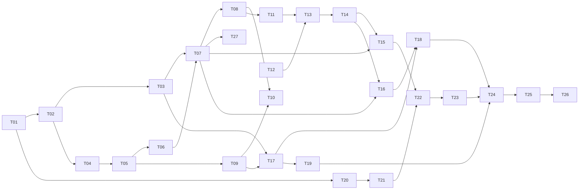

# Givsoner タスクリスト

v1（Phase 1〜9）の残作業を、人間が概ね 3 日で終える単位に割ったもの。

- **決定の記録**は [`docs/DESIGN.md`](docs/DESIGN.md)
- **実装中に毎回効く制約**は [`CLAUDE.md`](CLAUDE.md)
- **今やること（＝このファイル）** が進捗の唯一の正

---

## このファイルの規約

**着手前に必ずこの節を読むこと。**

1. **完了の記録はコミットと同時に行う。** タスクを終えたら、その実装と同じコミットで
   チェックを入れ、末尾の「完了済み」節へ 1 行に畳んで移す。別コミットにすると忘れる。

2. **ID は再利用しない。** タスクを削除・統合しても番号は空けたままにする。
   3 日に収まらないと判明したタスクは、**末尾に新しい ID を発番**して分割する
   （枝番 `T-13a` は使わない）。ID は発番順であり、実行順は「推奨する着手順」の表と
   各タスクの `依存:` 行が決める。

3. **受け入れ条件には 2 種類ある。**
   - `▸コマンド:` — 実行すれば判定できる。エージェントが自分で確認してよい
   - `▸目視:` — 人間の確認が必要
   
   **目視項目が 1 つでも残っているタスクを、エージェントが単独で「完了」と宣言してはいけない。**
   実装を終えたら「目視確認をお願いします」と述べて止まること。

4. **未着手タスクに書かれた型定義は着手時点の設計案であり、先行タスクの実装が正。**
   着手時に必ず実物と突き合わせ、食い違っていたらタスク本文を書き直してから実装する。

5. **骨子のままのタスクは、着手前に詳細化する。** ⑥実装内容と⑧受け入れ条件が埋まって
   いないタスクは、詳細化そのものを最初の作業として行う（本文に「骨子」と書いてある節から先）。
   **いまは T-21 以降が骨子**（T-20 までは詳細化済み）。

6. **制約の再掲は出典付き。** 各タスクの「制約」に書かれた内容は CLAUDE.md / DESIGN.md からの
   再掲であり、必ず出典を併記してある。**食い違いを見つけたら CLAUDE.md 側が正。**
   決定理由は再掲していないので、なぜそう決めたか知りたいときは DESIGN.md を読むこと。

---

## 現在地

**最終更新**: 2026-09-05

| 項目 | 内容 |
|---|---|
| 直前に完了 | T-19 clone（**Phase 7 完了 ＝ 書き込み系は終わり**。目視 2026-09-05 通過） |
| 次にやる | **T-20 LLM プロバイダ設定と資格情報保管（Phase 8）** |
| 未解決の判断事項 | なし |

**T-20 は詳細化済み**なので、その節を読めばそのまま着手できる。**T-21 以降は骨子**なので、
着手時に詳細化そのものを最初の作業として行うこと（規約 5）。Phase 8 は AI レビューで、
T-20 → T-21 → T-22 → T-23 の順に依存している。

**T-20 は `secret.rs` と `client.rs` を先に閉じてから画面へ行くこと。** 画面から作ると、
API キーが通る経路が増えてから塞ぐことになる。

**Phase 8 で最初に効く制約は CLAUDE.md §4 と §7。** とくに
「**API キーを `settings.json` に書かない**（Windows 資格情報マネージャーへ）」と
「**JSON パース失敗時の Markdown フォールバックを必ずテストで通す**」の 2 つは、
後から足すと経路ごと作り直しになる。

### 直近 2 つの Phase で踏んだ落とし穴（次も効く）

**画面まで一度も通していない経路は、テストが緑でも動かないと思ったほうがよい**（T-18）。
`rename_all_fields` を落としていて、引数の組み立てを固定するテストが全部通ったまま、
ボタンが 1 度も機能しなかった。**フロントから構造体を送る箇所は、Rust 側がその JSON を
実際に食えることをテストで固定する**（CLAUDE.md §8）。T-19 では
`the_clone_wire_format_matches_what_the_front_end_sends` がその役をしている。

**判定をコンポーネントに直書きするとテストが 1 つも当たらない**（T-19）。フロントは
純関数だけテストする決まりなので、`.tsx` に書いた条件は誰も見ていない。実際、
clone の「この保存先を次回から既定にする」は**条件が常に成立せず一度も表示されない**まま
コマンドの受け入れ条件を全部通した。**判定は `src/lib/*.ts` へ出してから書く。**

**押せる条件でだけ選択肢を出すと、画面から消えて何が効いているのか読めなくなる**（T-19）。
押せない形で残し、押せない理由といまの値を文言に出す（CLAUDE.md §6）。

**UI の文言は「何が起きるか」で書く**（T-18）。「FF マージ」は通じなかった。
メニューは「main に origin/x を取り込む」のように方向を名前で書き、
**できないときも何ができないのかを説明する**。

**目視は 1 巡では終わらない。** T-18 は 3 巡・9 件、T-19 は 2 巡・2 件だった。
実装が終わった時点を「終わり」と見積もらないこと。

### 抱えている割り切り（承知の上で残してあるもの）

- **probe は 1 リポジトリあたり git を 5 回起動する。** T-17 でリモートの有無を足したぶん
  1 回増えた。この環境では 1 回 34ms（実測）なので、登録 7 件で一覧の更新が 240ms ほど伸びる。
  リモートの有無は「放置警告を永久に出し続けない」ための必須情報なので落とせない。
  気になるようになったら、**リポジトリごとの probe を並列にする**のが効く（いまは 1 件ずつ順）
- **中止で落とせるのは git 本体だけ。** `git-remote-https` のような子は残りうる。親が死ねば
  追って終わるが即座ではないので、理屈の上では「中止しています…」のまま返ってこない経路がある。
  **T-19 で「Job Object は入れない」と決着した**（DESIGN.md §8.4）。clone の残骸は
  再試行で消しており、消せなければ場所を出す。fetch 側はそもそも残骸の概念が無い
- **確認画面を出すまでに git を 9 回起動する**（T-18）。判定に probe（5 回）と
  `status`（4 回）を通すため、この環境では 300ms ほど無反応になる。判定を 1 箇所に
  保つほうを取った（probe を分解すると bare / unborn / `index.lock` の判定が 2 系統になる）。
  気になるようになったら、**確認画面を先に出して判定を後から差し込む**のが素直
- **サブモジュールが取り込まれることを結合テストで確かめられない**（T-19）。git 2.38 以降は
  サブモジュールの `file` トランスポートを拒む（この環境の git 2.43 で実測）ので、生成した
  ローカルの上流では成功しない。`protocol.file.allow` を緩めると全 git 呼び出しに効くので
  行わず、**フラグが実際のプロセスへ届いていること**をコマンドログで固定してある

### 済んだ Phase で決めたこと — 出典だけ置く

**毎回効く制約は CLAUDE.md、決定理由は DESIGN.md に移してある。**
ここへ書き写すと必ずどちらかが古くなるので、迷ったら出典を読むこと。

| Phase | 決まったこと | 出典 |
|---|---|---|
| 2 | レーン割り当てと描線（**判定ゲート合格 2026-09-03。以降動かさない**）／第 2 親のレーン合流は不採用 | CLAUDE.md §3 / DESIGN.md §5.1, §5.2, §15.1 |
| 3 | 可視 ref の絞り込みと ahead/behind ／ ref が数千本のときにペインが潰れる件 | CLAUDE.md §6 / DESIGN.md §4.4, §4.5, §6.4 |
| 4 | 3 ペイン配置 ／ 差分の色と語単位強調（強調の中では構文色をやめた）／ 文字コードの判別順 | DESIGN.md §6.1, §7.2, §9.1 |
| 5 | 任意 2 点比較（**`A...B` は 1 つの引数**）／ 作業ツリーの擬似行 | CLAUDE.md §6 / DESIGN.md §7.5, §10.3 |
| 6 | fetch の進捗・中止・放置警告・上流のタグ付け替え | CLAUDE.md §2, §8 / DESIGN.md §8.3, §8.3.1 |
| 6 | checkout の渡し分け ／ 確認画面 ／ FF マージ ／ 書き込み後は HEAD へ寄せる | CLAUDE.md §1, §2, §6 / DESIGN.md §8.1, §8.2, §8.5 |
| 7 | clone の引数と保存先の決め方 ／ 残骸の後始末（**自分が作ったフォルダだけ**）／ Job Object は入れない ／ サブモジュールは**確認画面で選ばれたときだけ** | CLAUDE.md §1, §4, §6, §8 / DESIGN.md §8.4 |

**利用者の判断で「実装しないと決めた」ものを 2 つ緩めてある。** どちらも
**「黙ってやらない」ほうを守った条件付きの緩和**であり、同じ形が必要になったら
勝手に変えず利用者に聞くこと。

| いつ | 何を | 条件 |
|---|---|---|
| 2026-09-04 | ローカル追跡ブランチの作成（`checkout -b --track`） | checkout の確認画面で**選ばれたときだけ**（DESIGN.md §8.1）|
| 2026-09-05 | サブモジュールの取り込み（`--recurse-submodules`） | clone の確認画面で**チェックされたときだけ**（DESIGN.md §8.4）|

**EUC-JP の判別が当たらない件は「当面このまま」で決着した**（2026-09-03、利用者の判断）。
EUC-JP を使う予定が無く、**UTF-8 と Shift_JIS が判定できれば足りる**ため。挙動は
`encoding.rs` の `euc_jp_hiragana_is_misdetected_as_shift_jis` が固定している（DESIGN.md §9.1）。

### 登録済みリポジトリ（判定と目視に使うもの）

| リポジトリ | コミット | max_lane | 同時レーン平均 | ルート |
|---|---|---|---|---|
| gitviewer / AerialSoldierMaker / save_temperature | 24 / 22 / 10 | 0 | 1.00 | 1 |
| drogon | 2,298 | 20 | 2.91 | 1 |
| vite | 10,186 | 54 | 5.45 | 1 |
| onyx | 20,285 | 52 | 11.43 | 4（orphan ブランチ 2 本）|
| MinerU | 6,692 | — | — | **T-19 の目視で clone したもの**（ref 304 本）|
| linux | 148 万 | — | — | DESIGN.md §4.1 の非対象 |

小さい 3 つはマージが 1 件も無い一直線なので、枝分かれの確認には使えない。
**サブモジュールを持つリポジトリはまだ登録していない。** T-19 の目視には使ったが、
以後もサブモジュールの確認が要るなら 1 つ手元に置いておくとよい。

**100 万コミット級の正式対応は v1.1 以降に送った**（DESIGN.md §1.1, §4.1 / 下の「v1.1」表）。
v1 では非対象のままだが、恒久的な非対象ではなくなった。

---

## 推奨する着手順

上から順に着手するのが効率的。

| 順 | Phase | タスク | 備考 |
|---|---|---|---|
| 1 | 1 | T-01 → T-02 → T-03 / T-04 | **済** |
| 2 | 2 | T-05 → T-06 → T-07 → T-08 → T-27 | **済**（T-08 は判定ゲート。合格） |
| 3 | 3 | T-09 → T-10 | **済** |
| 4 | 4 | T-11 → T-12 → T-13 → T-14 | **済** |
| 5 | 5 | T-15 → T-16 | **済** |
| 6 | 6-7 | T-17 → T-18 → T-19 | **済**（書き込み系はこれで終わり）|
| 7 | 8 | **T-20** → T-21 → T-22 → T-23 | いまここ。**着手前に詳細化**（規約 5）|
| 8 | 9 | T-24 → T-25 → T-26 | |

---

# Phase 8 — AI レビュー

## - [ ] T-20 [Phase 8] LLM プロバイダ設定と資格情報保管

**目的**: OpenAI 互換の接続先をプロファイルとして保存し、**API キーを平文でどこにも残さず**扱う。
Phase 8 の土台であり、ここで作る `llm/client.rs` を T-22 のレビュー実行が使う。

**参照**: DESIGN.md §10.1, §10.2, §12.2 / CLAUDE.md §4, §7

**依存**: T-01

**T-19 までの申し送り（着手時に確認すること。規約 4）**

- **`LlmProfile` と `ReviewSettings` は T-01 で既にある**（`src-tauri/src/store/settings.rs` /
  `src/lib/ipc.ts`）。**新設ではなく、これが正**。保持項目は
  `id` / `name` / `base_url` / `model` / `context_window` / `temperature` / `max_tokens` /
  `credential_key`。**`credential_key` は既に「参照キーだけ」の形**になっている
- 既定プロファイルは**リポジトリごと**（`RepositorySettings.default_llm_profile_id`）。
  グローバルの既定は持たない
- **設定の保存は `Store::save_settings` を通す。** `settings.json` は手編集を想定した
  唯一のファイルなので（DESIGN.md §12.2）、書き方を増やさない
- **フロントから構造体を送るなら `rename_all` を忘れない**（T-18 で嵌まった）。
  Rust 側がその JSON を実際に食えることをテストで固定する（CLAUDE.md §8）
- **判定・整形はコンポーネントに直書きしない**（T-19 で嵌まった）。純関数は
  `src/lib/*.ts` へ置き、`*.test.ts` を対で作る（CLAUDE.md §8）
- ダイアログは `components/common/ConfirmDialog.tsx` / `CloneDialog.tsx` の形が使える。
  **選択肢は押せないときも消さない**（CLAUDE.md §6）
- **設定画面は T-25。** T-20 ではヘッダに入口を 1 つ足してモーダルで出し、
  T-25 でその中身を設定画面へ移す（**画面をもう 1 枚作らない**）

**この節で決めた実装レベルの選択**（DESIGN.md 付録 B の範囲）

| 決めたこと | 理由 |
|---|---|
| 資格情報は **`keyring` crate**（Windows Credential Manager バックエンド）| `CredWriteW` を直に叩くと**このプロジェクト初の `unsafe`** とワイド文字列の自前変換が要る。依存 1 つと引き換えに unsafe ゼロを保つ |
| HTTP は **`ureq`（ブロッキング）＋ rustls** | このコードベースは全部ブロッキング ＋ `spawn_blocking`（`exec.rs`）。T-22 の SSE も `run_progress` と同じ「チャンクを読んで行に切る」形でそのまま書ける。`reqwest` を入れると async の流儀が 2 つ並ぶ |
| モックサーバは **`std::net::TcpListener` で自作** | dev-dependency を増やさない。必要なのは固定レスポンスを返すだけ |

**作成・変更するファイル**

| 種別 | パス | 内容 |
|---|---|---|
| 新規 | `src-tauri/src/secret.rs` | 資格情報マネージャーの読み書き。**ここ以外でキーに触らない** |
| 新規 | `src-tauri/src/llm/mod.rs` | モジュール宣言 |
| 新規 | `src-tauri/src/llm/client.rs` | OpenAI 互換クライアント（`/v1/models` と接続テスト）|
| 新規 | `src-tauri/tests/llm.rs` | モックサーバでの結合テスト |
| 変更 | `src-tauri/src/lib.rs` | コマンド登録 |
| 変更 | `src-tauri/Cargo.toml` | `keyring` / `ureq` |
| 新規 | `src/components/settings/LlmProfiles.tsx` | プロファイルの一覧と編集 |
| 新規 | `src/lib/llmProfile.ts` | 入力の検証と既定値（**純関数。テストはここ**）|
| 変更 | `src/lib/ipc.ts` / `src/App.tsx` / `src/i18n/ja.ts` / `src/styles/app.css` | 配線 |

**実装内容**

*資格情報（`secret.rs`）*

- `save(key, secret)` / `load(key) -> Option<String>` / `delete(key)` の 3 つだけ。
  **サービス名は `com.tatsu.givsoner`、ユーザー名は `credential_key`** に固定する
- `credential_key` は**プロファイル作成時に `llm/<uuid>` を採番**して以後変えない。
  名前や base URL を変えても資格情報を追いかけ直さなくて済む
- **キーの値を戻り値以外へ出さない。** `Debug` に載せない、ログに書かない、
  エラーメッセージへ混ぜない。**エラーは「保存できませんでした」までしか言わない**
- プロファイル削除時に資格情報も消す。**消し忘れると資格情報マネージャーに孤児が残る**

*クライアント（`llm/client.rs`）*

- `list_models(profile, api_key) -> Vec<String>`（`GET {base_url}/models`）
- `test_connection(profile, api_key) -> TestResult`
  （`POST {base_url}/chat/completions` に `max_tokens` 小さめの 1 往復）
  - **`/v1/models` だけで済ませない。** Ollama は認証不要なので、models が通っても
    実際の生成が通るとは限らない。**1 往復して応答が返ることまで見る**
- `Authorization: Bearer <key>` は**キーが空でないときだけ付ける**（Ollama は不要）
- **タイムアウトは接続 10 秒 / 応答 120 秒。** ローカル Ollama は初回のモデルロードで
  数十秒かかるので、短くすると「壊れている」ように見える
- 失敗は人間向けの 1 行 ＋ 展開で生の応答（DESIGN.md §3.6。fetch / clone と同じ形）。
  **401 / 404 / 接続不可 / タイムアウト / JSON でない応答**を言い分ける
- **base URL は末尾の `/` を落として `/models` を繋ぐ。** `http://localhost:11434/v1/` を
  貼られても壊れないように

*画面（`LlmProfiles.tsx` ＋ `lib/llmProfile.ts`）*

- 一覧（名前 / base URL / モデル）＋ 追加・編集・削除
- 編集フォーム: 名前 / base URL / モデル / コンテキスト長 / temperature / max tokens / API キー
- **API キー欄は `type="password"`。既存のキーは読み出して表示しない** —
  「保存済み」と出すだけで、空のままなら**既存のキーを変えない**
- 「モデル一覧を取得」ボタン → `/v1/models` の結果を `<datalist>` で補完。
  **取得できなくても手入力できる**（自前 API 互換サーバで `/models` を持たないものがある）
- 「接続テスト」ボタン → 結果を 1 行 ＋ 展開で生の応答
- 入力の検証は**純関数**（`lib/llmProfile.ts`）: base URL が http/https か、
  数値の範囲（context_window ≥ 1 / temperature 0〜2 / max_tokens ≥ 1）、名前が空でないか。
  **押せないときもボタンを消さず、理由を出す**（CLAUDE.md §6）
- 入口はヘッダの「設定」ボタン 1 つ（T-25 で設定画面へ移す）

**制約**

- **API キーを `settings.json` に書かない。** 書くのは `credential_key` だけ（CLAUDE.md §4）
- **キーが画面表示・ログ・エラーに出る経路を作らない。** `redact.rs` を通す（CLAUDE.md §4）
- **OpenAI 互換 API 1 系統のみ。** Ollama ネイティブ API (`/api/chat`) を実装しない（CLAUDE.md §7）
- 外部通信は LLM API と git だけ（CLAUDE.md §1）。**モデル一覧の取得先を増やさない**
- 表示文言は `src/i18n/ja.ts` に集約する（CLAUDE.md §6）

**受け入れ条件**

- ▸コマンド: `npm run test:rust` — 資格情報の**保存 → 読み出し → 削除**が往復すること、
  削除後に読むと `None` になること
- ▸コマンド: `npm run test:rust` — **保存した `settings.json` に平文のキーが 1 文字も
  現れないこと**（ファイルを読んで確かめる）
- ▸コマンド: `npm run test:rust` — モックサーバで
  ①正常な `/v1/models` ②正常な chat ③401 ④404 ⑤JSON でない応答 ⑥接続不可
  のすべてが**言い分けられること**、いずれでも**キーが結果に現れないこと**
- ▸コマンド: `npm run test:rust` — `Authorization` が**キーが空のときは付かない**こと
  （Ollama 向け）、base URL の末尾スラッシュの有無で URL が変わらないこと
- ▸コマンド: `npm run test` — 入力の検証（base URL / 数値の範囲 / 空の名前）
- ▸コマンド: `npm run test` / `npm run typecheck` / `npm run check:rust`
- ▸目視: Ollama（`http://localhost:11434/v1`）で接続テストが通ること
- ▸目視: OpenAI 互換の有償 API で接続テストが通ること
- ▸目視: **資格情報マネージャーに項目ができ、プロファイルを消すと消えること**
- ▸目視: キーを保存したあと `settings.json` を開いて、**平文が無いこと**
- ▸目視: 接続できないときに「何をすればいいか」が読めること

**テスト**: `npm run test:rust`, `npm run test`, `npm run typecheck`, 目視

**非スコープ**: skill（T-21）／レビュー実行とストリーミング（T-22）／レビュー UI（T-23）／
プロファイルごとのプロキシ設定（v1 の範囲外）

**注記**: 3 日基準に収まる見込み。**`secret.rs` と `client.rs` を先に閉じてから画面へ行く**
（画面から作ると、キーが通る経路が増えてから塞ぐことになる）。

---

> **ここから先は骨子。着手前に詳細化すること**（このファイルの規約 5）。

## - [ ] T-21 [Phase 8] skill の読み込みと信頼モデル

**目的**: レビュー観点を定義した skill を読み込み、**リポジトリ内 skill を安全に扱う。**

**参照**: DESIGN.md §11 / CLAUDE.md §4

**依存**: T-20

**作成・変更するファイル**: `src-tauri/src/llm/skill.rs`(新) / `src/components/review/SkillPicker.tsx`(新)

**実装内容（骨子）**

- Markdown + YAML frontmatter（`name` / `description` / `globs` / `enabled`）のパース
- グローバル（`%APPDATA%\com.tatsu.givsoner\skills\`）とリポジトリ内（`<repo>/.gitviewer/skills/*.md`）。
  リポジトリ内が優先
- **リポジトリ内 skill は既定で無効。** リポジトリごとに一度だけ明示的な信頼操作を要求し、
  **ファイル内容のハッシュが変わったら再確認**する
- `globs` にマッチした skill を自動で有効化しつつ、手動 on/off できる
- 内蔵 skill「汎用コードレビュー（日本語出力）」を 1 つ同梱

**制約**（CLAUDE.md §4）

- **リポジトリ内 skill を既定で読み込まない。** 他人のリポジトリを開く用途がある以上、
  リポジトリ内の指示文でレビュー結果を操作されうる
- 信頼状態とハッシュは `settings.json` の `repoSkills` に保存する

**受け入れ条件（骨子）**: 未信頼リポジトリの skill が**プロンプトに一切含まれない**ことのテスト、
ハッシュ変化で再確認が要求されること、frontmatter のパーステスト。

**テスト**: `cargo test`

**非スコープ**: レビュー実行（T-22）

---

## - [ ] T-22 [Phase 8] レビュー実行エンジン

**目的**: 差分をファイル単位で LLM に投げ、結果を構造化して受け取る。**フォールバック経路が要。**

**参照**: DESIGN.md §10.4〜10.7 / CLAUDE.md §7

**依存**: T-21, T-15

**作成・変更するファイル**: `src-tauri/src/llm/review.rs`(新) / `src-tauri/src/llm/client.rs`(変更)

**実装内容（骨子）**

- 投入単位は**ファイル単位 ＋ 最後に全体サマリ**。コンテキスト長超過時のみ hunk 分割にフォールバック
- モデルに渡すのは**パス ＋ unified diff (`-U10`) ＋ コミットメッセージ ＋ skill 本文**のみ。
  **ファイル全文は渡さない**
- **JSON スキーマを要求し、パース失敗時は生出力を Markdown として表示するフォールバック**
  （スキーマは DESIGN.md §10.6）
- 既定は逐次（並列度 1）、設定で最大 3。いつでもキャンセル可
- **1 ファイルの失敗で全体を止めない。** ファイル単位でエラーを記録し、サマリに「N 件失敗」を明示
- ストリーミング表示（SSE のパース）

**制約**（CLAUDE.md §7）

- **ファイル全文を渡さない**
- **JSON → Markdown フォールバックは必須**。この経路をテストで必ず通す
- 1 ファイルの失敗で全体を止めない

**受け入れ条件（骨子）**: モックサーバで
①正しい JSON ②壊れた JSON ③JSON でない Markdown ④途中で切れた応答 ⑤HTTP エラー
のすべてを流し、いずれもレビューが失われないこと。キャンセルが即座に効くこと。

**テスト**: `cargo test`（OpenAI 互換モックサーバ）

**非スコープ**: レビュー UI（T-23）

---

## - [ ] T-23 [Phase 8] レビュー UI と結果の永続化

**目的**: レビューを起動・表示し、結果を履歴として積む。

**参照**: DESIGN.md §10.3, §10.4, §12.4 / CLAUDE.md §5

**依存**: T-22

**作成・変更するファイル**: `src/components/review/ReviewDrawer.tsx`(新) /
`src/components/review/PreflightPanel.tsx`(新) / `src/components/review/ReviewHistory.tsx`(新) /
`src-tauri/src/store/reviews.rs`(新)

**実装内容（骨子）**

- **実行前パネルを必ず出す**: 対象ファイル一覧 ＋ 個別除外チェック、skill 複数選択、
  プロファイル選択、概算トークン数（文字数 ÷ 4）、超過ファイルに「hunk 分割されます」バッジ
- 差分ペイン右のドロワーに結果を表示。構造化できた指摘は差分の該当行にインラインバッジ
- 結果を `reviews/<repo-id>/<timestamp>.json` に保存。**上書きせず履歴として積む**
- リポジトリごとの「レビュー履歴」一覧。開くと当時の差分と並べて再表示
- 「Markdown で書き出し」ボタン（保存形式は JSON のまま、Markdown は出力専用）

**制約**（CLAUDE.md §5）

- レビュー結果は**上書きせず履歴として積む**
- 保存先は `%APPDATA%\com.tatsu.givsoner\reviews\`（OneDrive 配下に置かない）

**受け入れ条件（骨子）**: 同じ差分を 2 回レビューすると 2 件残ること、
JSON パース失敗時に Markdown が表示され「構造化に失敗しました」が添えられること、
`Ctrl+Shift+A` で起動できること。

**テスト**: `npm run typecheck`, 目視

**非スコープ**: fetch 後の自動レビュー（v1 では持たない）

---

# Phase 9 — 仕上げと配布

## - [ ] T-24 [Phase 9] ログファイルとエラー処理の仕上げ

**目的**: 後から追える記録を残し、エラー表示を人間向けに整える。

**参照**: DESIGN.md §13.3, §13.4 / CLAUDE.md §4

**依存**: T-18, T-19, T-23

**作成・変更するファイル**: `src-tauri/src/logging.rs`(新) / `src-tauri/src/redact.rs`(変更) /
`src-tauri/src/lib.rs`(変更)

**実装内容（骨子）**

- `logs/givsoner-YYYY-MM-DD.log` に書き、7 日分でローテーション
- Rust 側の panic をキャッチしてエラーダイアログを出し、ログの場所を案内
- **マスキングの適用範囲を点検する。** 画面表示とログの両方が `redact.rs` を通っているか、
  全経路を洗い出して確認する
- 各エラーの「人間向けメッセージ ＋ 展開で生 stderr」を整備する

**制約**（CLAUDE.md §4）

- **全出力が `redact.rs` を通ること。** `%APPDATA%` に平文トークンを残さない

**受け入れ条件（骨子）**: 認証情報付き URL を含むリモートで操作し、
ログファイルにも画面にも平文が出ないこと。panic を意図的に起こしてダイアログが出ること。

**テスト**: `cargo test`, 目視

**非スコープ**: 設定画面（T-25）

---

## - [ ] T-25 [Phase 9] 設定画面とショートカット

**目的**: 散らばっている設定を 1 画面にまとめ、ショートカットを全実装する。

**参照**: DESIGN.md §6.5, §12.2 / CLAUDE.md §6

**依存**: T-24

**作成・変更するファイル**: `src/components/settings/SettingsDialog.tsx`(新) /
`src/hooks/useShortcuts.ts`(新) / `src/i18n/ja.ts`(変更)

**実装内容（骨子）**

- 設定画面（git パス / ワークスペースルート / テーマ / 日時形式 / 差分レイアウト /
  コンテキスト行 / fetch 放置閾値 / レビュー並列度 / LLM プロファイル / skill）
- DESIGN.md §6.5 のショートカットをすべて実装し、キーバインド一覧を設定画面に表示
- `Ctrl+,` で設定を開く、`Esc` で閉じる

**制約**: 表示文言は `src/i18n/ja.ts`（CLAUDE.md §6）

**受け入れ条件（骨子）**: 全ショートカットが効くこと、設定変更が即座に反映され再起動後も保持されること。

**テスト**: `npm run typecheck`, 目視

**非スコープ**: 新機能の追加

---

## - [ ] T-26 [Phase 9] 配布ビルドと DoD 検証

**目的**: ポータブル zip を作り、実運用で v1 の完成を判定する。

**参照**: DESIGN.md §2.3, §15.2 / CLAUDE.md §10

**依存**: T-25

**作成・変更するファイル**: `package.json`(変更) / `README.md`(新)

**実装内容（骨子）**

- `npm run package:zip` が動作することを確認する（Phase 0 で用意済みのスクリプト）
- リリースビルドで起動し、開発ビルドとの差異（パス解決・アイコン・ウィンドウ）を確認する
- README を書く（何ができて何をしないか、起動方法、設定の場所）
- **実リポジトリを 5 個以上登録し、1 週間実運用する**

**制約**: Tauri の bundler に zip ターゲットは無いので、
`src-tauri/target/release/Givsoner.exe` を npm script で zip 化する（CLAUDE.md §10）

**受け入れ条件**

- ▸コマンド: `npm run package:zip` が `dist-zip/Givsoner-portable.zip` を生成する
- ▸目視: zip を展開した exe が単体で起動する
- ▸目視: **実リポジトリ 5 個以上で 1 週間実運用し、既存 GUI クライアントを一度も開かずに済んだ**

**⚠️ このタスクはエージェントが単独で完了を宣言してはいけない。**

**非スコープ**: 自動更新／コード署名／インストーラ（すべて恒久的に非対象）

**注記**: 3 日基準の例外。作業時間ではなくカレンダー時間（実運用 1 週間）。

---

# v1.1 以降（ID は振らない）

着手が近づいた時点で詳細化し、末尾から新しい ID を発番する。

## v1.1

| 項目 | 内容 | 参照 |
|---|---|---|
| コミット検索 | メッセージ / 作者 / `log -S` によるコード内容検索 | DESIGN.md §15.3 |
| stash 一覧 | stash の閲覧のみ（作成・適用はしない） | DESIGN.md §15.3 |
| ファイル単位の履歴 | `log --follow` によるファイルの変更履歴 | DESIGN.md §15.3 |
| ブランチ同士の比較 | `origin/main...HEAD` 形式の比較を専用 UI から起動 | DESIGN.md §10.3 |
| `--cc` マージ差分 | マージコミットで両親と異なる部分だけを示す combined diff | DESIGN.md §7.4 |
| 画像差分 | 画像ファイルの変更を並べて表示 | DESIGN.md §7.2 |
| リポジトリのグループ分け | サイドバーでフォルダによる分類 | DESIGN.md §6.2 |
| ローカル追跡ブランチ作成 | `checkout -b --track` を明示的なメニュー項目として追加 | DESIGN.md §8.1 |
| 100 万コミット級リポジトリ | 「全件をフロントへ渡す」前提の見直し。v1 は自動で読まないだけ | DESIGN.md §1.1, §4.1 |

## v2.0

| 項目 | 内容 | 参照 |
|---|---|---|
| blame | 行ごとの最終変更コミットの表示 | DESIGN.md §15.3 |
| reflog | reflog の閲覧 | DESIGN.md §15.3 |
| submodule 対応 | submodule の中身を辿れるようにする（v1 は「壊れない」だけ担保） | DESIGN.md §15.3 |

---

# 完了済み

| ID | Phase | タイトル | コミット |
|---|---|---|---|
| — | 0 | Tauri v2 雛形 ＋ git 検出 ＋ git コマンドログパネル | `93867ed` |
| T-01 | 1 | 設定ストアと %APPDATA% レイアウト（settings.json / state.json） | `cf5fd37` |
| T-02 | 1 | リポジトリの登録・判定・フォルダスキャン ＋ テスト用リポジトリ生成 | `1f368b7` |
| T-03 | 1 | リポジトリ一覧サイドバーと切替 ＋ 右クリック登録解除・D&D 並べ替え | `80189ea` |
| T-04 | 1 | コミットメタ情報の全件取得とパース ＋ 読み込み進捗と大規模リポジトリの確認 | `c9aae9d` |
| T-05 | 2 | レーン割り当てアルゴリズム ＋ topo / date の並び順 | `6601800` |
| T-06 | 2 | レーン配列 → SVG パス生成と描線 | `e6e877f` `7793d6a` `4bce75b` |
| T-07 | 2 | コミットリストの仮想スクロールと列表示 | `a419547` `f1da933` |
| T-08 | 2 | 判定ゲート — 美しさの検証と調整（**合格**） | `d861dba` `1a5f36a` `1662e52` |
| T-27 | 2 | orphan ブランチと履歴の終端に印を付ける | `3339a0c` |
| T-09 | 3 | 到達可能集合と ahead/behind の計算 | `01a1571` |
| T-10 | 3 | ブランチ / タグツリー UI | `79e5311` `4fb5ec9` |
| T-11 | 4 | コミット詳細と変更ファイル一覧（＋ 3 ペインへの配置替え） | `f0a7906` `041197b` |
| T-12 | 4 | 文字コード自動判別と改行コード検出 | `415e71f` |
| T-13 | 4 | 差分の取得・パースと side-by-side 描画 | `f6ff002` `012364a` |
| T-14 | 4 | Shiki ハイライトと大差分の折りたたみ | `9489720` |
| T-15 | 5 | 任意 2 コミット間差分 | `50a12fb` |
| T-16 | 5 | 作業ツリーの read-only 表示 | `fa7f998` |
| T-17 | 6 | fetch と放置警告 | `b12ec13` `6677914` `4e61936` |
| T-18 | 6 | checkout と FF マージのガード（**Phase 6 完了**） | `6ee4e1f` `cde5db4` `46ed744` |
| T-19 | 7 | URL から clone（**Phase 7 完了 ＝ 書き込み系は終わり**） | `555430b` `300e58b` `5a5298b` |
