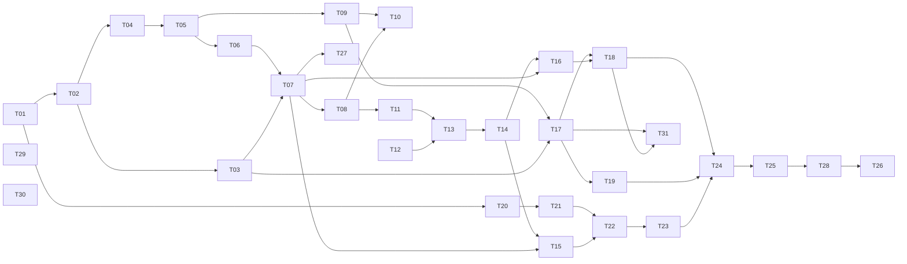

# GitPeek タスクリスト

v1（Phase 1〜9）の作業を、人間が概ね 3 日で終える単位に割ったもの。
**v1 は 2026-09-12 に完了した。** 以後の作業も同じ規約でここに積む。

- **決定の記録**は [`docs/DESIGN.md`](docs/DESIGN.md)（**踏んだ落とし穴と割り切りは §17**）
- **実装中に毎回効く制約**は [`CLAUDE.md`](CLAUDE.md)
- **今やること（＝このファイル）** が進捗の唯一の正

**このファイルには「今やること」しか置かない**（2026-09-09 に整理した）。
作り終わった形の説明・教訓・割り切りは DESIGN.md にある。

---

## このファイルの規約

**着手前に必ずこの節を読むこと。**

1. **完了の記録はコミットと同時に行う。** タスクを終えたら、その実装と同じコミットで
   チェックを入れ、末尾の「完了済み」節へ 1 行に畳んで移す。別コミットにすると忘れる。

2. **ID は再利用しない。** タスクを削除・統合しても番号は空けたままにする。
   3 日に収まらないと判明したタスクは、**末尾に新しい ID を発番**して分割する
   （枝番 `T-13a` は使わない）。ID は発番順であり、実行順は「推奨する着手順」の表と
   各タスクの `依存:` 行が決める。

3. **受け入れ条件には 2 種類ある。**
   - `▸コマンド:` — 実行すれば判定できる。エージェントが自分で確認してよい
   - `▸目視:` — 人間の確認が必要
   
   **目視項目が 1 つでも残っているタスクを、エージェントが単独で「完了」と宣言してはいけない。**
   実装を終えたら「目視確認をお願いします」と述べて止まること。

4. **未着手タスクに書かれた型定義は着手時点の設計案であり、先行タスクの実装が正。**
   着手時に必ず実物と突き合わせ、食い違っていたらタスク本文を書き直してから実装する。

5. **骨子のままのタスクは、着手前に詳細化する。** ⑥実装内容と⑧受け入れ条件が埋まって
   いないタスクは、詳細化そのものを最初の作業として行う。
   骨子のままのタスクはいま無い（T-39 は 2026-09-19 に T-38 へ統合した）。

6. **制約の再掲は出典付き。** 各タスクの「制約」に書かれた内容は CLAUDE.md / DESIGN.md からの
   再掲であり、必ず出典を併記してある。**食い違いを見つけたら CLAUDE.md 側が正。**
   決定理由は再掲していないので、なぜそう決めたか知りたいときは DESIGN.md を読むこと。

---

## 現在地

**最終更新**: 2026-09-24

**次のセッションが最初にやること**

1. 下の「▸コマンド」を 4 つ流してベースラインを取る（直近は **Rust 577 / vitest 547** で全部緑。ignore 2 本のうち 1 本は手元の onyx が要る中止のテスト）
2. **T-40（ファイルを変えたコミットを辿る）**。2026-09-24 に利用者が選び、詳細化した（「v1.1 — ファイル単位の
   履歴」の節）。**実装済みで、▸目視待ち。エージェントは完了を宣言しない** — 目視の結果をもらってから完了済みへ移す。
   **利用者は「使っていくと気になる部分があるかもしれない」と言っている**（取り込み判定とコミット検索）—
   出てきたら、文言と同じく実運用で挙げてもらって直す。文言の直しは「画面の名前と読んだ文」をもらって直す（下記）

```
npm run test:rust   npm run check:rust   npm run test   npm run typecheck
```

| 項目 | 内容 |
|---|---|
| 直前に完了 | **T-38**（取り込まれているかを画面に出す。2026-09-24 に利用者が目視確認）/ v0.2.3 の公開（GitLab ＋ GitHub。2026-09-20。探索を並列にして速くした）/ v0.2.2 / v0.2.1 / v0.2.0 / T-37 / T-36 / T-35 |
| いまここ | **T-40（ファイルを変えたコミットを辿る）実装済み・▸目視待ち**（▸コマンドは全部通っている）|
| 未解決の判断事項 | なし（git 2.38 未満は**警告して止める**と 2026-09-18 に確定）。ただし**文言はまだ途中で、利用者はまだ満足していない**（下記）|

**v1 は 2026-09-12 に終わった**（Phase 9 完了 ＋ 実リポジトリ 8 個で 7 日運用 ＋ 既存 GUI クライアントを
一度も開かなかった）。T-31（`git pull --ff-only` 相当）は
**CLAUDE.md §1 を緩める 3 件目**で、緩め方は既存の 2 件と揃えてある。理由は DESIGN.md §8.6 —
とくに**なぜ `git pull` を呼ばないのか**はそこにしか書いていない。

**待ち時間に T-32 / T-33 を入れ、v0.1.2 として公開した**（2026-09-09 に依頼、09-10 に目視・公開）。
ブランチ一覧の CSV 保存と、更新日でチェックを付け直す機能。**どちらも git の実行を増やしていない。**
決めたことと理由は DESIGN.md §6.4。

**作ってみて分かったこと（落とし穴・割り切り）は DESIGN.md §17。**

### 文言はまだ途中（T-29 の 1 巡目のあと。2026-09-06）

**利用者は「問題ない」と言ったが、「満足していない。今後もっと改善していく」とも
言った。通ったことにして忘れないこと。**

1 巡目で取ったのは**削れば直る硬さ**（自明な主語・重ね書き・翻訳調の連体修飾・
「〜の可能性があります」・「〜してください」の多用）。**残っているのは、
画面の中で読んだときにしか分からないもの** — 前後の文とのつながり、同じ画面に
並んだときの語調のばらつき、長さの釣り合い。**一覧をまとめて読んでも見つからない。**

**次に触るときは、実運用の中で引っかかった文を挙げてもらう形にする**。
**画面の名前と、そこで読んだ文をそのまま**もらえば直せる。

### 済んだ Phase で決めたこと — 出典だけ置く

**毎回効く制約は CLAUDE.md、決定理由は DESIGN.md に移してある。**
ここへ書き写すと必ずどちらかが古くなるので、迷ったら出典を読むこと。

| Phase | 決まったこと | 出典 |
|---|---|---|
| 2 | レーン割り当てと描線（**判定ゲート合格 2026-09-03。以降動かさない**）／第 2 親のレーン合流は不採用 | CLAUDE.md §3 / DESIGN.md §5.1, §5.2, §15.1 |
| 3 | 可視 ref の絞り込みと ahead/behind ／ ref が数千本のときにペインが潰れる件 | CLAUDE.md §6 / DESIGN.md §4.4, §4.5, §6.4 |
| 4 | 3 ペイン配置 ／ 差分の色と語単位強調（強調の中では構文色をやめた）／ 文字コードの判別順 | DESIGN.md §6.1, §7.2, §9.1 |
| 5 | 任意 2 点比較（**`A...B` は 1 つの引数**）／ 作業ツリーの擬似行 | CLAUDE.md §6 / DESIGN.md §7.5, §10.3 |
| 6 | fetch の進捗・中止・放置警告・上流のタグ付け替え | CLAUDE.md §2, §8 / DESIGN.md §8.3, §8.3.1 |
| 6 | checkout の渡し分け ／ 確認画面 ／ FF マージ ／ 書き込み後は HEAD へ寄せる | CLAUDE.md §1, §2, §6 / DESIGN.md §8.1, §8.2, §8.5 |
| 7 | clone の引数と保存先の決め方 ／ 残骸の後始末（**自分が作ったフォルダだけ**）／ Job Object は入れない ／ サブモジュールは**確認画面で選ばれたときだけ** | CLAUDE.md §1, §4, §6, §8 / DESIGN.md §8.4 |

**利用者の判断で「実装しないと決めた」ものを 4 つ緩めてある**（ローカル追跡ブランチ /
サブモジュール / 取ってきてから進める / `merge-tree` の一時フォルダへの書き込み）。どれも**「黙ってやらない」ほうを守った条件付きの
緩和**で、同じ形が必要になったら勝手に変えず利用者に聞くこと。
**一覧は CLAUDE.md §1 の表が正**（ここへ写すと必ず片方が古くなる）。

**EUC-JP の判別が当たらない件は「当面このまま」で決着した**（2026-09-03、利用者の判断）。
EUC-JP を使う予定が無く、**UTF-8 と Shift_JIS が判定できれば足りる**ため。挙動は
`encoding.rs` の `euc_jp_hiragana_is_misdetected_as_shift_jis` が固定している（DESIGN.md §9.1）。

### 登録済みリポジトリ（判定と目視に使うもの）

| リポジトリ | コミット | max_lane | 同時レーン平均 | ルート |
|---|---|---|---|---|
| gitviewer / AerialSoldierMaker / save_temperature | 24 / 22 / 10 | 0 | 1.00 | 1 |
| drogon | 2,298 | 20 | 2.91 | 1 |
| vite | 10,186 | 54 | 5.45 | 1 |
| onyx | 20,285 | 52 | 11.43 | 4（orphan ブランチ 2 本）|
| MinerU | 6,692 | — | — | **T-19 の目視で clone したもの**（ref 304 本）|
| linux | 148 万 | — | — | DESIGN.md §4.1 の非対象 |

小さい 3 つはマージが 1 件も無い一直線なので、枝分かれの確認には使えない。
**サブモジュールを持つリポジトリはまだ登録していない。** T-19 の目視には使ったが、
以後もサブモジュールの確認が要るなら 1 つ手元に置いておくとよい。

**100 万コミット級の正式対応は v1.1 以降に送った**（DESIGN.md §1.1, §4.1 / 下の「v1.1」表）。
v1 では非対象のままだが、恒久的な非対象ではなくなった。

---

## 推奨する着手順

上から順に着手するのが効率的。

| 順 | Phase | タスク | 備考 |
|---|---|---|---|
| 1 | 1 | T-01 → T-02 → T-03 / T-04 | **済** |
| 2 | 2 | T-05 → T-06 → T-07 → T-08 → T-27 | **済**（T-08 は判定ゲート。合格） |
| 3 | 3 | T-09 → T-10 | **済** |
| 4 | 4 | T-11 → T-12 → T-13 → T-14 | **済** |
| 5 | 5 | T-15 → T-16 | **済** |
| 6 | 6-7 | T-17 → T-18 → T-19 | **済**（書き込み系はこれで終わり）|
| 7 | 8 | T-20 → T-21 → T-22 → T-23 | **済**（**Phase 8 完了 ＝ AI レビューは終わり**）|
| 8 | 9 | T-24 → T-25 → T-28 → T-29 / T-30 → T-26 | **済**（**2026-09-12 に v1 の DoD が埋まった**）|
| 9 | 9 | T-31 | **済**（2026-09-08 に利用者が決めて足した。`git pull --ff-only` 相当。v0.1.1 として公開）|


```mermaid
graph LR
  T01 --> T02
  T02 --> T03
  T02 --> T04
  T04 --> T05 --> T06 --> T07 --> T08
  T07 --> T27
  T03 --> T07
  T05 --> T09 --> T10
  T08 --> T10
  T08 --> T11 --> T13 --> T14
  T12 --> T13
  T14 --> T15
  T14 --> T16
  T07 --> T15
  T07 --> T16
  T09 --> T17
  T03 --> T17
  T17 --> T18
  T16 --> T18
  T17 --> T19
  T01 --> T20 --> T21 --> T22 --> T23
  T15 --> T22
  T18 --> T24
  T19 --> T24
  T23 --> T24
  T24 --> T25 --> T28 --> T26
  T29
  T30
  T17 --> T31
  T18 --> T31
```

---

# v1.1 — ファイル単位の履歴

**2026-09-24 に利用者が着手を決めた**（v1.1 の候補表から）。

## - [ ] T-40 [v1.1] ファイルを変えたコミットを辿る

**目的**: 1 つのファイルを変えたコミットに印を付け、次 / 前で辿りながら、そのコミットでのそのファイルの
差分を読めるようにする。**改名をまたいで辿る。**

**参照**: DESIGN.md §6.6（コミット検索。見せ方と打ち方をそのまま使う）/ §7.3（変更ファイル一覧）/
§4.2（起点 ref）/ §4.4（レーンを絞らない理由）/ CLAUDE.md §2, §6, §8

**依存**: T-35 / T-36（済）

**制約**

- **引数は `git/search.rs` だけが組み立てる。** フロントから渡すのは構造体（`CommitQuery`）で、パスは
  pathspec として `--` の後ろへ置き、**`--literal-pathspecs` を付ける**（`*` や `[` や `:` を含むパスを
  glob / magic として読ませない）。起点は `--branches --remotes [HEAD]`、`--all` は使わない（CLAUDE.md §2）
- **グラフとレーンには触らない。行を絞らない**（DESIGN.md §6.6 と同じ理由。CLAUDE.md §3）
- 出し分け・打ち方の解釈・どのファイルを選ぶかは `src/lib/*.ts` の純関数へ。`.tsx` とフックは呼ぶだけ（CLAUDE.md §8）
- 文言は `ja.ts`。**「何が起きるか」で書く**（CLAUDE.md §6）
- **git の書き込みは増えない**（読むだけ。CLAUDE.md §1 に触れない）。新しい依存も足さない

**調べたこと**（2026-09-24）は **DESIGN.md §6.7 へ移した** — `git log --follow` は枝分かれした履歴で改名前の
コミットを落とし、git の既定の絞り方もファイルを変えたコミットを落とす（onyx の `main.py` で 13 件）。
改名は自前で辿り、`--full-history --simplify-merges` を付ける。

**決めたこと**（2026-09-24 に利用者が 5 点とも了承）

1. **見せ方はコミット検索と同じ「印を付けて次 / 前で辿る」**（推奨）。当たった行の背を変え、辿っている
   1 件を囲み、表示していない ref の側の当たりは件数で出す。**グラフを絞った専用の一覧は作らない**
   （絞るとレーンが意味を失う — §6.6）。別案は「ファイルの履歴だけを縦に並べる一覧ペイン」だが、
   ペインが 1 つ増え、グラフのどこにあるかが見えなくなる
2. **入口は変更ファイル一覧の右クリック**（コミットの一覧と作業ツリーの一覧の両方）。押すと検索欄に
   **`path:"<パス>"`** を入れて探す。**`path:` は手でも打て、`author:` / `message:` / `code:` と AND で組める**
   （pathspec を足すだけなので git の実行回数は増えない。`code:` はむしろ速くなる）。
   右クリックの項目名は文言の段で決める（例:「このファイルを変えたコミットに印を付ける」）
3. **改名は自前で辿る（`--follow` を使わない）**。理由は上の 1. と 2.。名前は**最大 20 個**まで
   （超えたらそこで止め、止めたと画面に出す）。**辿った名前は検索欄の下に出す**（「old.txt → new.txt も
   含めています」のように。黙って広げると、打っていない名前で当たったように見える）
4. **マージは `--full-history --simplify-merges`**（上の 3.）。**`path:` のあるときだけ付ける**（無いときは
   pathspec が無いので意味を持たない）
5. **当たったコミットへ移ったら、そのコミットでの名前のファイルを選ぶ**（改名の前後で名前が違うので、
   いまの「同じパスを選び続ける」だけでは改名より前で何も選ばれない）

**実装したもの**（2026-09-24。▸目視待ち）

1. **Rust**（`git/search.rs`）— `CommitQuery.path` ／ `follow_names`（改名を辿る。名前は `MAX_NAMES` = 20 まで）／
   `runs` は `path` があれば `--literal-pathspecs`（`log` の前）・`--full-history --simplify-merges`・`--` の後ろに
   全部の名前 ／ `CommitSearchOutcome` に `paths`（辿った名前）と `truncated`
2. **純関数** — `commitQuery.ts`（`path:` と `pathQuery`）／ `fileHistory.ts`（右クリックを押せるか・
   `historyFileIn`・`fileToSelect`）／ `commitSearch.ts`（辿った名前と上限の知らせ。**ファイルで絞った
   `code:` の実測は覚えない**）
3. **画面** — `FileHistoryMenu.tsx`（右クリック。コミットの一覧と作業ツリーの一覧）／ `store/fileHistory.ts`
   （右クリック → 探す欄への依頼と、辿った名前の受け渡し）／ `useCommitFiles` が `fileToSelect` で選び直す
4. **目視用のリポジトリ** — `npm run demo:repo` が `history-demo` も作る。手順は `確認手順.md` の 4.
5. **ドキュメント** — DESIGN.md §6.6 / **§6.7（新）** / §14.6 / §17.1、README、CLAUDE.md §2（`--follow` を使わない）

**目視で見つけて直したもの**

- **当たった行の色がホバーと同じで見分けられない**（2026-09-24 に利用者の指摘）。淡い黄（`--hit-bg`）＋ 左端の帯にし、
  選択の塗りが当たりの地に負けていたのも直した。あわせてスクロールバーに当たりの印を置いた（DESIGN.md §6.7）

**テストが当たらないところ**: 右クリックの配線（`FileList.tsx` / `WorkingTreeFiles.tsx` / `FileHistoryMenu.tsx`）／
右クリック → 探す欄の受け渡し（`store/fileHistory.ts` と `CommitList.tsx` の効果）／ `useCommitFiles` が
`fileToSelect` を呼ぶところ ／ `App.tsx` の配線。**判断そのもの（押せるか・何を入れるか・どれを選ぶか）は
純関数でテストしてある**

**受け入れ条件**

- ▸コマンド: `tests/search.rs` / `commitQuery.test.ts` / `commitSearch.test.ts` / `fileHistory.test.ts` ／ 4 コマンド
**目視用のリポジトリ**: `npm run demo:repo` で `~/gitpeek-demo/history-demo` もできる。手順は `確認手順.md` の 4.
- ▸目視: 目視用リポジトリで、改名をまたぐファイルを右クリック → 改名前と並行ブランチのコミットにも印が付き、
  辿った名前が読めること
- ▸目視: 次 / 前で改名をまたいだとき、**そのコミットでの名前のファイルが選ばれて差分が出る**こと
- ▸目視: 作業ツリーのファイルの右クリックからも同じことができること
- ▸目視: `path:` と `author:` を組んで絞れること。検索欄を空にすると印が消えること
- ▸目視: onyx の `backend/onyx/main.py` で、`backend/danswer/main.py` の時代まで辿れること（所要時間も見る）

**⚠️ このタスクはエージェントが単独で完了を宣言してはいけない。**

---

# v1.1 以降（ID は振らない）

着手が近づいた時点で詳細化し、末尾から新しい ID を発番する。

## v1.1

| 項目 | 内容 | 参照 |
|---|---|---|
| ~~コミット検索~~ | **T-35 / T-36 で実装済み**（末尾の「完了済み」）| DESIGN.md §6.6 |
| stash 一覧 | stash の閲覧のみ（作成・適用はしない） | DESIGN.md §15.3 |
| ~~ファイル単位の履歴~~ | **T-40 として発番**（2026-09-24。`--follow` は使わない — T-40 の「調べたこと」）| T-40 |
| ブランチ同士の比較 | `origin/main...HEAD` 形式の比較を専用 UI から起動 | DESIGN.md §10.3 |
| `--cc` マージ差分 | マージコミットで両親と異なる部分だけを示す combined diff | DESIGN.md §7.4 |
| 画像差分 | 画像ファイルの変更を並べて表示 | DESIGN.md §7.2 |
| リポジトリのグループ分け | サイドバーでフォルダによる分類 | DESIGN.md §6.2 |
| ローカル追跡ブランチ作成 | `checkout -b --track` を明示的なメニュー項目として追加 | DESIGN.md §8.1 |
| 100 万コミット級リポジトリ | 「全件をフロントへ渡す」前提の見直し。v1 は自動で読まないだけ | DESIGN.md §1.1, §4.1 |
| **文言の見直し 2 巡目** | **T-29 は 1 巡目で、利用者はまだ満足していない。** 実運用で引っかかった文を挙げてもらって直す（一覧をまとめて読んでも見つからない種類が残っている）| 「現在地」の節 |

## v2.0

| 項目 | 内容 | 参照 |
|---|---|---|
| blame | 行ごとの最終変更コミットの表示 | DESIGN.md §15.3 |
| reflog | reflog の閲覧 | DESIGN.md §15.3 |
| submodule 対応 | submodule の中身を辿れるようにする（v1 は「壊れない」だけ担保） | DESIGN.md §15.3 |

---

# 完了済み

| ID | Phase | タイトル | コミット |
|---|---|---|---|
| — | 0 | Tauri v2 雛形 ＋ git 検出 ＋ git コマンドログパネル | `93867ed` |
| T-01 | 1 | 設定ストアと %APPDATA% レイアウト（settings.json / state.json） | `cf5fd37` |
| T-02 | 1 | リポジトリの登録・判定・フォルダスキャン ＋ テスト用リポジトリ生成 | `1f368b7` |
| T-03 | 1 | リポジトリ一覧サイドバーと切替 ＋ 右クリック登録解除・D&D 並べ替え | `80189ea` |
| T-04 | 1 | コミットメタ情報の全件取得とパース ＋ 読み込み進捗と大規模リポジトリの確認 | `c9aae9d` |
| T-05 | 2 | レーン割り当てアルゴリズム ＋ topo / date の並び順 | `6601800` |
| T-06 | 2 | レーン配列 → SVG パス生成と描線 | `e6e877f` `7793d6a` `4bce75b` |
| T-07 | 2 | コミットリストの仮想スクロールと列表示 | `a419547` `f1da933` |
| T-08 | 2 | 判定ゲート — 美しさの検証と調整（**合格**） | `d861dba` `1a5f36a` `1662e52` |
| T-27 | 2 | orphan ブランチと履歴の終端に印を付ける | `3339a0c` |
| T-09 | 3 | 到達可能集合と ahead/behind の計算 | `01a1571` |
| T-10 | 3 | ブランチ / タグツリー UI | `79e5311` `4fb5ec9` |
| T-11 | 4 | コミット詳細と変更ファイル一覧（＋ 3 ペインへの配置替え） | `f0a7906` `041197b` |
| T-12 | 4 | 文字コード自動判別と改行コード検出 | `415e71f` |
| T-13 | 4 | 差分の取得・パースと side-by-side 描画 | `f6ff002` `012364a` |
| T-14 | 4 | Shiki ハイライトと大差分の折りたたみ | `9489720` |
| T-15 | 5 | 任意 2 コミット間差分 | `50a12fb` |
| T-16 | 5 | 作業ツリーの read-only 表示 | `fa7f998` |
| T-17 | 6 | fetch と放置警告 | `b12ec13` `6677914` `4e61936` |
| T-18 | 6 | checkout と FF マージのガード（**Phase 6 完了**） | `6ee4e1f` `cde5db4` `46ed744` |
| T-19 | 7 | URL から clone（**Phase 7 完了 ＝ 書き込み系は終わり**） | `555430b` `300e58b` `5a5298b` |
| T-20 | 8 | LLM プロバイダ設定と資格情報保管（keyring / ureq を追加。MSRV 1.88 へ） | `058db91` |
| T-21 | 8 | skill の読み込みと信頼モデル（**信頼はスキルごと**。globset を追加） | `533e251` `78fb9a9` |
| T-22 | 8 | レビュー実行エンジン（SSE ／ hunk 分割 ／ Markdown フォールバック。**依存を増やさず**） | `d8f7680` `a41ab5e` |
| T-23 | 8 | レビュー UI と結果の永続化（**Phase 8 完了**。目視 2 巡・1 件 ＋ 要望 2 件） | `625de38` `a952b6b` `f531b8e` `47776ff` |
| T-24 | 9 | ログファイルと panic の受け皿 ＋ マスキングの点検（`tauri-plugin-log` を追加） | `4a4ca0a` `af015e2` |
| T-25 | 9 | 設定画面とショートカット ＋ 差分内検索（目視 9 項目通過・要望 1 件。**依存を増やさず**） | `3af5ea2` `808afb2` `02bf7e3` |
| T-28 | 9 | `Givsoner` → `GitPeek` の改名（**identifier ごと変え、移行はしない**。経緯は DESIGN.md §2.3.1） | `0495f94` `2bc1c07` |
| T-30 | 9 | リポジトリの右クリックに「エクスプローラーで開く」（**パスは渡さず ID だけ**）| `56e6e82` `ee1cbae` |
| T-29 | 9 | 画面の文言の見直し **1 巡目**（`ja.ts` ＋ Rust 側。**まだ満足はされていない** — 「現在地」の節）| `a6f3c82` `ee1cbae` |
| — | 9 | GitLab へ公開 ＋ **v0.1.0 リリース**（`npm run release`。DESIGN.md §2.3.2）／ README と MIT ライセンス | `8359499` `cd936d1` `1aadbf5` |
| — | 9 | アプリのアイコンを独自の図案へ（DESIGN.md §2.3.3）／ **コード署名は「しない」を維持**（§2.3.4）| `5448c85` `3b62aa1` |
| T-31 | 9 | 取ってきてから、ブランチを進める（`git pull --ff-only` 相当。**CLAUDE.md §1 を緩める 3 件目**。目視 2 巡・2 件、どちらも文言。v0.1.1 として公開）| `f1cb3b0` `ea47af8` `b552922` |
| — | 9 | **v0.1.1 リリース**（T-31 入り。v0.1.0 で残っていたアイコンの積み残しもここで解消）| `ea47af8` `b552922` |
| T-32 | — | ブランチ一覧を CSV に保存（**チェック済みだけ / タグは入れない**。UTF-8 BOM 付き。`export_markdown` を `export_text` へ改名。DESIGN.md §6.4、割り切りは §17.2）| `acbf611` |
| T-33 | — | 更新日でブランチのチェックを付け直す（**押したときだけ効く**。**日付だけの ISO 文字列は UTC の 0 時**という罠を踏んだ。DESIGN.md §6.4、§17.1）| `acbf611` |
| — | — | **v0.1.2 リリース**（T-32 / T-33 入り。匿名で落とせることまで確認済み）| `84433e6` |
| T-34 | — | 差分が先頭の数十行しか描かれない不具合（1 本の ref を外枠と内側に付けていた。**テストでは固定できない**。DESIGN.md §17.1）／ `Enter` のフォーカス移動は効いていないように見えるが、利用者が求めないので直さない（§17.2）| `820ee1b` |
| T-26 | 9 | 配布ビルドと DoD 検証 — **v1 完了**。ログ 7 日（09-06〜09-12）/ 実リポジトリ 8 個 / **既存 GUI クライアントは一度も開かなかった**（2026-09-12 に利用者が回答。測り方は DESIGN.md §15.2）| `00b4590` |
| — | — | **v0.1.3 リリース**（T-34 入り）／ **GitHub にも写した**（上げる前に GitLab の SHA-256 と突き合わせ、両方ともログインせずに落とせることを確認）| `b34ac6f` |
| T-35 | v1.1 | ことばでコミットを探す（メッセージ / 作者。**`--author` を 2 つ並べると `--all-match` でも OR** — DESIGN.md §17.1。判定はフックから `planSearch` / `searchView` へ出した。DESIGN.md §6.6）| `a6b72e1` |
| T-36 | v1.1 | コード内容で探す（`log -S`）＋ 目安の時間と中止（`run_streaming` に中止の旗。覚えるレートは **`code:` だけの実行に限る**。onyx で 1.5 秒で中止 → 1.53 秒で戻る。DESIGN.md §6.6.1）| `287d678` |
| T-37 | v1.1 | ブランチが相手に取り込まれているかの判定（`merge-tree` を**一時フォルダへ隔離**。**CLAUDE.md §1 を緩める 4 件目**。squash / 途中まで / squash 後に書き換え を ③ と ② で見分ける。**git の下限を 2.38 へ**。テストを見直した際、**相手が隣の行を書き換えると誤って「途中まで」と答える**不具合を囮のテストで見つけ、②を二分探索より先にした（DESIGN.md §17.1）。▸目視なし — 画面は T-38。DESIGN.md §7.6）| `19ec785` |
| T-38 | v1.1 | 取り込まれているかを画面に出す（印は幹と比べて自動、右クリックで「取り込んでいる可能性があるブランチ」を全部調べる。**T-39 を取り込んだ**。目視で 2 件 — 止めていないのに「止めました」と出る（StrictMode）／ 遅い（相手ごとに並列にして 15.0 秒 → 1.6 秒）。**テストが当たらないところは DESIGN.md §7.6.1 の末尾**。DESIGN.md §7.6.1）| `31ddd35` `1ecc1d3` `3c09b6f` |
| — | — | **v0.2.3 リリース**（**相手ごとに並列**にして探索を速くした（確認用リポジトリ 78 本で 15.0 秒 → 1.6 秒、onyx 1,896 本で 2 分 31 秒。DESIGN.md §7.6.1 の「速さ」）＋ 目視用リポジトリを作るスクリプト（`npm run demo:repo`）。**`--since` は履歴を辿るのをやめるので `--since-as-filter` を使う** — DESIGN.md §17.1。**速さは利用者が目視確認済み** — T-38 全体の目視はまだ）／ GitHub にも写した（SHA-256 `39a2946f…`、ログインせずに落とせることを確認）| `561a7be` |
| — | — | **v0.2.2 リリース**（「取り込んでいる可能性があるブランチを調べる」で、**StrictMode の 2 回目の効果が 1 回目の中止された結果を採っていた**のを直した。DESIGN.md §17.1。**この修正は利用者が目視確認済み** — T-38 全体の目視はまだ）／ GitHub にも写した（SHA-256 `c53225c6…`、ログインせずに落とせることを確認）| `3539439` |
| — | — | **v0.2.1 リリース**（T-38 の印と「取り込んでいる可能性があるブランチを調べる」。**T-38 の ▸目視は未了のまま、利用者の指示で公開した** — T-38 は完了扱いにしていない）／ GitHub にも写した（SHA-256 `b47db155…`、両方ともログインせずに落とせることを確認）| `5ac9556` |
| — | — | **v0.2.0 リリース**（T-35 / T-36 のコミット検索 ＋ T-37 の判定の本体。**git 2.38 以上が必須になった**ので 2 桁目を上げた）／ **GitHub にも写した**（GitLab の SHA-256 `b6e9ddf8…` と突き合わせ、両方ともログインせずに落とせることを確認）| `a7feaf3` |
